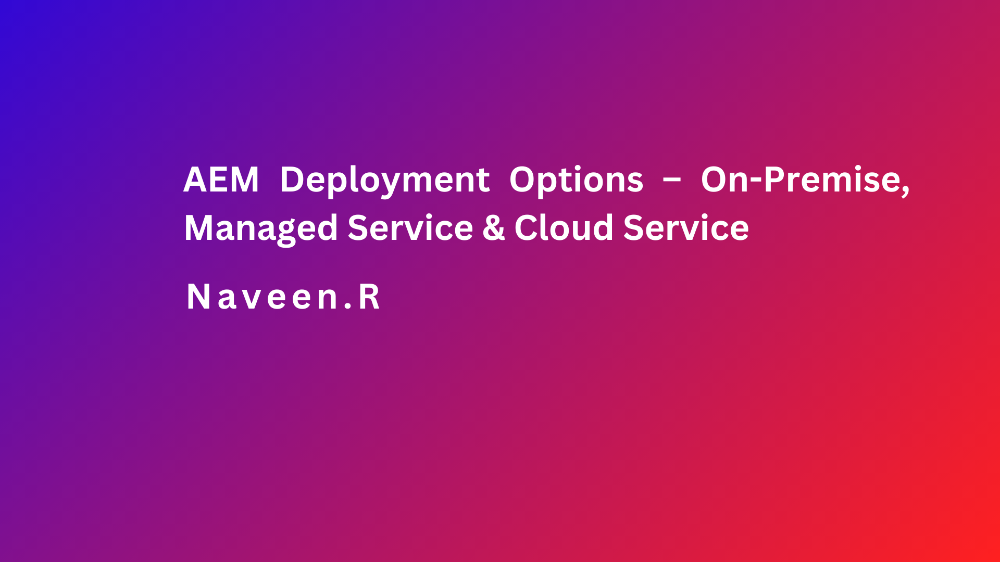

### Objective
- After reading this Article, You should have an Understanding of 
    - [Introduction to AEM deployment options](#introduction-to-aem-deployment-options)
        - [AEM On-Premises Architecture](#aem-on-premises-architecture)
        - [Adobe Managed Services (AMS) Architecture ](#adobe-managed-services-ams-architecture)
        - [AEM as a Cloud Service](#what-is-aem-as-a-cloud-service)
            - [Why AEM as a Cloud Service?](#why-aem-as-a-cloud-service)
        - [Comparison between On-Premise, Managed](#comparison-between-on-premise-managed)
        - [Comparison between On-Premise, Managed & cloud-deployment](#comparison-between-on-premise-managed--cloud-deployment)      
    - [Best practices for AEM deployment](#best-practices-for-aem-deployment)

### Introduction to AEM deployment options

Adobe Experience Manager (AEM) offers a range of deployment options to suit different organizational needs and preferences. It clearly depends on what you aim to achieve with AEM. Are you looking to build a new website, revamp an existing one, or create a personalized digital experience platform? Different deployment options have their own set of benefits and considerations, from the control and customization possible with on-premises deployment to the operational efficiency and innovation speed of AEM as a cloud service.
1. AEM on premisses
2. AMS – Adobe Managed Service (mainly hosted on AWS)
3. AEM as a Cloud Service (AEMaaCS) 

### AEM On-Premises Architecture

AEM on-premises architecture is a traditional deployment model where the AEM instances are hosted within an organization’s own data center or on their private cloud. This model gives organizations complete control over their infrastructure, security, and compliance.

- Key Components of AEM On-Premises Architecture
    - Author Instance
    - Publish Instance
    - Dispatcher
    - Database
    - File System
    - Replication Agents
    - Backup and Recovery

### Detailed Explanation of Components

#### Author Instance

- Purpose.
    - The Author instance is where content creators, editors, and marketers work. It is used for creating, editing, and managing the content.

- Features.
    - Content creation and editing
    - Workflow and approvals
    - Versioning and content management
    - User and group management
    - Integrated tools for digital asset management

#### Publish Instance
- Purpose
    - The Publish instance is responsible for delivering the content to end users. It serves the content through websites, mobile apps, and other channels.
- Features
    - High-performance content delivery
    - Scalability to handle large volumes of traffic
    - Secure delivery of published content
    - Integration with CDNs for global reach
#### Dispatcher
- Purpose
    - Dispatcher is a caching and load-balancing tool used to increase the performance of AEM. It caches content to reduce the load on the publish instances and balances the load among multiple publish instances.
- Features
    - Caching of HTML, images, and other static content
    - Load balancing across multiple publish instances
    - URL filtering and security enhancements
#### Database
- Purpose
    - The database is used to store content metadata, user data, and configuration settings. AEM supports various database systems such as PostgreSQL, MySQL, Oracle, and others.
- Features
    - Storing content metadata and configuration
    - Ensuring data integrity and consistency
    - Supporting transactional operations and queries
#### File System
- Purpose
    - The file system is used to store binary content such as images, videos, and other digital assets. These files are usually stored in a shared storage system accessible by AEM instances.
- Features
    - High-performance storage for large files
    - Support for distributed and shared file systems
    - Integration with AEM for asset management
```aem
+-------------------+
|    File System    |
|                   |
| +---------------+ |
| |   Binaries    | |
| |   Storage     | |
| +---------------+ |
+-------------------+
```

#### Replication Agents
- Purpose
    - Replication agents are responsible for transferring content from the author instance to the publish instances. They ensure that the latest content is available for end users.
- Features
    - Reliable and secure content transfer
    - Support for scheduled and on-demand replication
    - Monitoring and logging of replication activities

#### Backup and Recovery
- Purpose
    - Ensures that content, configurations, and system states can be restored in case of data loss, corruption, or system failures.
- Features
    - Regular backups of databases and file systems
    - Automated backup schedules and policies
    - Disaster recovery planning and implementation
```aem
+-------------------+     +-------------------+     +-------------------+
|   Author Server   |     |   Dispatcher      |     |   Publish Server  |
|                   |     |                   |     |                   |
| +---------------+ |     | +---------------+ |     | +---------------+ |
| |    Author     | |<--> | |    Cache      | |<--> | |    Publish    | |
| |    Instance   | |     | +---------------+ |     | |    Instance   | |
| +---------------+ |     +-------------------+     | +---------------+ |
|                   |          ^     ^              |                   |
| +---------------+ |          |     |              | +---------------+ |
| |   Database    | |          |     |              | |  Database     | |
| +---------------+ |          |     |              | +---------------+ |
|                   |          |     |              |                   |
| +---------------+ |          |     |              | +---------------+ |
| | File System   | |          |     |              | | File System   | |
| +---------------+ |          |     |              | +---------------+ |
+-------------------+          |     |              +-------------------+
         |                    Replication                    |
         +---------------------------------------------------+

```

- Control: Complete control over the infrastructure, security, and compliance.
- Customization: High flexibility for customization and integration with existing systems.
- Security: Direct control over security policies and data protection measures.

- Challenges:

    - Cost: Higher upfront and ongoing costs for hardware, maintenance, and staffing.
    - Complexity: Requires skilled IT staff to manage and maintain the infrastructure.
    - Scalability: Scaling resources can be more complex and slower compared to cloud solutions.
    
AEM on-premises architecture is suitable for organizations with stringent compliance, control, and customization requirements, providing full control over the entire content management infrastructure.


### Adobe Managed Services (AMS) Architecture 

AEM is hosted on Adobe’s cloud infrastructure but managed by Adobe. [More details](https://helpx.adobe.com/in/legal/product-descriptions/adobe-experience-manager-managed-services.html)
- Components
    - Author Instance: Managed by Adobe.
    - Publish Instance: Managed by Adobe.
    - Dispatcher: Managed by Adobe.
    - Cloud Manager: For deployment, monitoring, and scaling.


```aem
+--------------------+
|  Adobe Managed     |
|     Services       |
+--------------------+
         |
         v
+--------------------+
|   Cloud Manager    |
+--------------------+
         |
         v
+---------+----------+
|         |          |
|   Author Instance  |
|   Publish Instance |
+--------------------+
         |
         v
+--------------------+
|    Dispatcher      |
+--------------------+
         |
         v
+--------------------+
|   End Users        |
+--------------------+
```
- Ideal for organizations looking to offload infrastructure management to Adobe while maintaining some control.
- Offers a balance between control and managed services.

### Comparison between On-Premise, Managed


- Also, there were challenges that exists in both offerings (above):

    - Scalability limitation because of the way Oka/JCR repository works in classic AEM
    - Computational limitations (e.g., asset processing and rendition generation)
    - Content replication related issues (performance, reliability etc.) 

Some of these limitations (highlight) directly translates into a need of cloud native solution so that AEM can be scaled, inherit the security benefits of cloud along with lower cost of ownership and therefore Adobe came up with AEMaaCS offering.

- For now, consider that old classic AEM has been refactored into following:

    - A containerized architecture for scalability and to make AEM cloud-native
    - Set of smaller and scalable services (repository service, asset computer service etc.) for extensibility and performance improvements 


### What is AEM as a Cloud Service?

AEM as a Cloud Service (AEMaaCS) is the cloud-native version of Adobe Experience Manager, designed to leverage the benefits of cloud computing to deliver more agility, scalability, and resilience. It is part of the Adobe Experience Cloud and offers a range of features optimized for cloud deployment. [more details](https://helpx.adobe.com/legal/product-descriptions/aem-cloud-service.html)
 
- AEM as a Cloud Service let us explore the feature

    - Scale your DevOps efforts with Cloud Manager: CI/CD framework, autoscaling, API connectivity, flexible deployment modes, code quality gates, service delivery transparency, and guided updates.

    - Enable developers to add automation to application development practices.

    - Deliver content quickly and efficiently on a global scale, using a built-in Content Delivery Network (CDN) and other network-layer best practices.

    - Leverage a dynamic architecture that auto-scales, thus removing infrastructure considerations.

    - Stay on top of threats and security-risk mitigation, using automated tests to scan for common vulnerabilities.

    - Ensure maximum resilience and efficiency backed by optimized performance topologies.

    - Take advantage of AEM as a Cloud Service’s deep integration with the Adobe Experience Cloud to provide better customer experiences with online marketing and web analytics products.

    - Utilize tools that help accelerate the migration tasks, such as code refactoring, transfer of content, and more.


### Typical AEM as a Cloud Service environment

- A new project that is getting onboarded on AEMaaCS will be provisioned under a Program. There are three types of environments available with a Program of AEM as a Cloud Service:

    - **Production environment:** hosts the applications for the business practitioners.
    - **Stage environment:** is always coupled to a single production environment in a 1:1 relationship. The stage environment is used for various performance and quality tests before changes to the application are pushed to the production environment.
    - **Development environment:** allows developers to implement AEM applications under the same runtime conditions as the stage and production environments.


- Any new AEM project is always bound to exactly one specific codebase, where you can store both configuration and custom code for your project. This information is stored in a code repository, accessible via the usual Git clients, made available to you at the time new programs are created.

    - AEM Cloud Sites Service
    - AEM Cloud Assets Service

Both of these allow access to a number of features and functionalities. The author tier will contain all Sites and Assets functionality for all programs, but the Assets programs will not have a publish tier, nor a preview tier, by default.

### Core benefits of AEM as a Cloud Service:
- It is always on with zero downtime
- It is always at scale
- It is always current with latest features/upgrades
- It is always evolving (Adobe is adding new set of standards and best practices-constantly, those are by default included automatically)
- Low cost of ownership
- Usage based license model
- More secure as it is always on the latest security level
    

### Why AEM as a Cloud Service ?

why AEM as a Cloud Service, we need to look at the expectation of consumers and businesses in today’s era. Also, we need to look at the limitations/challenges with either AEM classic/on-premisses or AMS.
 
- At high-high customers want:

    - Better experience (personalization, just in time experience)
    -  Relevant content/information
    - Fast and seamless experience

- On the other hand, businesses expectation is:

    - Customer satisfaction
    - Lower cost of delivery
    - Self-resilient applications/IT infrastructure
    - Modernized and scalable applications


### Comparison between On-Premise, Managed & Cloud deployment


### Best practices for AEM deployment
Deploying Adobe Experience Manager (AEM) involves a set of best practices to ensure a smooth and efficient deployment process.

- **Environment Separation**: Maintain separate environments for development, testing, staging, and production. This helps in isolating changes, testing new features, and ensuring stability before deployment to production.
- **Version Control**: Use version control systems like Git to manage code and configuration changes. This enables tracking of changes, collaboration among team members, and easy rollback in case of issues.
- **Automated Deployment**: Implement automated deployment pipelines to streamline the deployment process. Use continuous integration/continuous deployment (CI/CD) tools like Jenkins, Bamboo, or Adobe CI/CD pipeline.
- **Configuration Management**: Manage AEM configurations using tools like OSGI configuration & Run mode. It maintains separate configuration sets for each environment to avoid configuration drift and ensure consistency.
- **Content Migration**: Plan and execute content migrations carefully, especially when upgrading or migrating between AEM versions. Utilize Adobe’s AEM migration tool or third-party migration solutions to automate and streamline the migration process.
- **Performance Optimization**: Optimize AEM performance by tuning configurations, implementing caching strategies, and leveraging CDNs. Regularly monitor performance metrics and optimize as needed to ensure an optimal user experience.
- **Backup and Recovery**: Establish robust backup and disaster recovery procedures to mitigate the risk of data loss and downtime. Regularly backup AEM repositories, configurations, and content, and have a tested recovery plan in place.
- **Monitoring and Alerting**: Implement comprehensive monitoring and alerting solutions to track system health, performance, and security incidents.

    
### **Important Links for more information** 

https://experienceleague.adobe.com/en/docs/experience-manager-cloud-service/content/overview/what-is-new-and-different

https://helpx.adobe.com/legal/product-descriptions/adobe-experience-manager-managed-services.html

https://helpx.adobe.com/legal/product-descriptions/aem-cloud-service.html

 