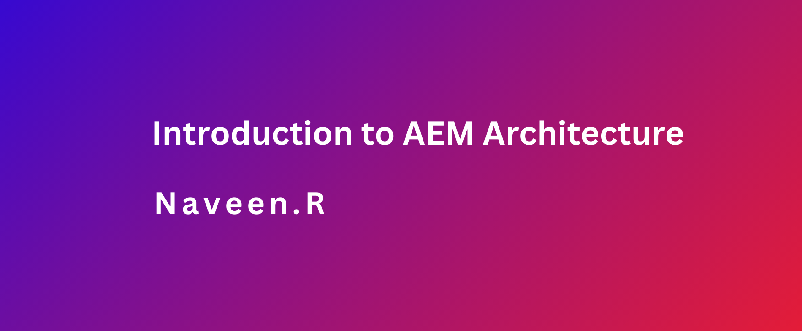
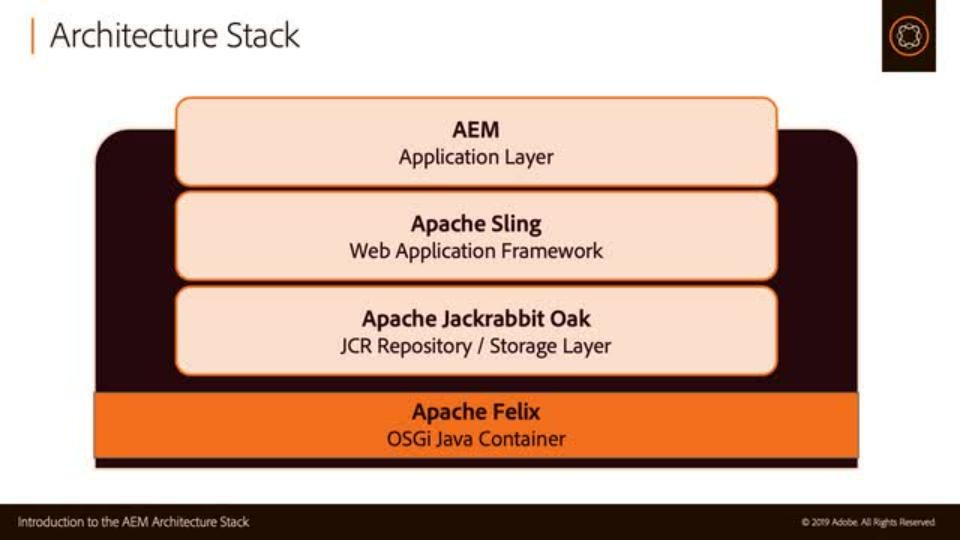
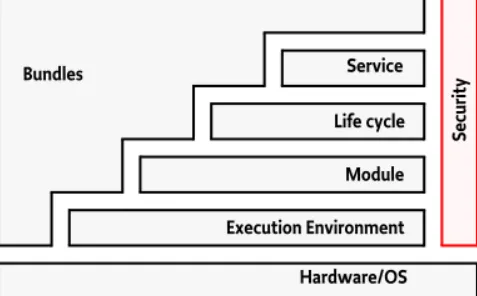
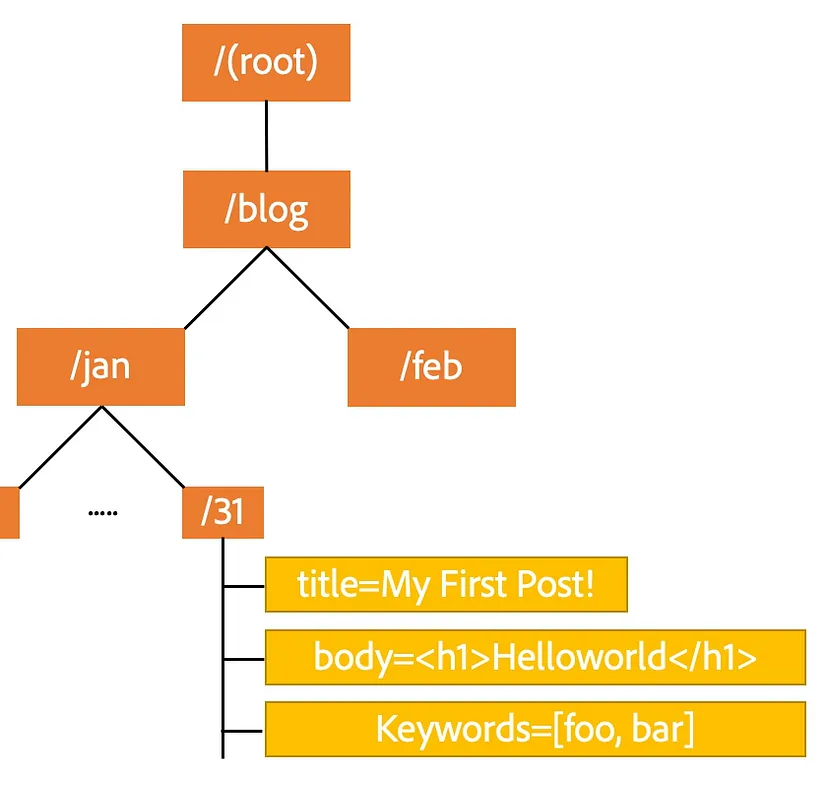
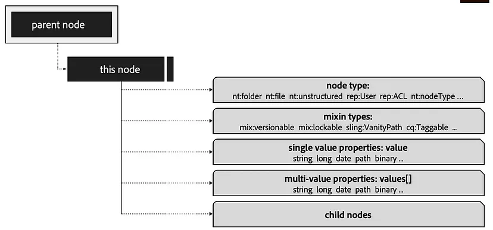

### Objective
- After reading this Article, You should have an Understanding of 

    - [OSGi Java Container](#osgi-java-container)
    - [Security Layer](#security-layer)
    - [Module Layer ](#module-layer)
    - [Java Content Repository (JCR)](#java-content-repository-jcr)
    - [Apache Sling](#apache-sling)

We learned the basics of AEM and how it functions as a CMS platform in the previous article [AEM overview](./01_AEM_Overview.md)Let’s explore the technology stack that was used to create this kind of software.

### OSGi Java Container
OSGi formerly known as the Open Services Gateway initiative. It offers a controlled, general-purpose Java framework that facilitates below features as listed.

- OSGi framework allows us to install, update, and download the bundles dynamically
- It offers feasibility for the bundle developer to benefit from Java’s platform independence and dynamic code-loading capability in order to quickly create services for small-memory devices
- OSGi framework further divided into different layers to provide different functionalities like security layer, module layer, service layer, life cycle layer and application layer

Let’s briefly discuss the purposes of each layer so that we may follow and understand them.

### Security Layer
- It is based on the Java security which add number constraints and limits the bundle functionalities based on the permissions given on the bundles or services. It is managed by the life cycle layer in the OSGi not by itself.
It provides the infrastructure to deploy and run the application in fine grained controlled manner.

### Module Layer
- The Module Layer defines a modularization model for Java development. It provides the strict rules for sharing and hiding the Java packages from one bundle to other bundle.
Bundle is example for unit of modularization in OSGi framework. They are the compiled classes and packaged as jar files with some additional metadata which describes how the bundle should be exposed and used by other bundles.
Life cycle layer provides APIs for managing the bundles and these bundles can be started, stopped, and installed independently without compromising the other bundles.

### Java Content Repository (JCR)
JCR is content repository which supports storing of structured and unstructured content in the hierarchy model.

- Principles of JCR
    - We have common programmatic interface for accessing the content
    - An API based which does not involve or connect to underlying architecture
    - JCR is organized as hierarchy or filesystem model which is easy access and maintain the content.

- JCR Features
    - Storing in binaries
    - Single & Multi Valued properties
    - Locking the content
    - versioning
    - Access control
    - Querying
    - Structuring
    - Event and Observation of content

JCR Hierarchy structure

JCR is all about the hierarchy structure which contains nodes which are similar to files and properties which are data in the files which is shown in the below image.

### Apache Sling
Sling is web application framework designed to develop the application which uses JCR as the datastore.

Sling Features

- It uses RESTful principles and provide the web API’s which is used by content oriented applications such as AEM.
- It is resource oriented and resolves the resource to JAVA objects which is used read or fetch the data from JCR
- Sling decomposes the JCR path to a resource and fetches the script which is responsible for rendering the content for user on the web page/component