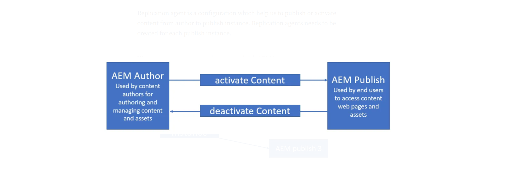

### Objective
- After reading this Article, You should have an Understanding of 

    - [AEM Author Instance](#aem-author-instance)
    - [AEM Publish instance](#aem-publish-instance)
    - [Differences Between Author and Publish Instances](#differences-between-author-and-publish-instances)
    - [Why Two Instances ?](#why-two-instances)

Before creating an instance let’s first try to understand two different unique instances as author and publish require for end to end development.

### AEM Author Instance

1. This is an internal (not for end user) server mainly used for content authoring. Content will get publish or transfer to multiple AEM instances on content replication which is also called as activation.

2. Creating an AEM instance required naming the AEM jar file as aem-author-p4502.jar

3. Double-click on the jar file to create a brand new AEM instance. After clicking on AEM Jar will open the below window. It will take a good amount of time around 15 to 20 min to start AEM for the first time. Next time onwards it will take max 5 minutes to start the instance

4. Once the AEM instance is up and running, it will open a browser with the below page open. Provide username and password as admin which is OOTB that can also be changed.

5. After login, it will open in below screen format

6. Clicking on the below question mark sign will help us to see the Adobe Experience Manager version.

### AEM Publish instance

- Publish instance is mainly a end user website where we do not edit or author content. It is generally hosted on 4503 port.

- To create an AEM instance it required to name AEM jar file as cq65-publish-p4503.jar

- Content will be available in publish instance as soon as it is activate / publish / replicate from author instance.

- We can Unpublished the content also if we want to remove content from live site or available to end users.

- Publish instance all called publisher.

- We can have multiple publishers for a single author instance to distribute the page access load if we are expecting large number of users

### Below are the steps to create publish instance

- Copy the jar to a new folder publish and rename it as aem-publish-p4503.jar

- Open the command line on the current folder and run **java -jar aem-publish-p4503.jar** command to start the publish instance

- Once AEM successfully starts, it is accessible on http://localhost:4503 using any browser of your choice

### Differences Between Author and Publish Instances
* **Access Control**: The Author instance is a secured, internal environment with restricted access, while the Publish instance is publicly accessible.
* **Content Management**: Content creation and editing happen only on the Author instance. The Publish instance displays the content but doesn’t allow editing.
* **Workflow and Approval**: The Author instance often includes workflows for content approval before publishing.

### Why Two Instances ?
* **Security and Control**: Separating environments ensures that in-progress content isn’t publicly visible and provides a controlled space for content creation.
* **Performance Optimization**: The Publish instance is optimized for fast content delivery, while the Author instance is optimized for content management functionalities.
* **Stability and Reliability**: This separation minimizes the risk of authoring activities impacting the performance of the live site.

### Important URL's

1. Content Page URL for all content website pages http://localhost:4503/sites.html/content 

2. Asset / DAM Page URL for all media files http://localhost:4503/sites.html/content

3. Code Editor URL to access code file http://localhost:4503/crx/de

4. Package Manager URL to access, build and install code and content packages. http://localhost:4503/crx/packmgr

5. System Console Bundle to access all bundles or jar files. It helps us to check bundle status as install, active, resolved, etc.  http://localhost:4503/system/console/bundles
 
6. System Console Components to check both out of the box and custom components.
http://localhost:4503/system/console/components

7. System Console Configurations to check and manage all the out of the box or system level configurations
http://localhost:4503/system/console/configMgr

