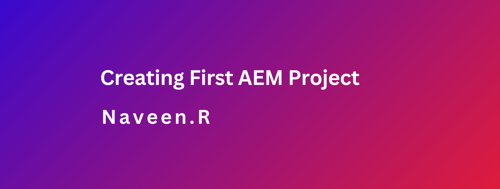

### Objective
- After reading this Article, You should have an Understanding of 
    - [How to create the AEM Project](#how-to-create-the-aem-project)
    - [Deploy and build the project](#deploy-and-build-the-project)
    - [Understand all submodules](#understand-all-submodules)
    - [Most Common Error](#most-common-error)


### How to create the AEM Project

1. Create a folder and Open Command Prompt

2. Paste the following into the command line to generate the project in batch mode

```java
mvn -B org.apache.maven.plugins:maven-archetype-plugin:3.2.1:generate -D archetypeGroupId=com.adobe.aem -D archetypeArtifactId=aem-project-archetype -D archetypeVersion=37 -D appTitle="mySite" -D appId="AEM-MySite" -D aemVersion="cloud" -D groupId="com.mySite"
```
3. Go inside the folder generated and you will be able to see below generated files

```java
~/code/
    |--- aem-guides-DeveloperResource/
        |--- all/
        |--- core/
        |--- ui.apps/
        |--- ui.apps.structure/
        |--- ui.config/
        |--- ui.content/
        |--- ui.frontend/
        |--- ui.tests /
        |--- it.tests/
        |--- dispatcher/
        |--- pom.xml
        |--- README.md
        |--- .gitignore
```
### Deploy and build the project

1. Build and deploy the project code to a local instance of AEM.

2. Ensure you have an author instance of AEM running locally on port 4502.

```cmd
cd <project Folder>
```

3. Below command will help us to clean all the modules and delete target folders.
```java
mvn clean install
```
4. Below command will help us to deploy code in AEM author instance. autoInstallPackage and other profiles will get generate at the time of project creation in main pom.xml. Below command will create a zip file of html, css, .jar and other resources and install same in AEM author instance.
```java
mvn clean install -PautoInstallPackage
```
5. Below command will help us to deploy code in AEM publish instance. As mentioned earlier, autoInstallPackagePublish profile will get generate at the time of project creation in main pom.xml. Below command will also create a zip file of html, css, .jar and other resources and install same in AEM author instance.
```java
mvn clean install -PautoInstallPackagePublish
```
6. Below command will deploy only java code as jar file in the form of bundle.
```java
mvn clean install -PautoInstallBundle
```
The build takes around a minute and should end with the following message

```java
...
[INFO] ------------------------------------------------------------------------
[INFO] Reactor Summary for DeveloperResource Sites Project 0.0.1-SNAPSHOT:
[INFO]
[INFO] DeveloperResource Sites Project ................................. SUCCESS [  0.113 s]
[INFO] DeveloperResource Sites Project - Core .......................... SUCCESS [  3.136 s]
[INFO] DeveloperResource Sites Project - UI Frontend ................... SUCCESS [  4.461 s]
[INFO] DeveloperResource Sites Project - Repository Structure Package .. SUCCESS [  0.359 s]
[INFO] DeveloperResource Sites Project - UI apps ....................... SUCCESS [  1.732 s]
[INFO] DeveloperResource Sites Project - UI content .................... SUCCESS [  0.956 s]
[INFO] DeveloperResource Sites Project - UI config ..................... SUCCESS [  0.064 s]
[INFO] DeveloperResource Sites Project - All ........................... SUCCESS [  8.229 s]
[INFO] DeveloperResource Sites Project - Integration Tests ............. SUCCESS [  3.329 s]
[INFO] DeveloperResource Sites Project - Dispatcher .................... SUCCESS [  0.027 s]
[INFO] DeveloperResource Sites Project - UI Tests ...................... SUCCESS [  0.032 s]
[INFO] ------------------------------------------------------------------------
[INFO] BUILD SUCCESS
[INFO] ------------------------------------------------------------------------
[INFO] Total time:  23.189 s
[INFO] Finished at: 2023-01-10T11:12:23-05:00
[INFO] ------------------------------------------------------------------------

```

7. Hit **http://localhost:4502/crx/packmgr/index.jsp ** URL and verify all below installed packages.

8. Below are the project related required packages which always needs to be install once build is successfully done.
    - project_name.ui.content-1.0.0-SNAPSHOT.zip
    - project_name.ui.apps-1.0.0-SNAPSHOT.zip
    - project_name.ui.config-1.0.0-SNAPSHOT.zip
    - project_name.all-1.0.0-SNAPSHOT.zip

9. For successful build, It is always require to verify installed bundle / jar file just after build. Its status muse be active.

    - http://localhost:4502/system/console/bundles


### Understand all submodules.


### ui.apps
ui.apps package creates an empty inside /apps/<my-project> and /etc/<my-project> hierarchy and responsible for component, OSGI configs, clientlibs and internationalization.


### ui.content
ui.content package creates an empty inside /content/<my-project> and /content/dam/<my-project> hierarchy and responsible for content, pages, assets, content, templates and experience fragment.


### ui.frontend
ui.frontend package is mainly responsible for front related items such as css, js and other resources.

### core module
core package is mainly responsible for Java or backend code. Jar file will get install in AEM instance as part of practice.all-1.0.0-SNAPSHOT.zip package.


### ui.config
ui.config package is responsible for defining run modes. Previously, it was a part of a ui.apps package and a small change in the configuration required a complete ui.apps package build. Using ui.config package we will be able to deploy config only.


### **Most Common Error**

1. Dispatcher issue may occur, GO to POM.xml in project and UnCommit the as per below image


2. **npm install** This issue will cover while installing maven command To Resolve this issue.

3. Go to Ui.frontend --> Module

4. Go to Package.json --> Update TypeScript value -->  **"typescript": "^4.8.3",**

5. **ui.apps** Any issue occurred in ui.apps --> Just go an Delete the folder Mostly common issue will logo file under ecommerace

### Debug the code in AEM

java -Xdebug -agentlib:jdwp=transport=dt_socket,server=y,suspend=n,address=8888 -jar aem-quickstart-6.5.0.jar
