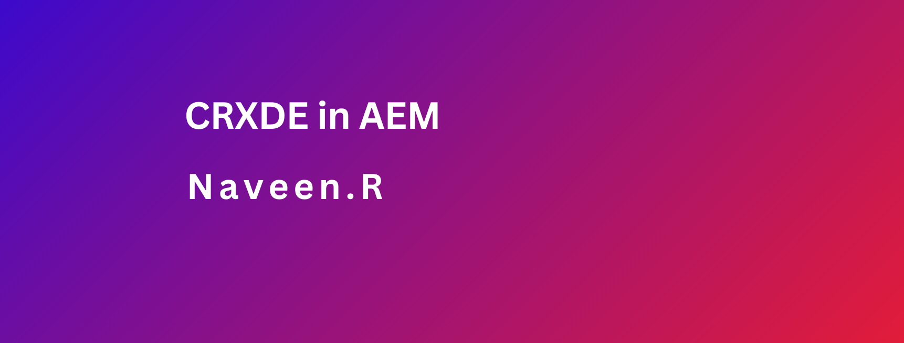
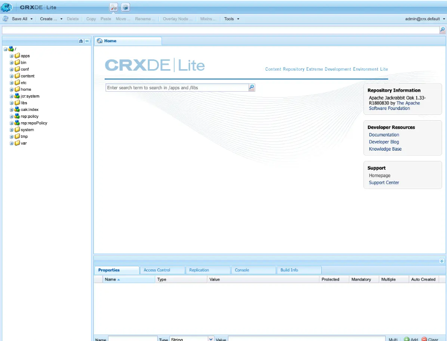

### Objective

- After reading this Article, You should have an Understanding of 
    - [What is CRX in AEM?](#what-is-crxde-in-aem)
        - [Key Features of CRX](#key-features-of-crxde)
        - [Functionality of CRX](#functionality-of-crxde)
    - [Working with CRX in AEM](#working-with-crx-in-aem)
        - [ CRXDE Lite Usage](#crxde-lite-usage)
    - [Best Practices for CRX in AEM](#best-practices-for-crx-in-aem)
    

### What is CRX/DE in AEM?
- CRX/DE (Content Repository Extreme Development Environment), is the underlying repository that serves as the backbone of AEM. It is based on the Apache Jackrabbit project, which implements the Content Repository API for Java (JCR). CRX/DE is responsible for storing and managing all the content, code, and configurations that make up an AEM instance.

### Key Features of CRX/DE
- CRX is the content repository at the core of AEM, based on Apache Jackrabbit.
- It stores and manages all content, code, and configurations in an AEM instance.
- CRX provides a hierarchical structure for organizing data, similar to a file system.
- It supports versioning, access control, and search capabilities.
- CRX offers various tools and interfaces for interacting with the repository.
- Understanding CRX is crucial for effective AEM development and administration.

### Functionality of CRX/DE
- Storing Content: It stores all the digital assets, pages, and other data in a structured format.
- Version Control: CRX keeps track of different content versions, enabling rollbacks and historical comparisons.
- Search and Indexing: It provides search capabilities across the repository’s contents with built-in indexing.
- Access Control: CRX manages user permissions and access rights to the content.

    ### Storing Content in CRX/DE

    - CRX organizes data in a hierarchical structure, similar to a file system. This structure is often referred to as the “repository tree” or “content tree.” Each item in the tree is called a “node,” and these nodes can contain properties and child nodes, forming a nested hierarchy.

    - The content tree in CRX follows a specific naming convention, with paths starting from the root node (“/”). For example, “/content/mysite/en” could represent the English version of a website’s content. This hierarchical structure makes it easier to organize and manage content in a logical and structured manner

    ### Versioning and Access Control
    - Every node in the repository can have multiple versions, allowing you to track changes over time and revert to previous versions if needed. This versioning capability is particularly useful for content management, where multiple authors may be working on the same content simultaneously.

    - CRX also provides robust access control mechanisms. You can define permissions at various levels of the repository tree, controlling who can read, write, or modify specific nodes. This access control system ensures that only authorized users can interact with the content, maintaining data integrity and security.

    ### Search Capabilities
    - CRX comes equipped with powerful search capabilities, allowing you to query the repository for specific content or metadata. This feature is essential for managing large volumes of content, as it enables you to quickly locate and retrieve the information you need.

    - CRX supports various search options, including full-text search, property-based search, and even custom queries using the Query Builder interface. These search capabilities can be leveraged both programmatically and through AEM’s user interfaces, making it easier to find and manage content across your AEM instance.

### Working with CRX in AEM
- Step-by-Step Interaction
    - Access CRXDE Lite: AEM provides a web-based tool called CRXDE Lite to interact directly with CRX.
    - Navigate the Repository: Use the tree structure to browse the nodes representing AEM content.
    - Modify Content: Create, edit, or delete nodes and properties as required.
    - Commit Changes: Save changes to the repository to make them persistent.

### CRXDE Lite Usage
- CRXDE Lite is the lightweight development environment included with AEM for working with CRX. It enables developers to:
    - Directly view and manipulate the repository structure.
    - Develop and test scripts and queries.
    - Access system and error logs.

### Best Practices for CRX in AEM
- To ensure optimal performance and maintainability:
    - **Understand JCR**: Familiarity with the JCR standard is crucial for working effectively with CRX.
    - **Limit CRXDE Lite Use**: Use CRXDE Lite primarily for exploration and debugging; prefer higher-level tools for content authoring.
    - **Backup Regularly**: Always maintain backups of your CRX repository to prevent data loss.
    - **Monitor Performance**: Keep an eye on repository size and query performance to maintain system responsiveness.