### Objective

- After reading this Article, You should have an Understanding of 
    - [What is Template?](#what-is-template)
    - [Types of AEM Templates](#types-of-aem-templates)
    - [What is Static Template?](#what-is-static-template)
        - [Disadvantages of Static Template.](#disadvantages-of-static-template)
    - [ What is Editable Template?](#what-is-editable-template)
        - [Editable Template Workflow](#editable-template-workflow)
        - [Editable Template and Pages Relationship](#editable-template-and-pages-relationship)
        - [Comparison Between Static and Editable Template in AEM](#comparison-between-static-and-editable-template-in-aem)
        - [How to Create editable template](#how-to-create-editable-template)
        - [How to Create a Template Type](#how-to-create-a-template-type)
        - [Editable Template Structure](#editable-template-structure)
            - [what is structure tab.](#what-is-structure-tab)
            - [what is Initial Content tab.](#what-is-initial-content-tab)
            - [Difference between initial and Structure tab](#difference-between-initial-and-structure-tab)
            - [Introduction to Policies](#introduction-to-policies)
                - [What is a Content Policy?](#what-is-a-content-policy)
                    - [Page Policy?](#page-policy)
                    - [Content Policy?](#content-policy)
                - [Storage of Policies](#storage-of-policies)
        - [Style System in Editable Template](#style-system-in-editable-template)
            - [Page-Level Style System](#page-level-style-system)
            - [Component-Level Style System](#component-level-style-system)
            - [Combination of Page and Component Policies](#combination-of-page-and-component-policies)
    - [Interview Questions for Editable Templates in AEM](#interview-questions-for-editable-templates-in-aem)
        - [General Questions](#general-questions)
        - [Editable Template Workflow](#editable-template-workflow-1)
        - [Policies](#policies)
        - [Style System](#style-system)
        - [Advanced Editable Templates Questions](#advanced-editable-templates-questions)

                

### What is Template?

- An Adobe Experience Manager (AEM) template is a foundational component used to create pages within AEM Sites. It provides a predefined structure or layout for the content, enabling consistent design and efficient content creation across a website or app.

- AEM Templates play a crucial role in establishing the layout and design of a page. They allow for the consistent application of branding and design elements across multiple pages

### Types of AEM Templates

1. Static Template

2. Editable Template

### What is Static Template?

- Static templates are the traditional way of creating templates in earlier versions of AEM.
    - Less flexible after creation.
    - Defined by developers.
    - Stored under the /apps directory in the repository.

- Creating a Static Template
    - Develop the Template Structure: Developers write the HTML structure and include components using JSP or HTL.
    - Define the Content: They specify the initial content and design for pages.
    - Deploy the Template: The template is deployed to the AEM instance.

### Disadvantages of Static Template.
- By using static template if you create new page --dynamic connection is not maintained between the page and the template--. This connection means that changes to the template structure are cannot reflected on any pages created with that template.

### What is Editable Template?

- Editable templates allow template authors with permissions to create and manage templates without requiring developer support.
- Key differences exist between static and editable templates, including dynamic updates and flexibility.

### Editable Template Workflow

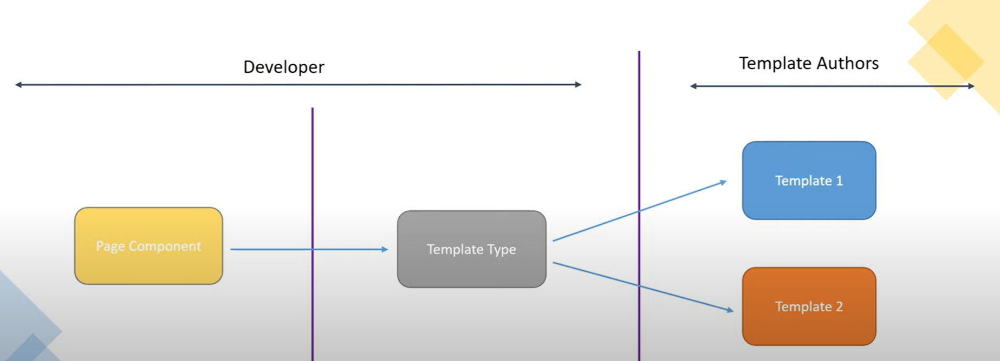

Developer Responsibilities:
- Page Component
    - Acts as the foundational building block for templates.
    - Contains scripts and configurations required to provide functionality to templates.
- Template Type
    - Created by developers using the page component.
    - Serves as the blueprint for template authors to create templates.

- Template Author Responsibilities.
    - Template Creation
        - Using the provided template type, authors can create multiple templates, such as.
            - Template 1
            - Template 2
        - Templates inherit configurations and structures defined in the template type.
- Dynamic Relationship.
    - Templates dynamically influence the pages created from them (e.g., layout or component updates in a template reflect on all associated pages).

### Editable Template and Pages Relationship.

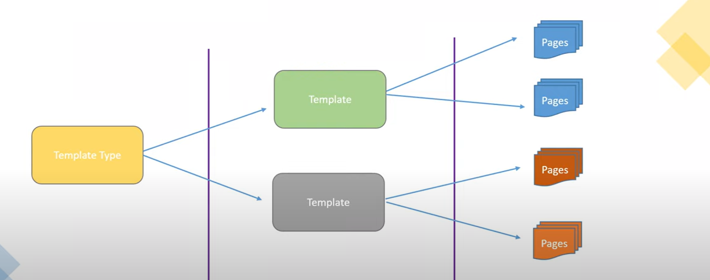

- Template Type.
    - Acts as the foundation for creating templates.
    - Created and maintained by developers.
    - Includes base configurations such as scripts and page components.
- Templates.
    - Created by template authors using a template type.
    - Allows layout configuration, pre-existing components, and content setup.
    - Connection with Template Type is static:
        - Changes in template type do not affect already created templates.
- Pages
    - Generated from templates.
    - Include layout and pre-defined components as per the template.
    - Connection with Template is dynamic
        - Updates in templates reflect in all associated pages.
- Static vs. Dynamic Connection
    - Template Type ↔ Template: Static.
    - Template ↔ Pages: Dynamic.

- Hierarchy Summary.
    - Template Type → Creates → Templates.
    - Templates → Generate → Pages.
    - Each layer impacts the next directly, with dynamic changes only applicable from template to pages.    

### Comparison Between Static and Editable Template in AEM

| Aspect | Static Template | Editable Template |
| --- | --- | ---|
| Creation | Created and maintained entirely by developers. | Created and managed by template authors or admins, with initial setup by developers.|
| Developer Involvement | Full developer involvement is required for creation and any changes. | Minimal developer involvement after initial setup; authors/admins handle changes. |
| Flexibility | Limited flexibility. Requires a complete development cycle for any modifications or new templates. | CHigh flexibility. Authors can modify or create templates without a development cycle.|
| Component Management | Initial components added by developers only; changes require development. | Components can be added or removed dynamically by authors, either in the structure or initial content.|
| Update Scope | Updates apply only to newly created pages; previously created pages are unaffected. | CUpdates can dynamically apply to both existing and new pages.|
| Template Relationships | Static relationship between templates and pages. | Dynamic relationship, enabling consistent updates across all associated pages.|
| Property Storage | Uses design nodes to store template-level properties. | Uses policies instead of design nodes, offering additional functionalities and flexibility.|
| Use Case Implementation | Time-consuming due to dependency on developers and QA cycles (e.g., requires at least one sprint for new templates). | Rapid implementation; authors can create and use templates within a day.|
|Ideal For | Scenarios where templates rarely change and are maintained by developers. | Dynamic content needs where quick updates and flexibility are crucial.|

### How to Create Editable Template.

- Create a folder for the templates. This folder is not mandatory, but is recommended best practice.

- Go to Tools --> General --> Configurations Browser.

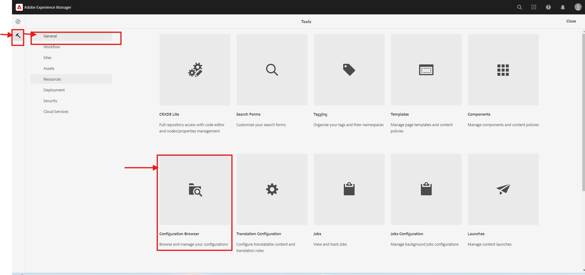

- In the Create Configuration dialog, the following fields must be configured:

    - Title: Provide a title for the configuration folder
    - Editable Template: Select to allow for editable templates within this folder

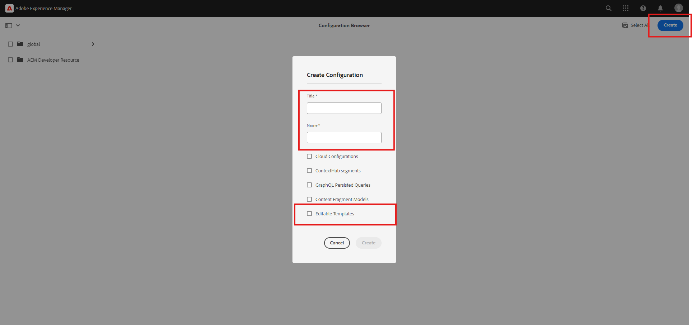

- Click Create Folder is created

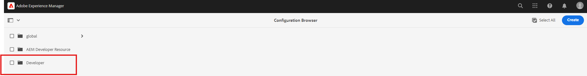
 

- Check Weather this folder is saved in DB(CRX/DE).

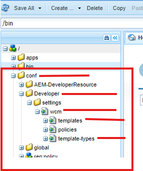

- Open the folder called Template Type inside you will not any template type.

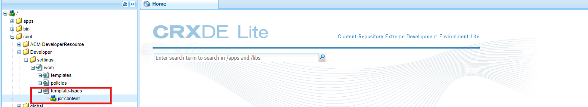

- Go to Tools --> general --> Template Folder --> Click on it.

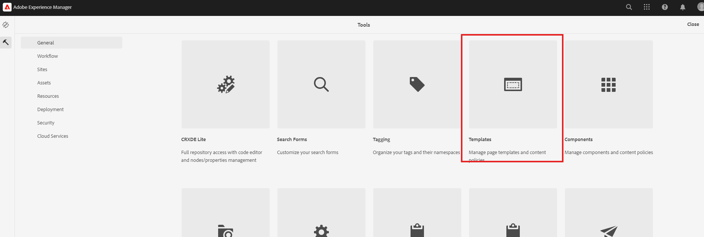

- Now you will be able to see the folder which is created earlier.

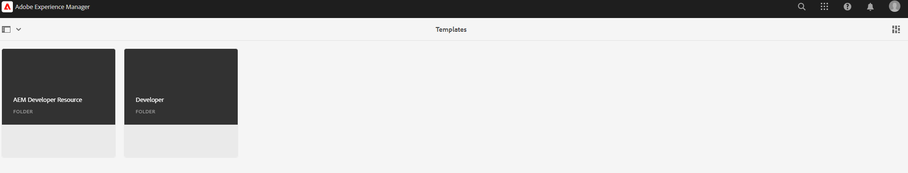

- Go inside the folder and Click on Create Button.

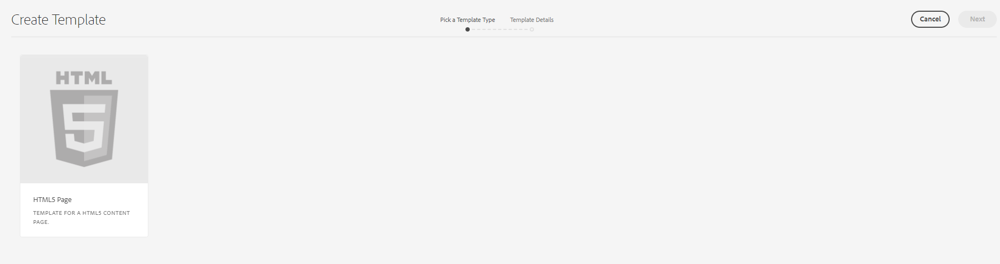

- You will find one template type which is coming from other resource Example it will check in the relative path if template type is not available in our project. 
    - /conf/myproject/myproject/settings/wcm/template-types
    - /conf/myfolder/settings/wcm/template-types
    - /conf/global/settings/wcm/template-types
    - /apps/settings/wcm/template-types
    - /libs/settings/wcm/template-types

### How to Create a Template Type 

- Best of creating template type is you can copy from wknd(project) or Any other project

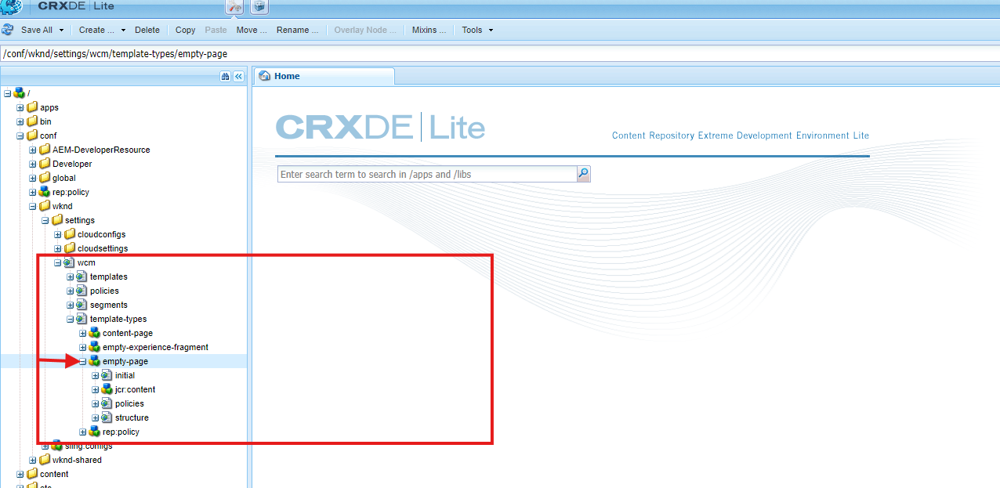 

- Once you copied the filed you can paste the file to your folder under template type and renamed the file name 

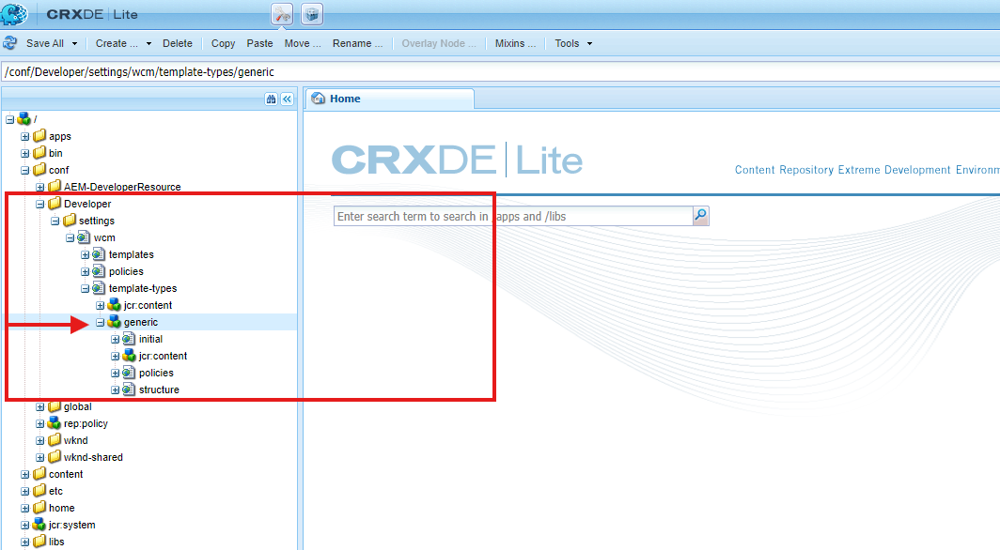

- Inside the folder jcr:content change the jcr:title and jcr:description.

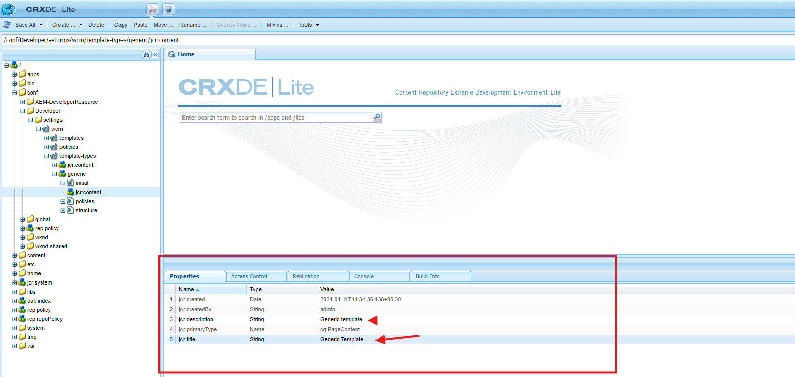

- Go to initial content node and change the sling:resourceType 

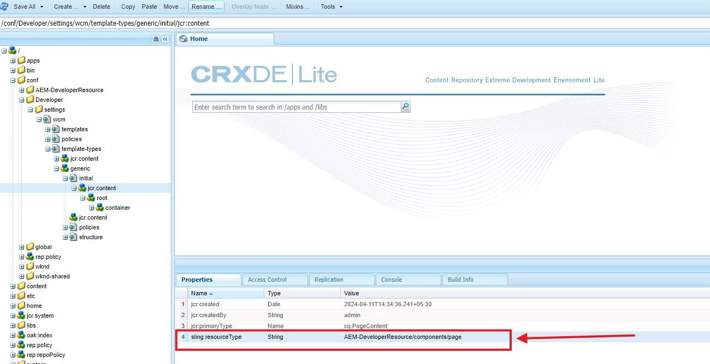

- Go to structure node and change sling:resourceType

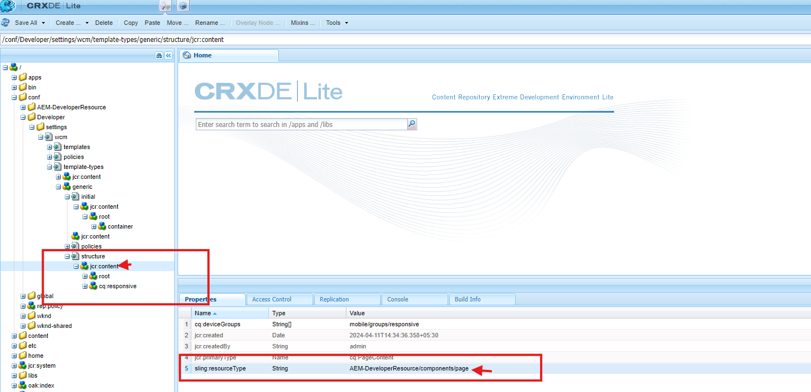

- Now we are ready with template type 

- Go back to tools --> general --> template --> your-Project Folder --> Click on Create Button

- You will find the template type which is created now.

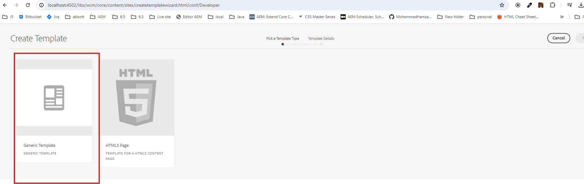

- Select the template type and create a template 

    - Need to add title 

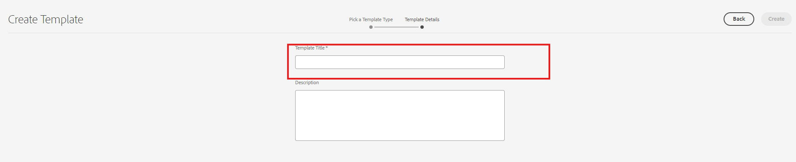

- Once you add the title click on create button

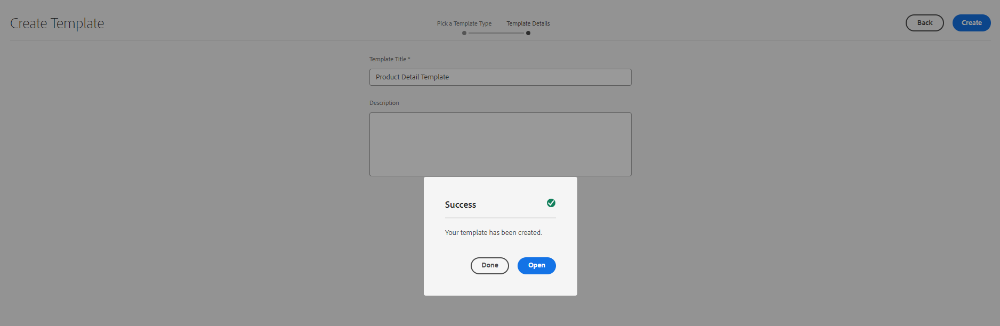

- Successfully we have created Template and using template type.

### Editable Template Structure.

- let's understand structure.

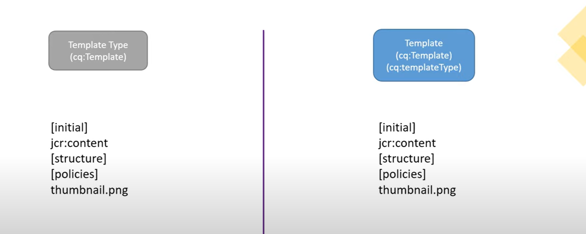

- Template Type (cq:Template).
    - Acts as the foundation for creating editable templates.
    - Contains configurations for.
        - [initial]: Defines the initial content or structure.
        - jcr:content: Node containing metadata and configurations for the template.
        - [structure]: Defines the layout and mandatory components for the template.
        - [policies]: Defines allowed components and associated settings.
        - thumbnail.png: Represents the template visually in the UI.
- Template (cq:Template and cq:templateType).
    - Created using the template type as the base.
    - Shares a similar structure:
        - [initial]: Used to define editable components and content available at page - creation.
        - jcr:content: Contains metadata and template-specific details.
        - [structure]: Layout and fixed components that cannot be removed.
        - [policies]: Restrictions and permissions for components.
        - thumbnail.png: Visual representation of the template in the interface.

- Static and Dynamic Reference.
    - Template Type ↔ Template: Static reference; changes in the template type do not affect existing templates.
    - Template ↔ Pages: Dynamic reference; changes in the template reflect on all pages created using that template.

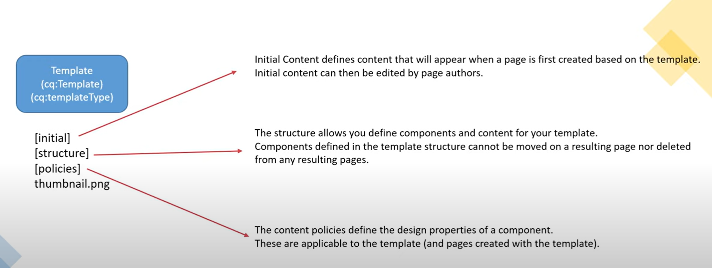

- **templates stored under /conf**

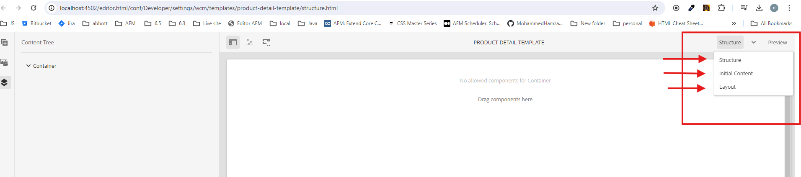

### what is structure tab.

- The structure if you want any components to be available on the page and content for your template.

- Components defined in the template structure cannot be moved on or deleted from any resultant pages.

- Changes made to the structure are reflected in any pages created with the template.

- After a component is unlocked, the editable property is set to true.

- After a component that already contains content is unlocked, this content is moved to the initial branch.

- The cq:responsive node holds definitions for the responsive layout.

- Components can be unlocked and locked again to let you define initial content.

- If you want page authors to be able to add and remove components, add a paragraph system to the template.

### what is Initial Content tab.

- initial you will defined the initial content and component which will be available when you create a page.
- Initial content can then be edited by page authors.

### Difference between initial and Structure tab

- In both you can add component and content to available when creating a page.
- The component you add in initial you can remove it.
- The component you added in the structure you cannot remove it.

### Introduction to Policies
- You can define what component need to allowed in the template using policies
- Equivalent to Design Mode in static templates.
- Define behavior and design properties for templates, components, and pages.
- Enable Style System, a robust feature for editable templates.

### What is a Content Policy?
- Sets design properties for pages and components linked to a template.
- Enables the Style System for customization (covered separately).

- Policy are divided into two types.
    -  Page Policy.
        - Defines global behaviors like client libraries, main selectors, etc., for all pages created using a template.
    - Content Policy.
        - Specifies allowed components and configurations for different template parts (e.g., parsys, containers).

### Page Policy
- Steps to Add a Page Policy.

    - Go to Template Editor → Click on Page Policy (3 dots menu).
    - Define properties like.
        - Client Libraries.
            - Base or dependency libraries (added to head or body).
            - Resource-specific libraries (icons, fonts, etc.).
    - JavaScript in Head: Add critical JavaScript to load before the page renders.
    - Main Selector: Helps identify the main section of the page.
    - Save changes.
- once changed saved, All pages created using the template will have these configurations applied globally.

### Content Policy
- Steps to Add a Content Policy.
    - Select the Container/Parsys in the Template Editor.
    - Click the Policy Icon and create a new policy or reuse an existing one.
    - Define.
        - Allowed components (e.g., form elements, global components).
        - Default components (optional auto-mapping based on media type).
        - Other options like background images, responsive columns, and styling (Style System).
    - Save and refresh the page to see the allowed components.
- Component-Specific Policy.
    - Some components (e.g., Form Container) may require their own policies for nested - components.
- Steps.
    - Select the component → Click Policy Icon → Define a policy specific to the component.
    - This overrides the parent container’s policy.

### Storage of Policies
- CRXDE.
    - Policies are stored under:
        - conf/<project>/settings/wcm/policies
        - Each template has a policy node referring to the actual policy.

- File System:
    - Policies are stored as single XML files under:
        - conf/<project>/settings/wcm/policies
- The file contains all policy details in a structured hierarchy (e.g., page, left, right sections).

- Now let add some policy to the template.

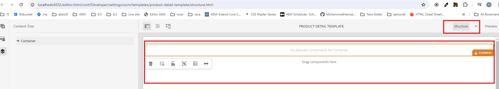

- In structure mode when you can on container component we don't have option to add component to it.

- so it enable that we need add policy to it.

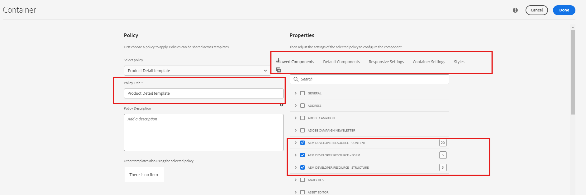

- Go the this url --> http://localhost:4502/sites.html/content/AEM-DeveloperResource/us/en 

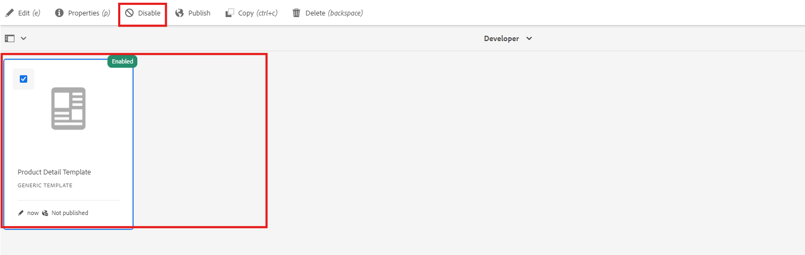

- you need to find your template in it. if your template is not visible 

    - Template is in draft mode
    - Template is not allowed 

- Let's make the template from draft to enable state.

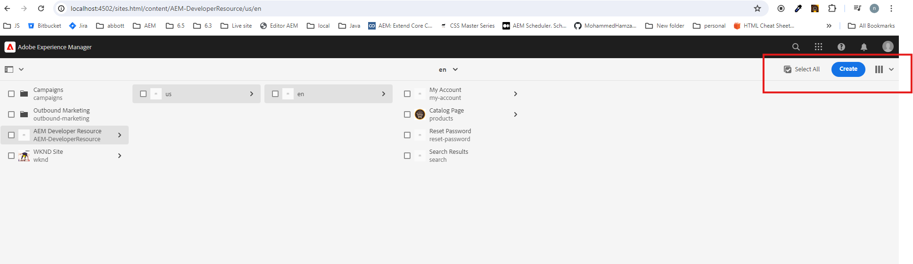

- After enable still you are not able find the template 

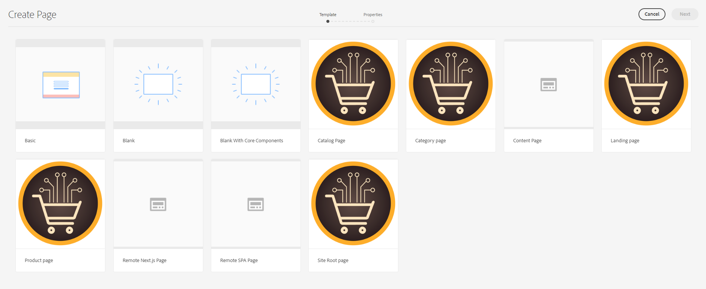

- Next you add in page properties under US--> page properties

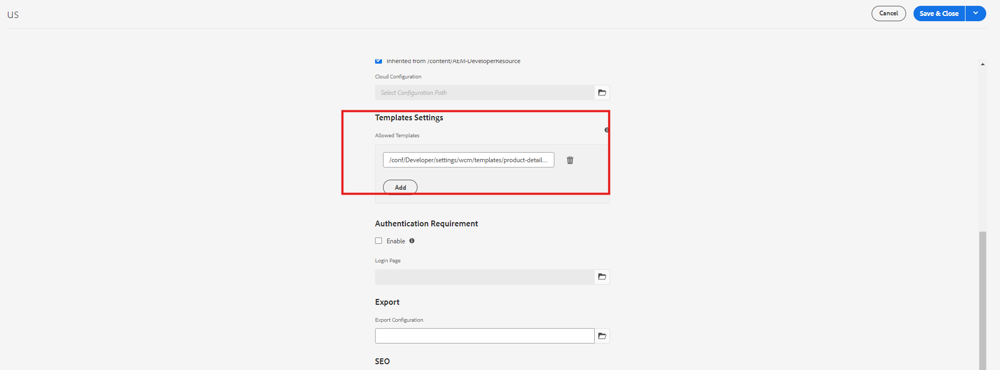

- now you will find your template when you are creating page.

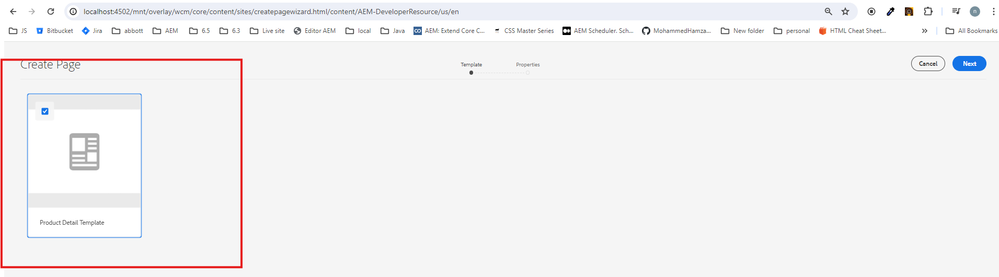

- let's create a page using this template.

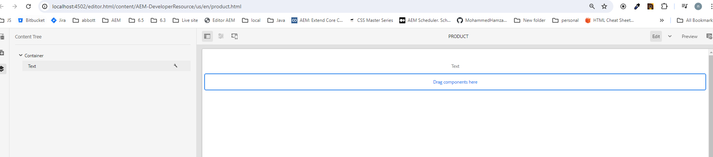

### Style System in Editable Template

- The style system in editable templates enables applying reusable styles to components and pages.
- Purpose to Avoids creating or modifying components for different UI needs.
- Usage.
    - Content authors and template authors can define styles.
    - Styles can be reused across pages and components.

- style system classified into two types.
    - Page-Level Style System
    - Component-Level Style System

### Page-Level Style System

- let understand page level style.
    - Navigate to the template editor.
    - Access Page Policy via the three-dot menu.
    - Define style groups under the "Styles" tab.
    - Example: A group named "Font Color" with options like "Red,". 
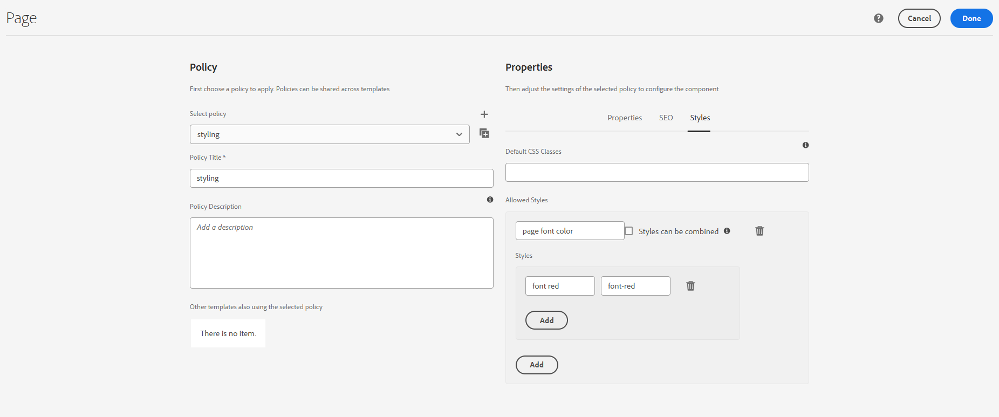       
    - Add the corresponding CSS for the classes defined in your project.
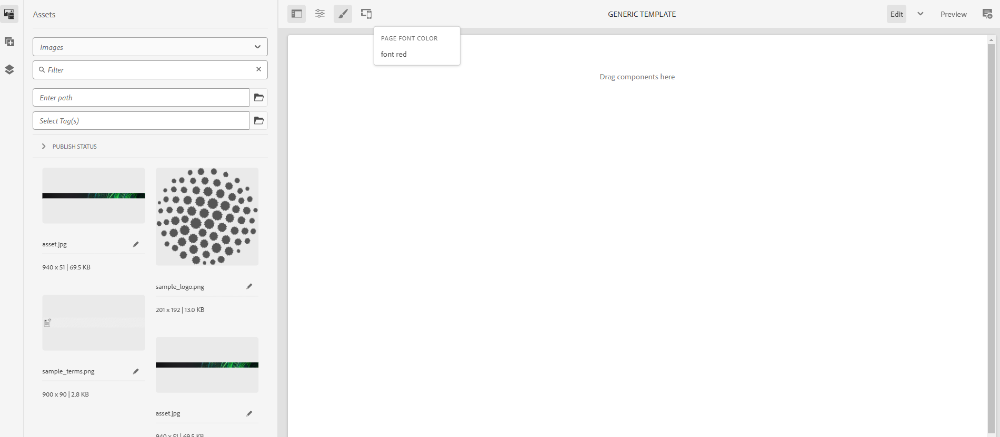 

### Component-Level Style System
- let understand Component level style.
    - Open the template editor.
    - Click the Policy Icon for the component.
    - Define styles specific to the component.
    - Example: Alignment styles like "Left," "Center," "Right."
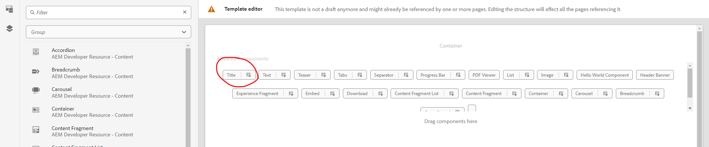       
    - Add CSS for the defined styles.
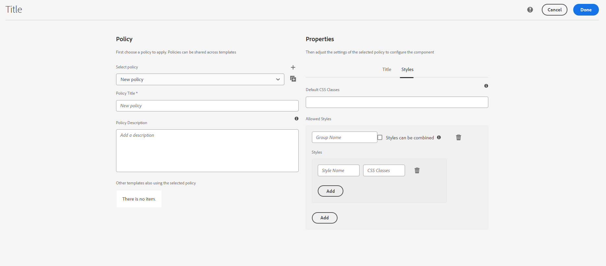        

### Combination of Page and Component Policies
- Sometimes, you need a mix of page and component policies to achieve advanced designs.

- Scenario.
    - You’re building a blog platform where.
    - The page background changes based on the category (e.g., Technology = blue, Lifestyle = green).
    - Individual blog titles need font size customization (e.g., small, medium, large).

- Page Policy: Define background colors for categories, category-tech, category-lifestyle, etc.
- Component Policy (Title): Add font size options for the title:
font-small, font-medium, font-large.    

### Interview Questions for Editable Templates in AEM

### General Questions

- What is an editable template in AEM, and how does it differ from a static template?
    - Answer: Editable templates allow flexibility by letting authors configure page structure and policies dynamically. Static templates are predefined and fixed, requiring developer involvement for changes.
    - Focus on reusability and authoring flexibility as the key benefits.

- What are the key components of an editable template?
    - Answer: Structure tab, Initial Content tab, and Policies.
    - Remember that structure defines layout, initial content provides defaults, and policies control styling and behavior.

- **Explain the difference between the Structure Tab and the Initial Content Tab**.
    - Structure Tab: Used to define the layout and allowed components. Changes here affect all pages using the template.
    - Initial Content Tab: Sets default content that authors can overwrite for individual pages.
    - Emphasize the relationship between global changes and page-specific customizations.

- What are the advantages of using editable templates over static templates?
    - Editable templates provide reusability, ease of maintenance, dynamic content customization, and empower authors to make changes without developer input.
    - Highlight the reduction of development effort and improved authoring experience.

- How do editable templates enhance reusability in AEM projects?
    - They allow developers to create generic templates that authors can customize using policies and style systems, eliminating the need for new templates for every variation.
    - Reusability = fewer templates + policy-based flexibility

### Editable Template Workflow

- Describe the workflow of creating an editable template in AEM.
    - Create a Template Type in the Templates console.
    - Define the Structure Tab for layout and allowed components.
    - Use the Initial Content Tab for default content.
    - Configure Policies for style and behavior.
    - Enable the template for authors to use.
    - Think of it as a step-by-step authoring tool setup.

- How does the Editable Template Editor function in AEM?
    - It provides a visual interface for developers and authors to create, edit, and manage templates without requiring backend development.
    - Mention that it is part of the Touch UI.
- What are the steps to add policies to an editable template?
    - Open the template in Template Editor.
    - Click on the Policy icon for the component or page.
    - Define and save the required policies (e.g., allowed styles).
    - Policies are associated with components and stored under cq:policy.

### Policies

- What is the purpose of a Content Policy in editable templates?
    - It defines rules and styles for components or pages, ensuring consistency across pages.
    - Policies = centralized style and behavior management.

- What is the difference between a Page Policy and a Component Policy?
    - Page Policy: Applied to the entire page (e.g., background color).
    - Component Policy: Applied to individual components (e.g., font styles for a Title component).
    - Page policies are global; component policies are granular.

- Where are policies stored in the JCR repository?
    - Under the cq:policy node within the conf folder.
    - Policies are linked to templates via references.

- How can you debug or troubleshoot policy-related issues in editable templates?
    - Check the conf folder for the policy configuration.
    - Ensure CSS classes defined in the policy exist in the front-end code.
    - Use the developer console to inspect added styles or classes.
    - Most issues arise from missing CSS or incorrect JCR paths.

### Style System
- What is the style system in AEM, and why is it used?
    - It enables authors to apply predefined CSS classes to components and - pages without developer intervention.
    - Think of it as a way to customize UI dynamically.

- How would you add a style to a component using the style system?

    - Open the template editor.
    - Select the component and click the Policy icon.
    - Define style groups and add class names.
    - Brush icon in author mode activates the style system.

- Explain the difference between Page-Level Styles and Component-Level Styles.
    - Page-Level Styles: Apply to the entire page layout.
    - Component-Level Styles: Apply to specific components.
    - Page = macro level; Component = micro level.

- How does the "Styles Can Be Combined" checkbox affect style system behavior?
    - It allows authors to select multiple styles from the same group, enabling compound styling.
    - Use it when multiple classes can coexist logically (e.g., bold + underline).

- What happens if a required CSS class is missing for a style system configuration?
    - The style won’t be applied, but the class will still appear in the DOM.
    - Always validate CSS availability during configuration

### Advanced Editable Templates Questions

- If a client requests different themes for their website pages, how would you configure this in AEM?
    - Use Page Policies to define themes (e.g., Light, Dark) and ensure CSS classes for those themes are present.
    - Add the theme class at the <body> level.

- How would you handle multiple components needing the same style or configuration?
    - Create a shared policy or style group that multiple components can reference.
    - Avoid duplication by reusing policies.

- How do editable templates interact with content fragments in AEM?
    - Editable templates can include content fragments by allowing components like the Content Fragment component in the template structure. This enables authors to embed and manage dynamic, reusable content fragments within pages created using the template.
    - Editable templates act as a container, while content fragments provide the content. Ensure the Content Fragment component is allowed in the template structure.

- can editable templates be versioned in AEM? How does versioning affect templates?
    - Yes, editable templates can be versioned. Each time a template is modified and saved, a new version is created automatically. Authors can revert to a previous version if needed.
    - Impact.
        - Versioning in Pages: Any updates in the template’s structure or policies may impact pages already using the template. These pages will reflect the latest changes unless locked.
        - Reverting Templates: Changes made to content authored on pages using the template are not reverted.
    - Be cautious about changes in live environments—test template updates thoroughly to avoid breaking page layouts.

- What are the limitations of editable templates, and how can you work around them?

    - Limitation: Templates may not cater to highly dynamic layouts without custom logic.
    - Workaround: Use the Layout Container to offer flexibility in layout design.
    - Limitation: Dependency on predefined policies may restrict some customization.
    - Workaround: Encourage well-structured CSS and policy configurations to maximize flexibility.
    - Limitation: Editing an editable template impacts all pages created with it.
    - Workaround: Lock pages where no further updates from the template are required to maintain stability.
    - Limitation: Cannot override template settings per page without advanced customization.
    - Workaround: Use page-specific configurations like page properties or overrides.

- How do editable templates impact content inheritance and page hierarchy?

    - Inheritance.
        - Editable templates define the structure and policies that all pages derived from them inherit. Changes to the template automatically propagate unless a page is locked from updates.
    - Page Hierarchy.
        - Editable templates streamline the creation of consistent hierarchical structures by providing pre-defined layouts and allowed components for child pages.
    - Impact on Authors: Authors save time by inheriting consistent structures and layouts. However, any inherited changes in live templates can disrupt pages if not planned.
    - Use inheritance cautiously and communicate template updates to content authors to avoid disruptions.    

