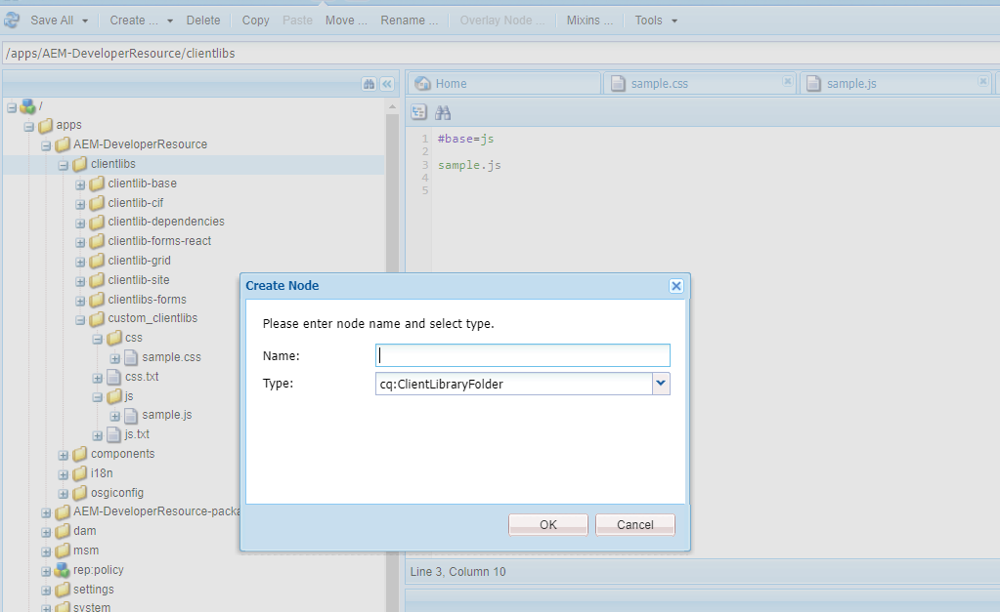
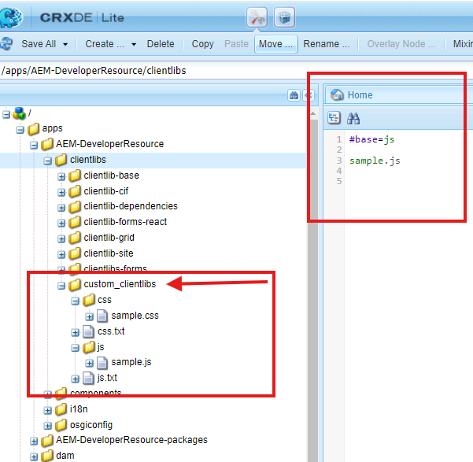
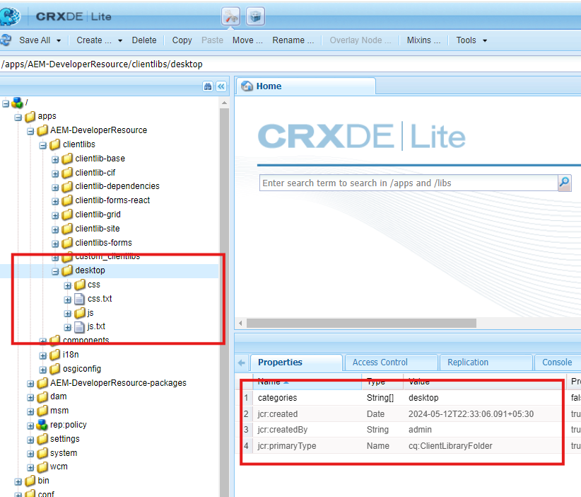
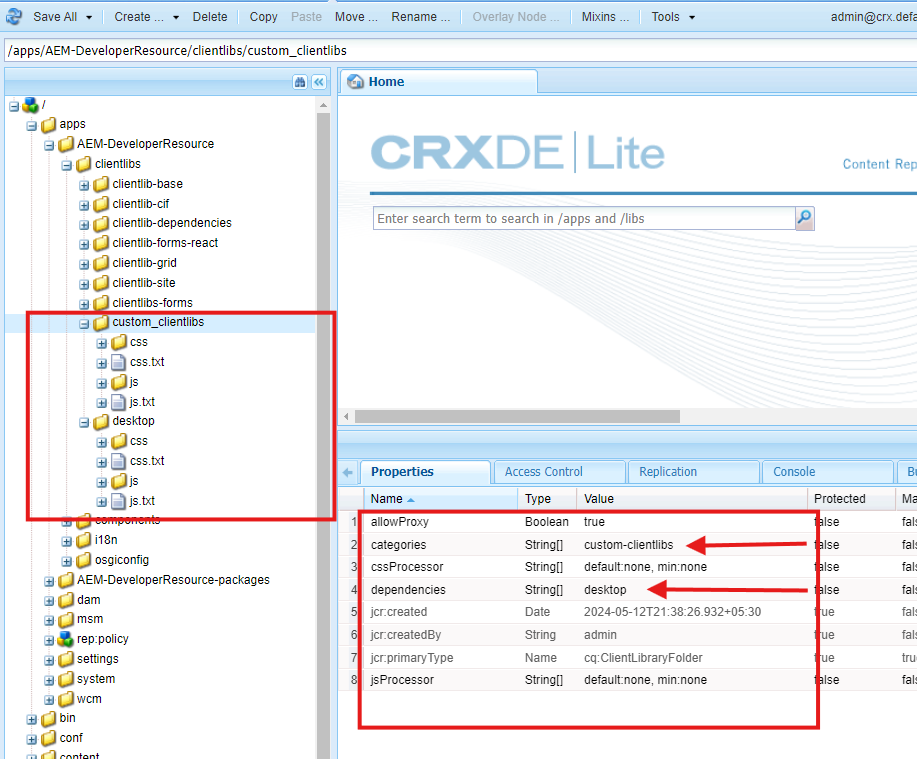
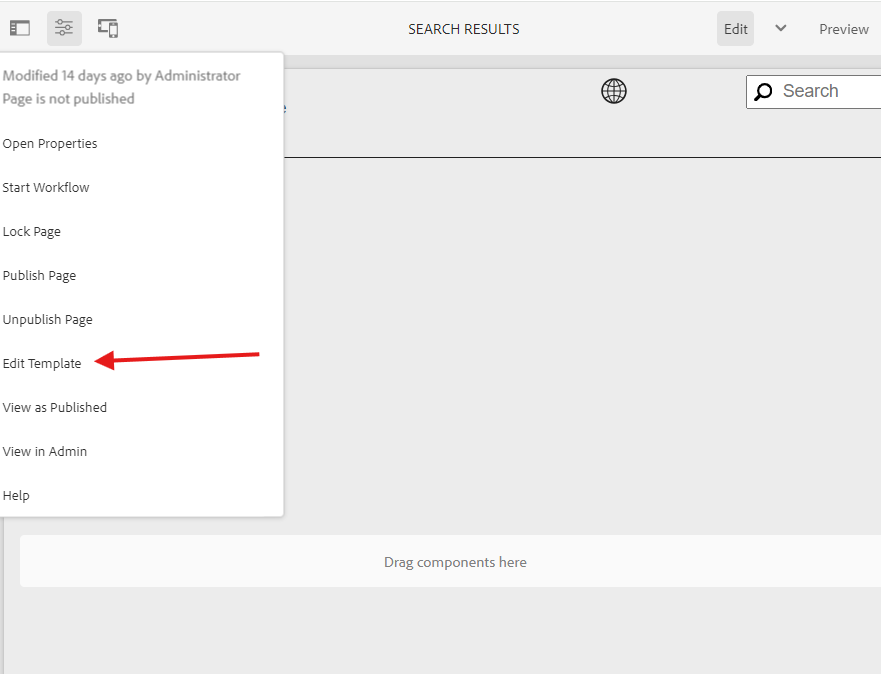
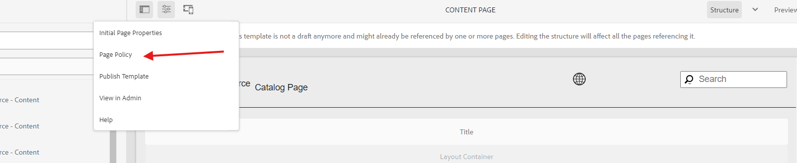
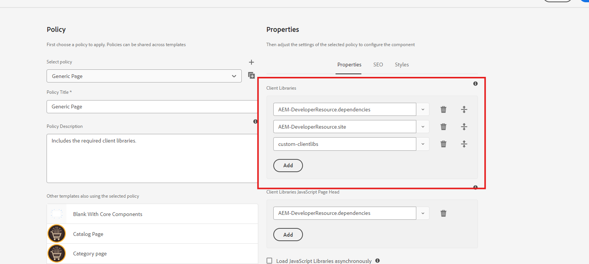
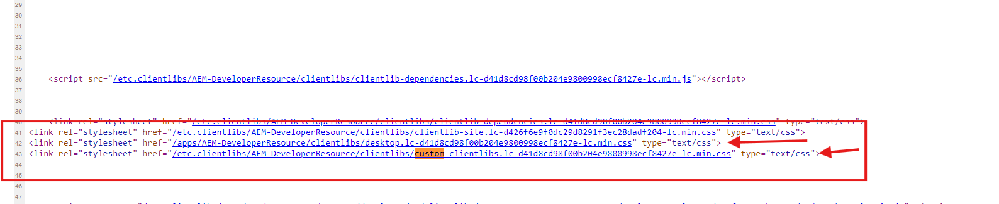

### Objective

- After reading this Article, You should have an Understanding of 

    - [What is Clientlibs ?](#what-is-clientlibs)
        - [Key Features of Clientlibs](#key-features-of-clientlibs)
        - [How to Create Clientlibs using crx/de](#how-to-create-clientlibs-using-crxde)
        - [Properties of Client Libraries](#properties-of-client-libraries)
            - [What is Categories ?](#)
            - [What is allowProxy ?](#)
            - [What is channels ?](#)
            - [What is Dependencies ?](#)
            - [What is Embed ?](#)
        - [Enable Using Policy](#using-policy)
        - [Using Javascript use API](#using-javascript-use-api)
        - [Loading Clientlibs Dynamically for Specific Components](#loading-clientlibs-dynamically-for-specific-components)
        - [Environment-Specific Loading](#environment-specific-loading)
        - [Common Interview Questions](#common-interview-questions)
    

### What is Clientlibs ?

- Clientlibs (Client Libraries) in Adobe Experience Manager (AEM) is a powerful feature used to manage and optimize the delivery of front-end resources like JavaScript, CSS, images, and fonts.

- AEM uses clientlibs to ensure efficient loading of resources, reducing page load times and maintaining modularity.

### Key Features of Clientlibs
-   Clientlibs combine multiple JavaScript and CSS files into a single file to reduce HTTP requests.
- Minification removes unnecessary characters (like spaces and comments) from the code to reduce file size.
- Clientlibs can declare dependencies on other clientlibs using the dependencies property. This ensures that files are loaded in the correct order.
- AEM automatically handles caching for client libraries, assigning a unique fingerprint (hash) to the file name based on its content. This ensures browsers only fetch updated versions when changes occur.
- Different clientlibs can be created for different themes or device types (e.g., mobile vs desktop).

### Properties of Client Libraries
- What is Categories ?

    - Uniquely identifies a client library for inclusion on pages or components.
    - categories property in AEM Client Libraries allows multiple values. This is achieved by using a multi-value property.

- What is allowProxy ?

    - The allowProxy property determines whether a Client Library can be accessed via AEM's Client Library Proxy Servlet.
    - When set to true, clientlibs can be accessed through /etc.clientlibs, which masks the actual path of the library, providing security and modularity.
    - When set to false, the clientlibs can only be accessed directly from their absolute path (e.g., /apps/your-app/clientlibs).    

    - allowProxy=false: Use Case for Internal-Only Libraries

        - These are not meant for public access but are used internally by components or templates.
        - Setting allowProxy=false restricts access, ensuring the library is only available within the application scope.
        - This is useful for sensitive resources or development-specific libraries.

- What is channels ?

    - The channels property allows you to define Clientlibs specifically for different channels, such as:
        - Desktop
        - Mobile
        - Tablet
    - This helps optimize resource delivery by tailoring libraries for different devices or platforms.
    - channels = ["mobile", "desktop"]

- What is Dependencies ?
    - is used to load the another clientlibs before our clientlibs.
    - EXAMPLE:
        - custom-clientlibs and desktop clientlibs so i want to load the desktop clientlibs before the custom-clientlibs to active we use dependencies.
    - Enables shared resources across libraries.

- What is Embed ?
    - Combines multiple files into one to reduce requests.
    -  embed helps us in combining all clientlibraries and load it as single CSS and JS file. If A category embeds two different categories as B and C. The resulting CSS and JS will have one single JS and CSS file.


- cssProcessor is to process CSS file using min:yui compiler

- jsProcessor is to process JS file using min:yui compiler

### How to Create Clientlibs using crx/de

-  Go to crx/de --> http://localhost:4502/crx/de/index.jsp

-  Go inside apps folder --> Go to clientlibs 

-  Right Click on clientlibs folder and click on create --> node

    - node type cq:ClientLibraryFolder and name can be anything.




- Create CSS and JS folders to place respective CSS and JS files.



- create sample.js and sample.css files.

- Create below js.txt file inside JS folder to declare file names which needs to be load as part of custom-clientlibs category.
    - base=js represents .js files root folder name.
```js
#base=js
sample.js
```
- Create below css.txt file inside CSS folder to declare file names which needs to be load as part of practice.custom-clientlibs category.
    - base=css represents CSS files root folder name.
```cs
#base=css
site.css
```
- once you are done with creating the folder structure 

- you can test weather clientlibs is working or no, Hit the below url to test.

    - Example: http://localhost:4502/apps/AEM-DeveloperResource/clientlibs/custom_clientlibs.js


- Create one more client library folder follow above steps.




- create below properties under custom-clientlibs.



- Once you added all the properties you need load your clientlibs.

- Go to page http://localhost:4502/editor.html/content/AEM-DeveloperResource/us/en/search.html


### Using Policy
- Using page component policy we can load client library on the page as shown below.

- Go to page level and Click on editable template.



- Click on page policy



- add your clientlibs --> category name and click on done.



- Once added your category name refresh the page and go to view page source

- You will find desktop is loaded first and custom-clientlibs is loaded next this worked by adding dependencies.



- clientlibs is a multiple value property which allows us to load multiple client categories at the same time.

- clientlibsJsHead allows us to load only JS for mentioned client category.

- clientlibsCssHead allows us to load only CSS for mentioned client category.

```html
<page jcr:primaryType="nt:unstructured">
    <policy
        jcr:description="Include Client libraries."
        jcr:primaryType="nt:unstructured"
        jcr:title="Page Component"
        sling:resourceType="wcm/core/components/policy/policy"
        clientlibs="[desktop,custom-clientlibs]"
        clientlibsJsHead="desktop">
        <jcr:content jcr:primaryType="nt:unstructured"/>
    </policy>
</page>
```

### Using Javascript use API
- Below is the code snippet to load both js and css for mentioned clientlib category as shown below:

```html
<sly data-sly-use.clientlib="core/wcm/components/commons/v1/templates/clientlib.html">
    <sly data-sly-call="${clientlib.all @ categories='AEM-DeveloperResource.base'}"/>
</sly>
```

- clientlib.all to load both CSS an js files

- clientlib.css to load both CSS files. Below statement helps us to load CSS as part of header.
```html
<sly data-sly-call=”${clientlib.css @ categories=’practice.base’}”/>
```
- clientlib.js to load both JS files. Below statement helps us to load JS as part of footer.
```html
<sly data-sly-call=”${clientlib.js@ categories=’practice.base’}”/>
```

### Loading Clientlibs Dynamically for Specific Components

- You might want to load specific client libraries only when a particular component is rendered on a page. This approach optimizes performance by reducing unnecessary resource loading.

- Using Sling Models and data-sly-test
- You can dynamically include clientlibs in your HTL templates based on conditions

```html
<sly data-sly-use.clientlib="core/wcm/components/commons/v1/templates/clientlib.html">
    <!-- Load clientlibs only if the condition is true -->
    <sly data-sly-test="${component.enabled}">
        <sly data-sly-call="${clientlib.all @ categories='your-component-clientlib'}" />
    </sly>
</sly>

```
- data-sly-use.clientlib:

    - This imports the clientlib helper script for dynamically including client libraries

- data-sly-test:

    - This checks the condition (e.g., ${component.enabled}) to determine if the clientlib should be included.

    - Replace component.enabled with the actual logic (e.g., checking a component property or context variable).    

- data-sly-call:
    - Loads the required client libraries using their category name (your-component-clientlib).

    - Use clientlib.all to include both CSS and JS.
    
    - Alternatively, use clientlib.css or clientlib.js to load only CSS or JS, respectively

 ```html
 <sly data-sly-call="${clientlib.css @ categories='your-component-clientlib'}" />
<sly data-sly-call="${clientlib.js @ categories='your-component-clientlib'}" />
```

### Environment-Specific Loading 

- You can conditionally load clientlibs in your HTL scripts based on 

    - Editor mode
    - preview mode

```html
<sly data-sly-use.clientlib="core/wcm/components/commons/v1/templates/clientlib.html">
    <sly data-sly-test="${wcmmode.edit}">
        <!-- Load editor-specific clientlibs -->
        <sly data-sly-call="${clientlib.all @ categories='editor-clientlibs'}" />
    </sly>
    <sly data-sly-test="${wcmmode.disabled}">
        <!-- Load user-specific clientlibs -->
        <sly data-sly-call="${clientlib.all @ categories='user-clientlibs'}" />
    </sly>
</sly>

```

### Common Interview Questions
- What are Client Libraries?
    - Clientlibs (Client Libraries) in Adobe Experience Manager (AEM) is a powerful feature used to manage and optimize the delivery of front-end resources like JavaScript, CSS, images, and fonts..

- Purpose of Allow Proxy?
    - To hide actual paths for security reasons.

- How to debug missing dependencies?
    - Your CSS/JS isn't loading or the page layout appears broken due to missing files.

    - Steps to Debug.
        - Check the Page Source:
            - Open the browser's developer tools.
            - Inspect the network tab to see if the required CSS/JS files are being loaded.
    - Verify Dependencies in crx/de.
        - Navigate to the client library in crx/de.
        - Check the dependencies property to ensure all required clientlibs are listed.
    - Inspect Logs.
        - Check the AEM error logs (/system/console/slinglog) for warnings or errors related to clientlibs.
    - Check File Paths.
        - Ensure files listed in css.txt or js.txt have the correct file paths and names.
    - Validate Categories.
        - Ensure the correct category is specified in the data-sly-call or <cq:includeClientLib> tags.    

-  What happens if two clientlibs have the same category name?

    - AEM merges all resources (CSS, JS) from clientlibs with the same category name into a single - output.

    - Files are combined in the order they are listed in css.txt and js.txt files across all matching - clientlibs.

    - Potential Issues.

        - File Overwrites: If files have the same name across clientlibs, the last one loaded will overwrite the previous one.

        - Unintended Styling or Functionality: Conflicting CSS or JS could cause unexpected behavior.
    - Use unique category names for unrelated clientlibs.
    - Use the embed property to include other libraries explicitly instead of reusing the same category.
    - Organize resources in separate libraries based on functionality (e.g., desktop-styles, mobile-scripts).           

- What is the difference between dependencies and embed properties?
    - Dependencies.
        - Ensures that a clientlib is loaded before the current one.
        - Example: Declaring desktop-clientlib as a dependency for custom-clientlib ensures that desktop-clientlib is loaded first.
        - Resources remain separate.
    - Embed.
        - Combines multiple clientlibs into a single file for better performance.
        - Example: Embedding desktop-clientlib into custom-clientlib results in a single output file containing resources from both libraries.    
- How can I test clientlibs locally?
    - Use the direct clientlib URLs:
        - Example: http://localhost:4502/etc.clientlibs/your-project/clientlib-name.js
    - If the file does not load:
        - Verify the folder structure, css.txt, js.txt, and the allowProxy property.        