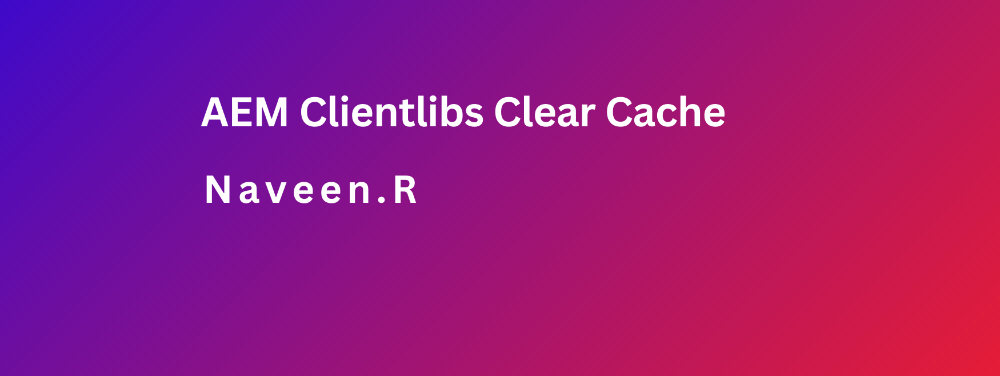

### Objective

- After reading this Article, You should have an Understanding of 

    - [AEM clientlibs clear cache and recompile clientlibs in Local Environment](#aem-clientlibs-clear-cache-and-recompile-clientlibs-in-local-environment)
    
    - [Why Rebuilding Clientlibs is Necessary](#why-rebuilding-clientlibs-is-necessary)
    - [Step-by-Step Process with Explanations](#step-by-step-process-with-explanations)
    - [Alternative Methods for Rebuilding Clientlibs](#alternative-methods-for-rebuilding-clientlibs)

### AEM clientlibs clear cache and recompile clientlibs in Local Environment

- As it consists of JS and CSS and in some instances they get cached and you can face some issues while developing.

-  it's particularly useful for developers during debugging and QA teams verifying updates.

### Why Rebuilding Clientlibs is Necessary

- Caching Issues

    - Browser Caching: Browsers cache JS and CSS to reduce load times, but updates may not appear immediately. This happens if the browser serves an older cached version.

    - AEM Caching: AEM also caches clientlibs for performance. If the cache isn't invalidated, new changes might not be recognized or served.

- Why Rebuilding Helps

    - Forces Refresh: Rebuilding clears caches, ensuring AEM fetches and compiles the latest versions of clientlibs.

    - Immediate Updates: Ensures changes (like new styles or bug fixes) are applied and visible to users without using outdated files.

- Typical Scenarios for Rebuilding
    - During Development: Changes to clientlibs may not show up until caches are cleared.
    - After Adding/Removing Dependencies: Rebuilding ensures dependencies are included and loaded in the correct order.
    - After Modifying Resources: Rebuilding ensures new or modified JS/CSS files are applied.
    - Ensures Fresh Versions: Rebuilding guarantees all changes are compiled and ready for testing or deployment..

### Step-by-Step Process with Explanations

-  Navigate to the Dumplibs URL 

    - [http://localhost:4502/libs/granite/ui/content/dumplibs.rebuild.html](http://localhost:4502/libs/granite/ui/content/dumplibs.rebuild.html)
    - This URL is Accessible in local env.

- Click Invalidate Caches.
    - Mention that this clears the current cache of client libraries, forcing AEM to re-fetch the   latest versions.
- Click Rebuild Libraries.
    - Explain that this compiles the client libraries again, ensuring that all dependencies and embedded resources are refreshed.

- Check Browser Cache
    - After invalidating and rebuilding, clear your browser cache to avoid using stale clientlibs.
- Inspect Page Source
    -  Verify that the correct clientlibs are being included by viewing the page source or using developer tools.

-  Some environments may block direct access to the Dumplibs page. Provide an alternative method (e.g., using the Felix console).

### Alternative Methods for Rebuilding Clientlibs

- In some environments, direct access to the Dumplibs page may be blocked. In these cases, developers can use other tools to clear and rebuild clientlibs:

- Using the CRX/DE Lite Console

    - CRX/DE Lite is a web-based tool that allows developers to interact with the AEM repository. It can be used to clear clientlibs and perform rebuilds.

    - Navigate to CRX/DE Lite at: http://localhost:4502/crx/de

    - From here, developers can browse the repository, locate the clientlib folder, and manually invalidate or trigger a rebuild.

- Using the Felix Console

    - The Felix Console allows for more advanced management of AEM components, including cache management and triggering rebuilds of clientlibs programmatically.

    - Access the Felix Console at: http://localhost:4502/system/console

    - Developers can use the Apache Sling Cache Manager to invalidate cache and manage clientlib rebuilding processes. This console offers finer control and can be especially useful when working with multiple environments.

- Using AEM Scripts or Sling Servlet
    - Developers can create custom Sling Servlets or scripts to trigger cache invalidation and clientlib rebuilds. These can be invoked from the AEM UI or through backend tasks, providing flexibility when dealing with more complex environments or automation.
