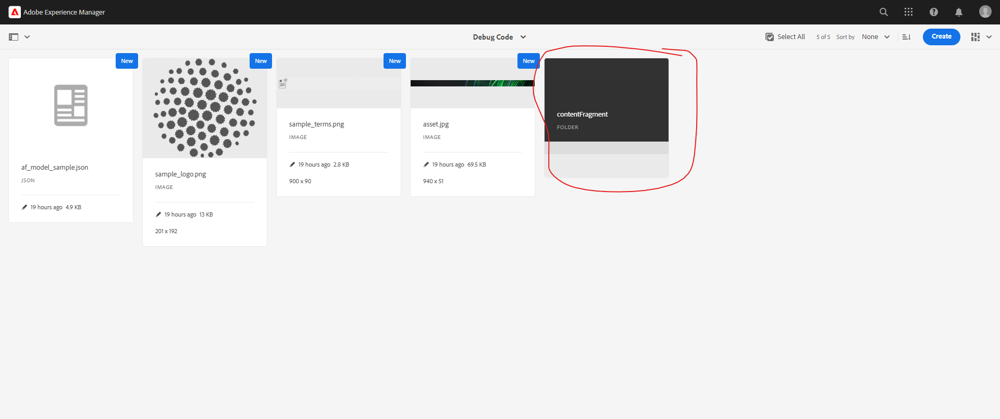

### Objective

- After reading this Article, You should have an Understanding of 

    - [What is Content Fragment Model ?](#what-is-content-fragment-model)
    
    - [Key Features of Content Fragments](#key-features-of-content-fragments)
    - [Content Fragment Architecture](#content-fragment-architecture)
    - [Workflow of Content Fragment Creation and Management](#workflow-of-content-fragment-creation-and-management)
    - [How to Create a Content Fragment Model in AEM](#how-to-create-a-content-fragment-model-in-aem)
    - [How to Access the Content Fragment using Component](#how-to-access-the-content-fragment-using-component)
    - [Differenec between Sling Model Exporter and Asset API](#differenec-between-sling-model-exporter-and-asset-api)
    - [Version Compare](#version-compare)
    - [Annotation](#annotation)
    - [Text Statistics](#text-statistics)

### What is Content Fragment Model ?

- Content Fragment in AEM is a piece of content that is created and managed independently by specific page or website. 

- It typically contains text, media (like images), and metadata, and is created to be used across multiple channels (e.g., websites, mobile apps, and social media) without the need to duplicate content.

- Content Fragments are part of AEM's DAM (Digital Asset Management) system and are stored as assets.

- They are often used for structured content, such as articles, product descriptions, or other types of content that can be reused and displayed across various contexts.

### Key Features of Content Fragments

- Reusable: Can be used across different pages, websites, and applications.

- Structured: Can contain structured data, like text, numbers, dates, and multi-field options.

- Content Management: Separate from the layout and design; focuses only on the content.

- Separation of Content and Presentation: Allows marketers and content creators to focus solely on the content, without worrying about the design.

### Content Fragment Architecture

### Workflow of Content Fragment Creation and Management

- Create Content Fragment Model – Define structure and fields (Author, Date, Description, etc.).

- Create Content Fragment – Enter content based on the model’s fields.
- Edit and Review – Make changes, version content, and manage approval workflows.
- Publish – Publish the content fragment for use in multiple channels.
- Reuse and Display – Integrate and display content across pages, websites, and apps.
- Update and Maintain – Monitor usage, update content, and push changes to all instances.

### How to Create a Content Fragment Model in AEM

- Navigate to Content Fragment Model

    - Go to Tools > Assets or General and select Content Fragment Model

        

    - now click on content fragment folder.

        

    - If your folder is not visible, it may be due to two reasons.

        - The folder doesn't exist.

        - The folder exist lacks of permissions to create content fragment models.

    - The folder doesn't exist.

        
    
- Creating a New Folder

    - If the folder is missing, create a new folder -> go to Tools > Configuration Browser.

        

    - Ensure that the new folder has the necessary permissions to create content fragment models.

         

- Ensure Folder Permissions:

    - To resolve folder visibility issues, go to Tools > Configuration Browser.
    
    - Locate your project-specific folder (e.g.,).
 
    - If it's not visible, your folder might not be allowed to create content fragment models.
    
    - Right-click on the folder > select Properties > check the Content Fragment Model checkbox to enable model creation.

        

- Create Content Fragment Model:

    - Go back to Tools > Assets or General > Content Fragment Model.

    - Now, your folder should be visible, and you can create a new content fragment model by clicking on it.

        

    - click on your folder you will find create button.

          

    - once you click on create button You will be prompted to name the model. For example, name it debugcode to create an content fragment model.

         

    - click on save button

- Editor Interface

    - After creation, you'll be presented with a Canvas and on the right-hand side, you'll see available Data Types and Fields.    

         

    - This is where you'll define your content fragment model's structure.     

- Add Fields to Content Fragment Model

    - Click on the Data Types to add fields

    - Add a Single Line field for "First Name".

        - Define the field's Label (e.g., "First Name").

        - Set the Property name, which is used to store the data (e.g., "firstName").

        - You can also add placeholder text, default values, and descriptions.

    - Add Multi-field.

        - You can add a Multi-field to allow for multiple entries.
        
        - Example: Add a Books Name field as a multi-field, where users can add multiple books.
        
        - Define a Property name (e.g., "books") and description for this field.

    - Add Boolean Field.

        - Add a Boolean field to represent a checkbox (e.g., "Is Author").

        - Set the Property (e.g., "isAuthor") and define a default value (checked or unchecked).

    - Add Date Field.

        - Add a Date field for attributes like "Published Date".

        - Define the Property (e.g., "publishedDate").
    
        

- Save Content Fragment Model

    - Once you've added all necessary fields, click Save to complete the content fragment model creation.

- great work !!! your CF Model is now ready for further use. 

- Location of Content Fragment Models

    - Content Fragment Models are stored in your project-specific folder within the conf directory.

    - The path is: /conf/[your project]/dam/contentfragmentmodel/models.

        

    - You can view and manage your created models from here.

- Manage Content Fragment.

    - Now we are creating a folder inside the dam

    - Go to -> Assets -> 

        

    - Files -> Project Folder ->

        

    - Create a Folder

        

    - In this folder we will create all the content fragment using content fragment model.

        
    
    - Once Folder is created, click on create -> Content Fragment Button  

        
    
    - you have see the model which we have created earlier. if it's not appearing.

        
    
    - Enable the model which you have created - Go To - Folder - Select Folder - Click - Properties -Enable this options and click on Save Button

         

    - Now Go to the folder Select Content Fragment 

        
    
    - Now you will find the Model which we have created earlier using this model we can create content fragment as many as you want

        
    
    - then you will see all the models you created under your CF Model folder here. Select your model and click Next

    - Give your content fragment a name, description (optional), and tags (optional). Then select Create.

        

    - Select your content fragment and edit it. Now you can see all the fields you added during the creation of the CF Model. Now Author all the values and click save.

    - Congrats!!! Now you know how to create a content fragment.

- Publish and Reuse

    - Once the content fragment is created and reviewed, publish it

    - The content fragment can now be used across multiple pages, apps, or even exported as Raw JSON for third-party integration

        

### How to Access the Content Fragment using Component

- Here I am explaining how to use content fragment in the page 

    - Go to -> Sites -> Any Page -> Drag Component - Content Fragment 

    

    - Select Component and authored some filed which i have shown in the below image

    

    - Click on done. you will get the data on the page, what ever is authored in content fragment 

    

### How to Export Content Fragment content in JSON Format.

- Content Fragment Content Export in two ways.
    - Sling Model Exporter
    - Asset API

- Sling Model Exporter

    - Go To -> CRX/de -> /content/AEM-DeveloperResource/us/en/generic-template/jcr:content/root/container/contentfragment

    - This Path where content fragment component is used and saved the content.

    - To get in json format use this format -> http://localhost:4502//content/AEM-DeveloperResource/us/en/generic-template/jcr:content/root/container/contentfragment.model.json

- Asset API

    - Go To -> Asset -> File -> Your Project Folder -> Content fragment folder - Select content fragment -> click on Edit -> Below URL will show in Search Bar

    - http://localhost:4502/editor.html/content/dam/debugcode/contentfragment/product2

    - Remove -> editor.html/content/dam 

    - add -> api/assets

    - End add -> json 

    - http://localhost:4502/api/assets/debugcode/contentfragment/product2.json

    - using asset api you will be seeing all the content

### Differenec between Sling Model Exporter and Asset API

- Using Sling Model Exporter you can only what ever are using on the page.

- Using Asset API you can have complete data including master and variations.

### Version Compare

- Go to -> Asset -> Content Fragment Folder -> Select one Content Fragment -> Click on Timeline option

    

- you have two option in the image.
    - compare to current

    

    - Revert to this version 

### Annotation

- Go to content fragment select the icon show below

    

- once opened you need add the annotation

    

- you can see what annotation is given

     

### Text Statistics

- To check overall text in the content fragment 

    

