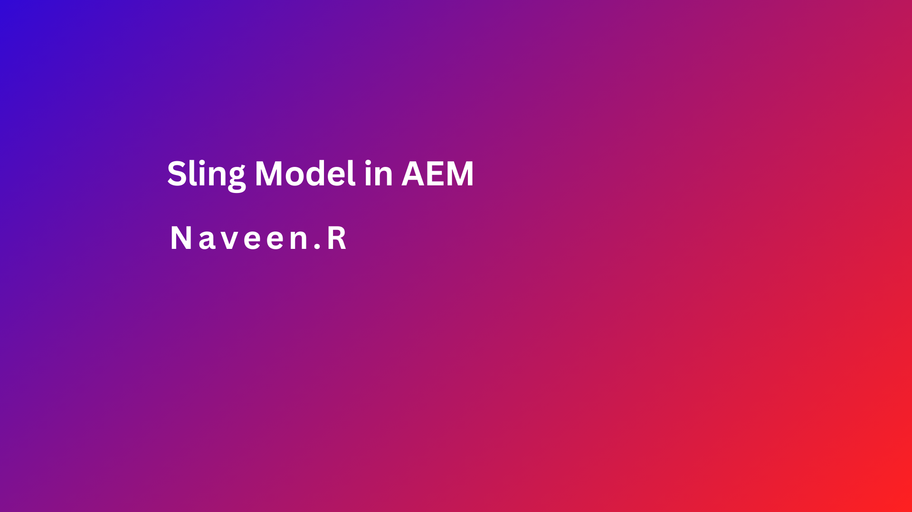
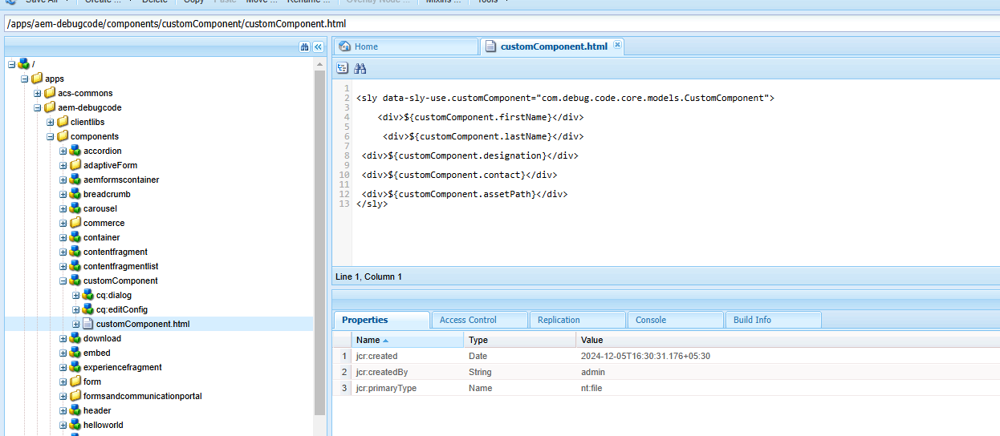
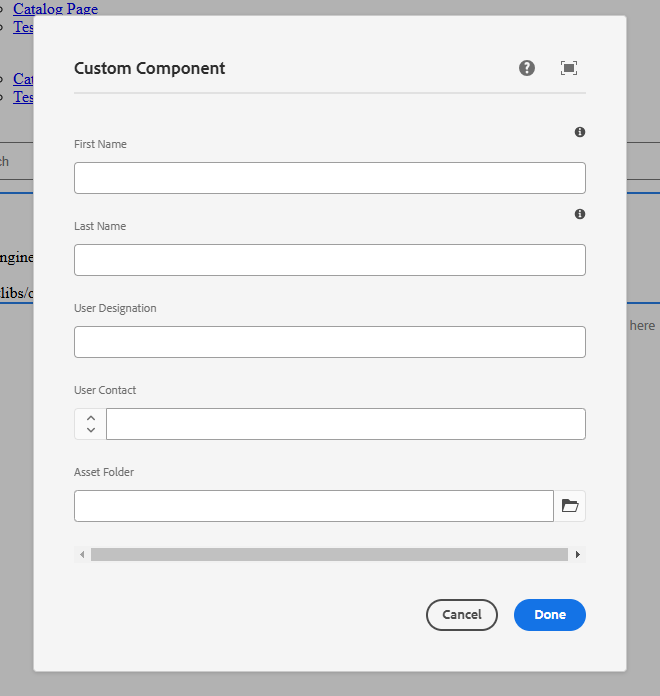
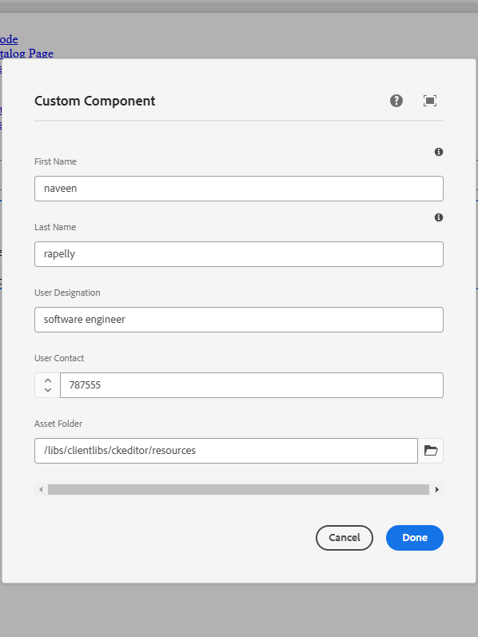
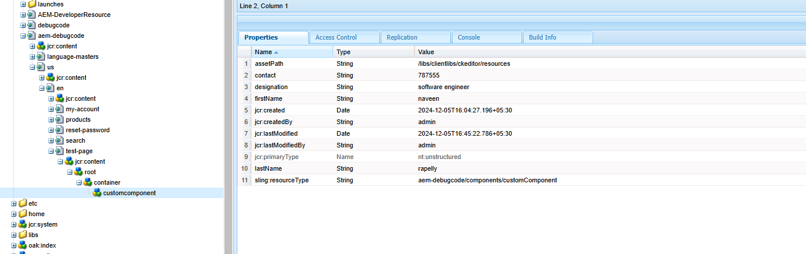
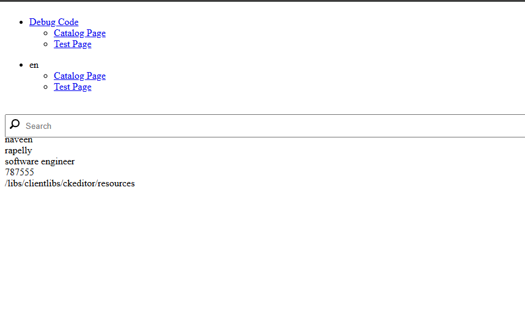
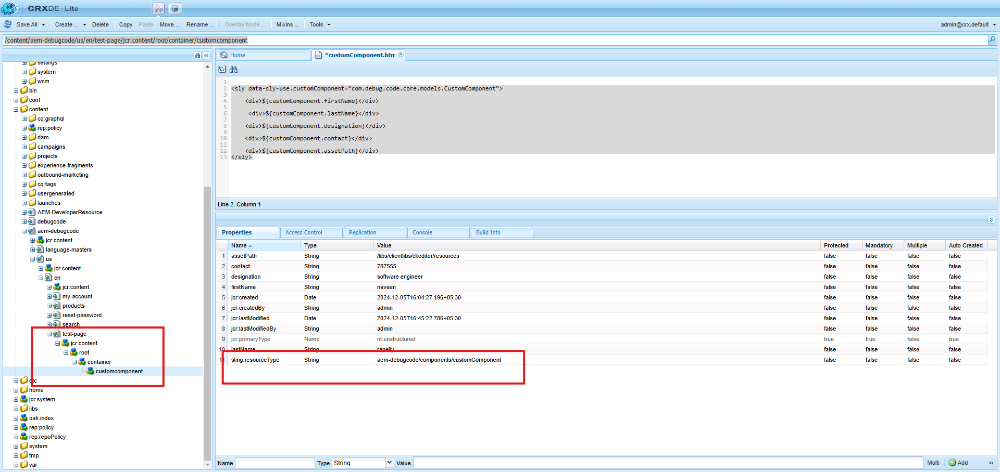

### Objective

- After reading this Article, You should have an Understanding of 

    - [What is Sling Model ?](#what-is-sling-model)
    
    - [How Many Ways We Can Adapt Sling Model ?](#how-many-ways-we-can-adapt-sling-model)

    - [Lets Understand Above Attributes](#lets-understand-above-attributes)

    - [Create a Component using Sling Model](#lets-create-a-component-using-sling-model)

    - [Sling Model Work Flow](#sling-model-work-flow)

### What is Sling Model ?

- Sling Model is the one of restful framework which is created inside the AEM Architecture which is used to map request or resource objects.

- They also allows us to map resource properties and inject OSGI services.

- A Sling Model is implemented as an OSGi bundle. 


### How Many Ways We Can Adapt Sling Model ?

- we can adapt sling model in two ways.

    - Resource.class

    - SlingHttpServletRequest

```Js
@Model(adaptables = {Resource.class, SlingHttpServletRequest.class}, adapters = {Button.class}, resourceType = {ButtonImpl.RESOURCE_TYPE}, defaultInjectionStrategy = DefaultInjectionStrategy.OPTIONAL)
public class ButtonImpl extend Button{
    // logic
}
```
### Lets Understand Above Attributes

- @Model annotation
    - This annotation marks the class as a Sling Model and must be present on the class.
    - Represents content properties in a key-value format.

- adaptables.
    - This attribute specifies the types from which this model can be adapted.

   - Resource.class

        - The data are stored inside the JCR and the content are resource for adapting that data we can use Resource.class.

    - SlingHttpServletRequest

        - If you need access to information specific to the HTTP request, such as request parameters, headers, or session data, then using SlingHttpServletRequest as an adaptable is more suitable.

- adapter
    - The adapters attribute specifies the interface(s) or class(es) that this model will be adapted to.

- resourceType 

    - The resourceType attribute specifies the resource types that this model supports.    


- defaultInjectionStrategy

    - The defaultInjectionStrategy attribute defines how Sling Models handle injection when a value is not found

    - **DefaultInjectionStrategy.OPTIONAL** means that if a value is not available for injection, it will be set to null instead of throwing an error.

    - **DefaultInjectionStrategy.REQUIRED** means that all the values should be available for injection, if not found it will throw and error.

### Let`s Create a Component using Sling Model

- We will create a new component named “CustomComponent” with the following structure in CRX/DE.

    

- cq:dialog code here 

```xml
<?xml version="1.0" encoding="UTF-8"?>
<jcr:root xmlns:jcr="http://www.jcp.org/jcr/1.0" xmlns:nt="http://www.jcp.org/jcr/nt/1.0" xmlns:granite="http://www.adobe.com/jcr/granite/1.0" xmlns:cq="http://www.day.com/jcr/cq/1.0" xmlns:sling="http://sling.apache.org/jcr/sling/1.0"
    jcr:primaryType="nt:unstructured"
    jcr:title="Custom Component"
    sling:resourceType="cq/gui/components/authoring/dialog">
    <content
        jcr:primaryType="nt:unstructured"
        sling:resourceType="granite/ui/components/coral/foundation/container">
        <items jcr:primaryType="nt:unstructured">
            <tabs
                jcr:primaryType="nt:unstructured"
                sling:resourceType="granite/ui/components/coral/foundation/tabs"
                maximized="{Boolean}true">
                <items jcr:primaryType="nt:unstructured">
                    <properties
                        jcr:primaryType="nt:unstructured"
                        jcr:title="Properties"
                        sling:resourceType="granite/ui/components/coral/foundation/container"
                        margin="{Boolean}true">
                        <items jcr:primaryType="nt:unstructured">
                            <columns
                                jcr:primaryType="nt:unstructured"
                                sling:resourceType="granite/ui/components/coral/foundation/fixedcolumns"
                                margin="{Boolean}true">
                                <items jcr:primaryType="nt:unstructured">
                                    <column
                                        jcr:primaryType="nt:unstructured"
                                        sling:resourceType="granite/ui/components/coral/foundation/container">
                                        <items jcr:primaryType="nt:unstructured">
                                            <firstName
                                                    jcr:primaryType="nt:unstructured"
                                                    sling:resourceType="granite/ui/components/coral/foundation/form/textfield"
                                                    fieldLabel="First Name"
                                                    fieldDescription="Please Enter First Name"
                                                    name="./firstName"/>
                                            <lastName
                                                    jcr:primaryType="nt:unstructured"
                                                    sling:resourceType="granite/ui/components/coral/foundation/form/textfield"
                                                    fieldLabel="Last Name"
                                                    fieldDescription="Please Enter Last Name"
                                                    name="./lastName"/>
                                            <designation
                                                    jcr:primaryType="nt:unstructured"
                                                    sling:resourceType="granite/ui/components/coral/foundation/form/textfield"
                                                    fieldLabel="User Designation"
                                                    name="./designation"/>
                                            <contact
                                                    jcr:primaryType="nt:unstructured"
                                                    sling:resourceType="granite/ui/components/coral/foundation/form/numberfield"
                                                    fieldLabel="User Contact"
                                                    name="./contact"/>
                                            <assetPath
                                                    jcr:primaryType="nt:unstructured"
                                                    sling:resourceType="granite/ui/components/coral/foundation/form/pathfield"
                                                    fieldLabel="Asset Folder"
                                                    name="./assetPath"/>
                                        </items>
                                    </column>
                                </items>
                            </columns>
                        </items>
                    </properties>
                </items>
            </tabs>
        </items>
    </content>
</jcr:root>
```

- Once Xml is added You need to Author Component to check the field in the component.

    

- Once dialog is ready, Now we need to write a sling model in Java.

- This is interface named as “CustomComponent.java

```java
package com.debug.code.core.models;

public interface CustomComponent {
    String getFirstName();
    String getLastName();
    String getDesignation();
    String getContact();
    String getAssetPath();
}

```
- This is Class named as “CustomComponentImpl.java

```java
package com.debug.code.core.models.impl;

import org.apache.sling.api.SlingHttpServletRequest;
import org.apache.sling.models.annotations.DefaultInjectionStrategy;
import org.apache.sling.models.annotations.Model;
import com.debug.code.core.models.CustomComponent;
import javax.annotation.Resource;
import javax.inject.Inject;

@Model(adaptables = Resource.class, adapters = CustomComponent.class,
        defaultInjectionStrategy = DefaultInjectionStrategy.OPTIONAL
)
public class CustomComponentImpl implements CustomComponent{

    @Inject
    String firstName;

    @Inject
    String lastName;

    @Inject
    String designation;

    @Inject
    String contact;

    @Inject
    String assetPath;


    @Override
    public String getFirstName() {
        return firstName;
    }

    @Override
    public String getLastName() {
        return lastName;
    }

    @Override
    public String getDesignation() {
        return designation;
    }

    @Override
    public String getContact() {
        return contact;
    }

    @Override
    public String getAssetPath() {
        return assetPath;
    }
}

```
- Now lets map this sling model in HTL/Sightly.

- we should Use ‘data-sly-use” for fetching the sling model in our HTL file.
```html
<sly data-sly-use.customComponent="com.debug.code.core.models.CustomComponent">

    <div>${customComponent.firstName}</div>

	 <div>${customComponent.lastName}</div>

 	<div>${customComponent.designation}</div>

 	<div>${customComponent.contact}</div>

 	<div>${customComponent.assetPath}</div>
</sly>
```
- Let`s author the component and see how the sling model to fetch data from the authoring dialog and provide to HTL.

    

- Once you author the values in the dialog that are stored inside content directory of CRXDE.

    

- and here is the output of this component.

    

- In this way you can create a sling model.

### Sling Model Work Flow

- You have authored component in this page - http://localhost:4502/content/aem-debugcode/us/en/test-page.html?wcmmode=disabled

- When this URL is accessed, AEM resolves it by checking the underlying CRX/DE path - 
/content/aem-debugcode/us/en/test-page/jcr:content/root/container/customcomponent

- AEM will check the sling:resourceType property of the customcomponent node to determine the corresponding component.

     

- This property points to a path under /apps - /apps/aem-debugcode/components/customComponent

- Inside the resolved component folder, AEM looks for the HTL/Sightly file (e.g., customComponent.html) for renderin

- The HTL script references a Sling Model class using the data-sly-use attribute


```html
<sly data-sly-use.customComponent="com.debug.code.core.models.CustomComponent">
```

- AEM binds this HTL file to the Sling Model (CustomComponent class) specified by the fully qualified Java class name (com.debug.code.core.models.CustomComponent)

- The referenced Sling Model class is instantiated and its methods are executed to provide data or logic for the HTL script.

- The returned data is then rendered as part of the final HTML output

