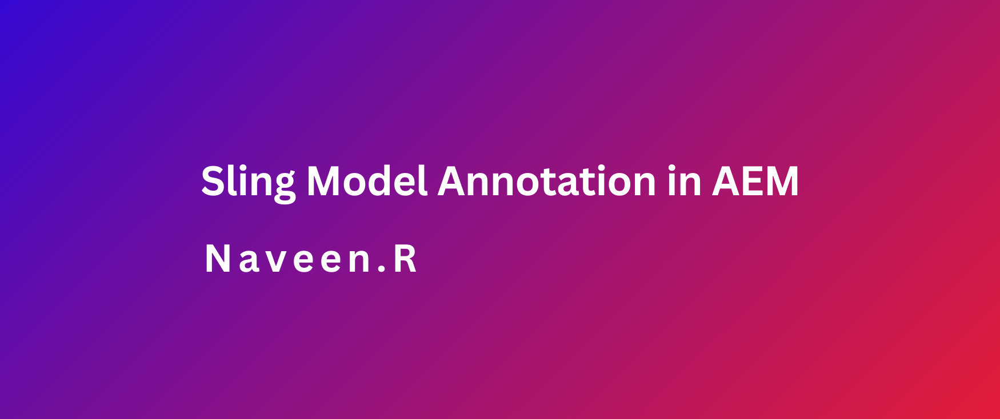

### Objective

- After reading this Article, You should have an Understanding of

    - [What is Annotation in Sling Model?](#what-is-annotation-in-sling-model)
    - [Types of Annotations](#types-of-annotations)
        - [@Inject](#inject)
        - [@ValueMapValue](#valuemapvalue)
        - [Comparison @@Inject and @ValueMapValue](#comparison-inject-and-valuemapvalue)
        - [@Named](#named)
        - [@default](#default)
        - [@Self](#self)
        - [@Via](#via)
        - [@PostConstruct](#postconstruct)
        - [@ChildResource](#childresource)
        - [@OSGiService](#osgiservice)
        - [@SlingObject](#slingobject)
        - [@ScriptVariable](#scriptvariable)
        - [@ResourcePath](#resourcepath)
        - [@RequestAttribute](#requestattribute)
        - [@Designate](#designate)
        - [@Activate](#activate)


### What is Annotation in Sling Model?

- Annotations in Sling Models are a way to map AEM content properties, resources, or services to Java objects. They make it easier to access and use content stored in the repository within your Java code

### Types of Annotations

###  @Inject

- The @Inject annotation is a generic annotation used to inject properties or objects from various contexts in Sling Models.

- It does not enforce type safety for the injected dependencies, making it more flexible but less strict.

- By default, fields annotated with @Inject are optional. If a value is unavailable, the field will be null unless explicitly marked as required.

- This annotation is primarily used for dependency injection in Sling Models.

```java
@Model(
    adaptables = Resource.class,
    adapters = CustomComponent.class,
    defaultInjectionStrategy = DefaultInjectionStrategy.OPTIONAL
)
public class CustomComponentImpl implements CustomComponent {

    @Inject
    private String firstName;

}
```  

### @ValueMapValue

- The @ValueMapValue annotation is used to inject properties directly from a resource, making it ideal for mapping resource properties to model fields.

- It supports default values, so if a property is missing in the ValueMap, the model field can still receive a default value.

- If needed, the annotation automatically converts the resource property to the appropriate field type.

- It provides type safety by allowing you to specify the exact type of the Java field being mapped to the JCR property.

### Comparison @@Inject and @ValueMapValue

- Both the @Inject and @ValueMapValue annotations are used in AEM Sling Models to map content in the AEM JCR (Java Content Repository) to Java fields in the Sling Model. However, they serve different purposes and are used in different contexts.

| Comparison   | @Inject | @ValueMapValue |
| -------- | ----------- | -----------|
| Dependency vs Direct Property Mapping |  @Inject is used to inject OSGi services and other dependencies into the Sling Model | @ValueMapValue is used to map JCR properties directly to Java fields in the Sling Model.
| Usage context | Typically used for injecting services and dependencies that aren't directly related to the content being mapped but are necessary for the Sling Model to function properly. | Used specifically to map content properties from the JCR to Java fields in the Sling Model. |
| Type safety |   @Inject does not provide type safety, so it's important to ensure the correct type is injected. |  @ValueMapValue offers type safety, allowing you to specify the type of the Java field being mapped to the JCR property. |    

### @Named

- The @Named annotation is particularly useful when the field name in the model doesn't match the property name in the source, or when you need to inject a specific value from a multi-field or a map.

- For instance, if you want to fetch a property like jcr:lastModifiedBy from the JCR repository for a specific component, you can use the @Named annotation to map the property name to your model field.

- Here’s how you can use the @Named annotation

```Java
@ValueMapValue
@Named("jcr:lastModifiedBy")
private String createdBy;

public String getCreatedBy() {
    return createdBy;
}

```   

### @default
- The @Default annotation specifies a default value to be used if the injection of a property is unsuccessful.

- By using a default value, you can avoid issues like NullPointerExceptions when a property is missing.

- Here’s an example of how to use the @Default annotation:

```Java
@ValueMapValue
@Default(values = "Default Title Field") // Provides a default value for the title field
private String titleField;

@ValueMapValue
@Default(intValues = 0) // Provides a default value of 0 for the count field
private int count;

``` 

### @Self

- The @Self annotation in Sling Models allows you to inject the adaptable object itself directly into the model. This is helpful when you need to interact with the original resource, request, or any other adaptable object that the model is based on.

- By using @Self, you gain direct access to the adaptable object, enabling you to perform additional operations or retrieve properties that may not be directly mapped to the model fields

- Here’s an example of how to use the @Self annotation

```java
@Self
private Resource resource; // Inject the adaptable object itself
```
- In this example, the @Self annotation injects the Resource object into the resource field, giving the model direct access to the resource for further operations or property retrievals.

- Example 1: Accessing the HTTP request

```Java
@Model(adaptables = SlingHttpServletRequest.class)
public class RequestModel {

    @Self
    private SlingHttpServletRequest request;

    public String getRequestPath() {
        return request.getRequestURI();
    }
}
```
- Example 2: Working with a resource

```Java
@Model(adaptables = Resource.class)
public class CustomModel {

    @Self
    private Resource resource;

    public boolean hasChildNodes() {
        return resource.hasChildren();
    }
}
```

###  @Via     
- The @Via annotation allows you to specify an alternative method or path to access a value. This is useful when the value you're looking for is not directly available on the adaptable but can be accessed through another resource or object.

- The @Via annotation defines an intermediary adapter that enables the model to access values via a different object or resource

- Common Use Cases for @Via

    - Accessing a Child Resource: When the desired value is located in a child resource instead of the current resource.

    - Accessing a Parent Resource: When the value can be found in a parent resource.

    - Accessing a Different Model: When the value is part of a different Sling Model or object.

-  By using @Via, you can enhance the flexibility of Sling Models and access values that may not be directly available on the adaptable object

- Here’s how you can use the @Via annotation

```java
JCR Structure-------------------------------------------------

/content/myproject/jcr:content
  + myComponent
    + buttondetails
      - title: "Hello"
      - description: "This is a description."
```
```java
@Model(
    adaptables = Resource.class,
    defaultInjectionStrategy = DefaultInjectionStrategy.OPTIONAL
)
public class MyComponentModel {

    @ValueMapValue
    @Via("buttondetails") // Specifies that the value should be taken from the "buttondetails" child resource
    private String title;

    @ValueMapValue
    @Via("buttondetails")
    private String description;

}
```
- Here’s how you can use the @Via annotation

```Java
import org.apache.sling.api.resource.Resource;
import org.apache.sling.models.annotations.DefaultInjectionStrategy;
import org.apache.sling.models.annotations.Model;
import org.apache.sling.models.annotations.injectorspecific.Self;
import org.apache.sling.models.annotations.injectorspecific.ValueMapValue;
import org.apache.sling.models.annotations.Via;

@Model(
    adaptables = Resource.class,
    defaultInjectionStrategy = DefaultInjectionStrategy.OPTIONAL
)
public class ParentModel {

    @ValueMapValue
    private String title;

    public String getTitle() {
        return title;
    }
}

@Model(
    adaptables = Resource.class,
    defaultInjectionStrategy = DefaultInjectionStrategy.OPTIONAL
)
public class ChildModel {

    @Self
    @Via("parentResource") // Accessing the ParentModel through the parentResource
    private ParentModel parentModel;

    public String getTitleFromParent() {
        return parentModel.getTitle();
    }
}
```
### @PostConstruct

- The @PostConstruct annotation is used to mark a method in a Sling Model that should run after the model's dependencies are injected and the model is fully initialized.

- A method annotated with @PostConstruct must have a void return type and take no arguments.

- This method is typically used for any setup or initialization tasks that need to happen after the model is created.

- Here’s how you can use the @PostConstruct annotation

```java
import org.apache.sling.api.resource.Resource;
import org.apache.sling.models.annotations.DefaultInjectionStrategy;
import org.apache.sling.models.annotations.Model;
import org.apache.sling.models.annotations.injectorspecific.ValueMapValue;

import javax.annotation.PostConstruct;

@Model(
    adaptables = Resource.class,
    defaultInjectionStrategy = DefaultInjectionStrategy.OPTIONAL
)
public class CustomModel {

    @ValueMapValue
    private String titleField;

    @ValueMapValue
    private String description;

    @PostConstruct
    protected void init() {
        // Validate and set default values
        if (titleField == null || titleField.isEmpty()) {
            titleField = "Default Title Field";
        }
        if (description == null || description.isEmpty()) {
            description = "Default Description";
        }
    }

    public String getTitleField() {
        return titleField;
    }

    public String getDescription() {
        return description;
    }
}
```
- The init method checks if title and description are null or empty, and if so, assign default values.

### @OSGiService
- The @OSGiService annotation is used to inject OSGi services directly into a Sling Model. This allows you to easily access and use OSGi services within your model.

- Here’s how you can use the @OSGiService annotation

```Java
@Model(adaptables = SlingHttpServletRequest.class,
        defaultInjectionStrategy = DefaultInjectionStrategy.OPTIONAL )
public class CustomConfigurationModelImpl {
    
    @OSGiService
    CustomConfigurationMethods customConfigurationMethods;


    public String getFirstName() {
        return customConfigurationMethods.getFirstName();
    }


    public int getLastName() {
        return customConfigurationMethods.getLastName();
    }
}

```        
### @SlingObject

- The @SlingObject annotation is used to inject common Sling objects directly into a Sling Model, providing easy access to key Sling components.

- Global Objects with @SlingObject

    - Resource: Represents the resource being adopted.

    - ResourceResolver: Provides methods to resolve resources.

    - SlingHttpServletRequest: Represents the current HTTP request.

    - SlingHttpServletResponse: Represents the current HTTP response.

    - SlingScriptHelper: Provides access to various scripting utilities and services.

- Here’s how you can use the @SlingObject annotation

```java

@SlingObject
private Resource resource; // Injects the current Resource

@SlingObject
private ResourceResolver resourceResolver; // Injects the ResourceResolver

@SlingObject
private SlingScriptHelper scriptHelper; // Injects the SlingScriptHelper

```

### @ScriptVariable

-  The @ScriptVariable annotation in AEM is used in Sling Models to inject values from the script context, such as the current page, resource, request, and other context-specific objects.

-  Common Objects Injected with @ScriptVariable:

   - Page: Represents the current page.

   - Resource: Represents the current resource.

   - SlingHttpServletRequest: Represents the current HTTP request.

   - SlingHttpServletResponse: Represents the current HTTP response.

   - ValueMap: Represents the properties of the current resource.

   - SlingScriptHelper: Provides access to various AEM services.

   - ResourceResolver: Provides access to resources within the JCR.

- Here’s how you can use the @ScriptVariable annotation

```java
import com.day.cq.wcm.api.Page;
import org.apache.sling.api.resource.Resource;
import org.apache.sling.api.resource.ResourceResolver;
import org.apache.sling.api.scripting.SlingScriptHelper;
import org.apache.sling.api.scripting.SlingBindings;
import org.apache.sling.models.annotations.DefaultInjectionStrategy;
import org.apache.sling.models.annotations.Model;
import org.apache.sling.models.annotations.ScriptVariable;
import org.apache.sling.models.annotations.injectorspecific.ValueMapValue;

@Model(
    adaptables = Resource.class,
    defaultInjectionStrategy = DefaultInjectionStrategy.OPTIONAL
)
public class CustomModel {

    @ValueMapValue
    private String titleField;

    @ScriptVariable
    private Page currentPage;

    @ScriptVariable
    private Resource resource;

    @ScriptVariable
    private ResourceResolver resourceResolver;

    @ScriptVariable
    private SlingScriptHelper sling;

    public String getTitleField() {
        return titleField;
    }

    public Page getCurrentPage() {
        return currentPage;
    }

    public Resource getResource() {
        return resource;
    }

    public ResourceResolver getResourceResolver() {
        return resourceResolver;
    }

    public SlingScriptHelper getSling() {
        return sling;
    }
}
```

### @ChildResource

- The @ChildResource annotation allows you to directly inject a child resource of the current resource into the model.

- You can specify a path relative to the current resource to identify the child resource, making it easy to work with nested resources.

- The annotation can be used to inject either a single child resource or collections of resources (e.g., lists of resources).

- Here’s how you can use the @ChildResource annotation

```java
JCR Structure-------------------------------------------------

/content/myProject/jcr:content
  + myComponent
    - titleField: "Title"
    + detailsField
      - subtitleField: "Sub TitleField"
      - description: "Detailed description."
    + items
      + item1
        - name: "Item 1"
      + item2
        - name: "Item 2"

```
```java
import org.apache.sling.api.resource.Resource;
import org.apache.sling.models.annotations.DefaultInjectionStrategy;
import org.apache.sling.models.annotations.Model;
import org.apache.sling.models.annotations.injectorspecific.ChildResource;
import org.apache.sling.models.annotations.injectorspecific.ValueMapValue;

import java.util.List;

@Model(
    adaptables = Resource.class,
    defaultInjectionStrategy = DefaultInjectionStrategy.OPTIONAL
)
public class CustomModel {

    @ValueMapValue
    private String titleField;

    @ChildResource(name = "detailsField")
    private Resource detailsField; // Injects the 'detailsField' child resource

    @ChildResource(name = "items")
    private List<Resource> items; // Injects the 'items' child resources

    public String getTitleField() {
        return titleField;
    }

    public String getSubtitleField() {
        return detailsField != null ? detailsField.getValueMap().get("subtitleField", String.class) : null;
    }

    public String getDescription() {
        return detailsField != null ? detailsField.getValueMap().get("description", String.class) : null;
    }

    public List<Resource> getItems() {
        return items;
    }

    public String getItemName(int index) {
        if (items != null && items.size() > index) {
            return items.get(index).getValueMap().get("name", String.class);
        }
        return null;
    }
}
```

- @ChildResource(name = "detailsField"): Injects the detailsField child resource.

- @ChildResource(name = "items"): Injects a list of child resources from the items node

### @ResourcePath

- The @ResourcePath annotation is used to inject a resource based on a specified path.

- This is especially useful when you need to work with resources that are not part of the current request or resource tree, allowing you to inject resources from any location within the JCR repository.

- Here’s how you can use the @ResourcePath annotation

```java
JCR Structure-------------------------------------------------

/content/myProject
  + jcr:content
    - titleField: "Main Content"
  + referencedContent
    - titleField: "Referenced Content"
```
```java
import org.apache.sling.api.resource.Resource;
import org.apache.sling.api.resource.ValueMap;
import org.apache.sling.models.annotations.DefaultInjectionStrategy;
import org.apache.sling.models.annotations.Model;
import org.apache.sling.models.annotations.injectorspecific.ResourcePath;
import org.apache.sling.models.annotations.injectorspecific.ValueMapValue;

@Model(
    adaptables = Resource.class,
    defaultInjectionStrategy = DefaultInjectionStrategy.OPTIONAL
)
public class CustomModel {

    @ValueMapValue
    private String titleField;

    @ResourcePath(path = "/content/myProject/referencedContent")
    private Resource referencedResource; // Injects the resource at the specified path

    public String getTitleField() {
        return titleField;
    }

    public String getReferencedTitle() {
        if (referencedResource != null) {
            ValueMap valueMap = referencedResource.getValueMap();
            return valueMap.get("titleField", String.class);
        }
        return null;
    }
}
```
### @RequestAttribute

- The @RequestAttribute annotation allows you to access request attributes directly within your model. Request attributes are data passed along with the HTTP request, and this annotation is particularly useful when you need to process or use data that is dynamically provided during the request.

- Step 1: Set Up the Request Attribute

- In your servlet or any other part of your code that handles the request, you can set the request attribute

- Here’s how you can use the @RequestAttribute annotation

```java
request.setAttribute("myAttribute", "This is a request attribute");
```

```java
import org.apache.sling.api.SlingHttpServletRequest;
import org.apache.sling.models.annotations.DefaultInjectionStrategy;
import org.apache.sling.models.annotations.Model;
import org.apache.sling.models.annotations.injectorspecific.RequestAttribute;

@Model(
    adaptables = SlingHttpServletRequest.class,
    defaultInjectionStrategy = DefaultInjectionStrategy.OPTIONAL
)
public class CustomModel {

    @RequestAttribute(name = "myAttribute")
    private String myAttribute; // Injects the request attribute

    public String getMyAttribute() {
        return myAttribute;
    }
}
```

### @Designate
-  Used for OSGi component configuration in Sling Models.

### @Activate
- Used to define when an OSGi component should be activated.