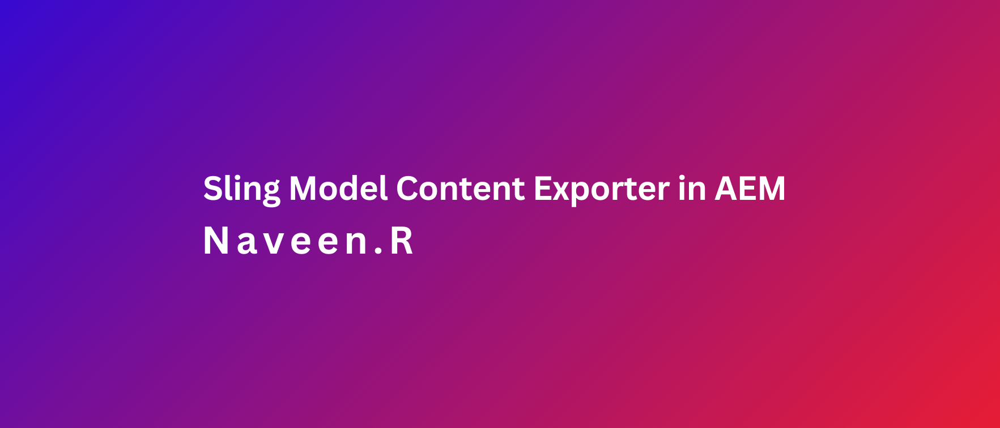

### Objective

- After reading this Article, You should have an Understanding of

    - [What is Sling Model Exporter ](#sling-model-exporter)

    - [Default Exporters ](#default-exporters)

        - [Testing the Default Exporter](#testing-the-default-exporter)

    - [Exporter using Jackson ](#exporter-using-jackson)

        - [Testing the Jackson Exporter](#testing-the-jackson-exporter)

    - [Custom Selector](#custom-selector)

        - [Testing the Custom Selector Exporter](#testing-the-custom-selector-exporter)

    - [Jackson Exporter with Annotations](#jackson-exporter-with-annotations)

        - [Key Annotations](#key-annotations)

        - [Testing the Jackson Exporter](#testing-the-jackson-exporter-1)

    - [Custom Sling model exporter using XML](#custom-sling-model-exporter-using-xml)

        - [Testing the Custom Exporter](#testing-the-custom-exporter)
    
    - [Practical Tips](#practical-tips)

    - [Reference link](#reference-link)


### Sling Model Exporter

The Sling Model Exporter is a feature in AEM that allows developers to extract and expose the content of a Sling Model in formats like JSON or XML. It enables seamless integration with third-party systems by providing content as a service, making AEM function as a headless CMS.

- key Points

    - Uses annotations like @Model and @Exporter to mark Sling Models for export.
    
    - Supports both node properties and custom/calculated fields.
    
    - Typical use cases: feeding content to mobile apps, web applications, or legacy systems.


### Default Exporters

- Default exporters (.infinity.json) export all properties, including unwanted metadata.


### Testing the Default Exporter

- After implementing the code, test the exporter by accessing this URL: http://localhost:4502/content/aem-debugcode/us/en/sss/jcr:content/root/container/container_1373393089/custombutton.infinity.json


Expected Json Output:

```json
{
    "jcr:primaryType": "nt:unstructured",
    "jcr:createdBy": "admin",
    "anchorName": "hhh",
    "jcr:lastModifiedBy": "admin",
    "jcr:created": "Fri Dec 27 2024 10:54:07 GMT+0530",
    "urlLink": "hh",
    "buttonText": "hhh",
    "jcr:lastModified": "Fri Dec 27 2024 11:40:46 GMT+0530",
    "sling:resourceType": "aem-debugcode/components/customButton",
    "assetLink": "hhh",
    "targetNewWindow": "true"
}
```

### Exporter using Jackson

- Jackson Exporter is used to export AEM content as JSON.

- All getter methods are included in the JSON by default.

- Provides flexibility to:
    
    - Customize JSON key formats.
    
    - Add or exclude specific properties using annotations.


- **Default selector: "model"**.

```java
@Model(adaptables = SlingHttpServletRequest.class,
        adapters = CustomButton.class,
        defaultInjectionStrategy = DefaultInjectionStrategy.OPTIONAL,
        resourceType = CustomButtonImpl.RESOURCE_TYPE)
@Exporter(name = "jackson", extensions = "json")
```

### Testing the Jackson Exporter

- After implementing the code, test the exporter by accessing this URL: http://localhost:4502/content/aem-debugcode/us/en/sss/jcr:content/root/container/container_1373393089/custombutton.model.json 

Expected Json Output:

```java
{
"buttonText": "hhh",
"urlLink": "hh",
"targetNewWindow": "true",
"anchorName": "hhh",
"assetLink": "hhh"
}
```

### Custom Selector

syntax: 

```java

@Exporter(name = "jackson", extensions = "json", selector = "debugcode")
```

- selector = "debugcode" changes the default selector (model) to debugcode.

- JSON output will now be accessible via URLs ending with .debugcode.json

### Testing the Custom Selector Exporter

- After implementing the code, test the exporter by accessing this URL: http://localhost:4502/content/aem-debugcode/us/en/sss/jcr:content/root/container/container_1373393089/custombutton.debugcode.json


Expected Json Output:

```java
{
    "urlLink": "hh",
    "targetNewWindow": "true",
    "anchorName": "hhh",
    "assetLink": "hhh",
    "button": "hhh"
}
```

### Jackson Exporter with Annotations

```java
package com.debug.code.core.models.impl;

import com.debug.code.core.models.CustomButton;
import com.fasterxml.jackson.annotation.JsonProperty;
import com.fasterxml.jackson.annotation.JsonRootName;
import org.apache.sling.api.SlingHttpServletRequest;
import org.apache.sling.models.annotations.DefaultInjectionStrategy;
import org.apache.sling.models.annotations.Exporter;
import org.apache.sling.models.annotations.ExporterOption;
import org.apache.sling.models.annotations.Model;
import org.apache.sling.models.annotations.injectorspecific.ValueMapValue;

@Model(adaptables = SlingHttpServletRequest.class,
        adapters = CustomButton.class,
        defaultInjectionStrategy = DefaultInjectionStrategy.OPTIONAL,
        resourceType = CustomButtonImpl.RESOURCE_TYPE)
@Exporter(name = "jackson", extensions = "json", selector = "debugcode",
    options = {
            @ExporterOption(name="SerializationFeature.WRAP_ROOT_VALUE", value = "true"),
            @ExporterOption(name="MapperFeature.SORT_PROPERTIES_ALPHABETICALLY", value = "true"),
    })

@JsonRootName("buttonComponentDetails")
public class CustomButtonImpl implements CustomButton{

    static final String RESOURCE_TYPE = "aem-debugcode/components/customButton";

    @ValueMapValue
    String buttonText;

    @ValueMapValue
    String urlLink;

    @ValueMapValue
    String targetNewWindow;

    @ValueMapValue
    String anchorName;

    @ValueMapValue
    String assetLink;


    @JsonProperty(value = "button")
    @Override
    public String getButtonText() {
        return buttonText;
    }

    @Override
    public String getUrlLink() {
        return urlLink;
    }

    @Override
    public String getTargetNewWindow() {
        return targetNewWindow;
    }

    @Override
    public String getAnchorName() {
        return anchorName;
    }

    @Override
    public String getAssetLink() {
        return assetLink;
    }
}

```

### Testing the Jackson Exporter

- After implementing the code, test the exporter by accessing this URL: http://localhost:4502/content/aem-debugcode/us/en/sss/jcr:content/root/container/container_1373393089/custombutton.debugcode.json

Expected Json Output:

```java
{
"buttonComponentDetails": {
    "anchorName": "hhh",
    "assetLink": "hhh",
    "button": "hhh",
    "targetNewWindow": "true",
    "urlLink": "hh"
    }
}
```

### Key Annotations

- Including Non-Getter Methods Use @JsonProperty to include methods that aren't standard getters

    - Allows defining custom JSON keys for clarity or specific requirements.

- Use @JsonIgnore to exclude specific properties from the JSON output.

- Use @JsonRootName to group all properties under a parent JSON object.

- Enable root nodes with SerializationFeature.WRAP_ROOT_VALUE in ExporterOptions.

- Use MapperFeature.SORT_PROPERTIES_ALPHABETICALLY in ExporterOptions to sort JSON properties alphabetically.

### Custom Sling model exporter using XML.

- The custom Sling Model Exporter lets us export AEM content as XML. This is particularly useful when integrating AEM with systems that require XML data formats. In this guide, we'll create a generic XML exporter, define a model interface, and implement it using JAXB for XML.

Step 1: Create the Generic Exporter
    
    - The first step is to create a generic class, CustomXmlExporter, that handles the export logic. This class implements the ModelExporter interface and uses JAXB to convert the data model into XML format.

```java
package com.debug.code.core.exporter;

import org.apache.sling.models.export.spi.ModelExporter;
import org.apache.sling.models.factory.ExportException;
import org.osgi.service.component.annotations.Component;
import org.slf4j.Logger;
import org.slf4j.LoggerFactory;

import javax.xml.bind.JAXBContext;
import javax.xml.bind.JAXBException;
import javax.xml.bind.Marshaller;
import java.io.StringWriter;
import java.util.Map;

@Component(service = ModelExporter.class)
public class CustomXmlExporter implements ModelExporter {
    private static final Logger LOG = LoggerFactory.getLogger(CustomXmlExporter.class);
    @Override
    public boolean isSupported(Class<?> aClass) {
        return true;
    }

    @Override
    public <T> T export(Object model, Class<T> aClass, Map<String, String> options) throws ExportException {
        StringWriter stringWriter = new StringWriter();
        try {
            JAXBContext jaxbContext = JAXBContext.newInstance(model.getClass());
            Marshaller marshaller = jaxbContext.createMarshaller();
            marshaller.setProperty(Marshaller.JAXB_FORMATTED_OUTPUT, true);
            marshaller.marshal(model, stringWriter);
        } catch (JAXBException e) {
            LOG.info("\n Marshell Error : {} ",e.getMessage());
        }
        return (T) stringWriter.toString();
    }

    @Override
    public String getName() {
        return "customxml";
    }
}
```

Step 2: Define the Model Interface
    
    - Next, we create an interface for the model, which defines the methods that will be exposed in the XML.

java
Copy code


```java
package com.debug.code.core.models;

public interface XmlExporter {

    public String getTitle();
    public String getDescription();
}

```
Step 3: Implement the Model

    - Now, implement the XmlExporter interface in a class. We use annotations like @Exporter and JAXB annotations such as @XmlElement and @XmlRootElement to structure the XML output

```java
package com.debug.code.core.models.impl;

import com.debug.code.core.models.XmlExporter;
import org.apache.sling.api.SlingHttpServletRequest;
import org.apache.sling.models.annotations.*;
import org.apache.sling.models.annotations.injectorspecific.ValueMapValue;
import org.slf4j.Logger;
import org.slf4j.LoggerFactory;

import javax.xml.bind.annotation.*;

@Exporter(name = "customxml",extensions = "xml")
@Model(
        adaptables = SlingHttpServletRequest.class,
        adapters = XmlExporter.class,
        resourceType = XmlExporterImpl.RESOURCE_TYPE,
        defaultInjectionStrategy = DefaultInjectionStrategy.OPTIONAL
)
@XmlRootElement(name = "xml-exporter")
public class XmlExporterImpl implements XmlExporter{

    static final String RESOURCE_TYPE="aem-debugcode/components/customXML";

    private static final Logger LOG = LoggerFactory.getLogger(XmlExporterImpl.class);

    @ValueMapValue
    String xmltitle;

    @ValueMapValue
    String xmldescription;

    @Override
    @XmlElement(name = "author-title")
    public String getTitle() {
        return xmltitle;
    }

    @Override
    @XmlElement(name = "author-description")
    public String getDescription() {
        return xmldescription;
    }

}

```

### Testing the Custom Exporter

- After implementing the code, test the exporter by accessing this URL: http://localhost:4502/content/aem-debugcode/us/en/sss/jcr:content/root/container/container_774198738/customxml.model.xml

Expected XML Output:

```xml
<xml-exporter>
    <author-description>ddd</author-description>
    <author-title>ddd</author-title>
</xml-exporter>
```

### Practical Tips

- Root Element: The @XmlRootElement annotation defines the root element of the XML document.

- Custom Element Names: Use @XmlElement(name = "custom-name") to customize XML element names.

- Error Handling: If you encounter JAXBException, ensure the JAXB library is included in your project dependencies.

- Pretty-Printed Output: Use Marshaller.JAXB_FORMATTED_OUTPUT for a clean, indented XML structure.

### Reference link

- https://fasterxml.github.io/jackson-databind/javadoc/2.6/com/fasterxml/jackson/databind/SerializationFeature.html

- https://github.com/FasterXML/jackson-annotations/wiki/Jackson-Annotations

- https://fasterxml.github.io/jackson-databind/javadoc/2.7/com/fasterxml/jackson/databind/MapperFeature.html

- https://docs.oracle.com/javase/8/docs/api/javax/xml/bind/JAXB.html
