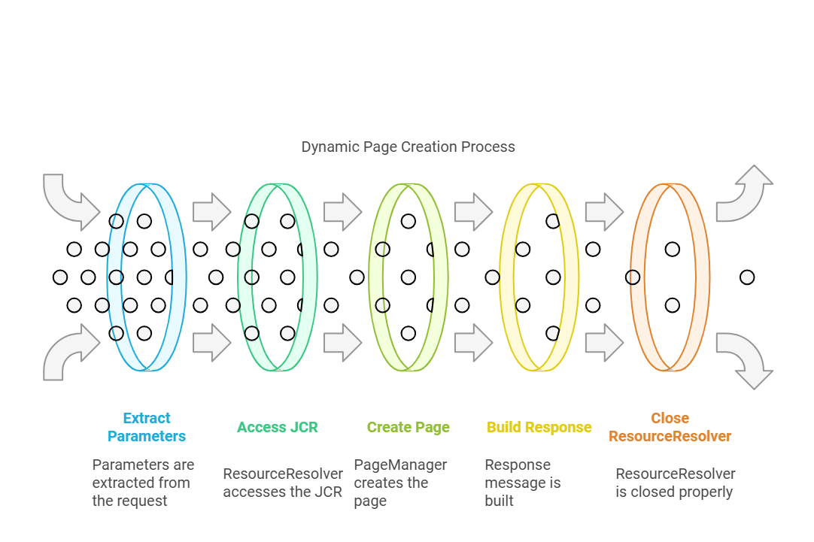

### Objective

- After reading this Article, You should have an Understanding of 

    - [What is Sling Servlet ?](#what-is-sling-model)
    
    - [Java Servlet Life Cycle](#java-servlet-life-cycle)

    - [Lifecycle of an AEM Servlet](#lifecycle-of-an-aem-servlet)

    - [Key Differences Between Normal Servlets and AEM Servlets](#key-differences-between-normal-servlets-and-aem-servlets)

    - [What are Sling Servlets?](#what-are-sling-servlets)

        - [Restrictions on Sling Servlets](#restrictions-on-sling-servlets)

        - [Types of Sling Servlets](#types-of-sling-servlets)

        - [Step-by-Step Flow and Architecture of Sling Servlets](#step-by-step-flow-and-architecture-of-sling-servlets)

        - [Servlet Registration](#servlet-registration)

        - [A Sling servlet can be registered in two ways](#a-sling-servlet-can-be-registered-in-two-ways)

        - [Important Properties in Servlet Annotations](#important-properties-in-servlet-annotations)

        - [Resource Type vs Path-Based Servlets](#resource-type-vs-path-based-servlets)

    - [Real Time Example for Create Path Based Servlet](#real-time-example-for-create-path-based-servlet)

        - [Requirement](#requirement)

        - [Approach to Implement the Requirement](#approach-to-implement-the-requirement)

        - [Implement the logic for DynamicPages](#implement-the-logic-for-dynamicpages)

        - [let's Understand the code](#lets-understand-the-code)

    - [Real Time Example for Create Resource Type Servlet](#real-time-example-for-create-resource-type-servlet)

        - [Requirement](#requirement-1)

### What is a Servlet?

- A servlet is a Java class designed to enhance the functionality of servers that handle client requests and generate responses, typically in web-based applications.

- While servlets can process a wide range of requests, they are primarily used to add features to web servers.

- Every servlet implements the Servlet interface, which defines essential life-cycle methods for handling requests and managing resources.


### Java Servlet Life Cycle


- Loading and Instantiation
    
    - The servlet container loads the servlet class when the application starts or when the servlet is accessed for the first time (depending on configuration).

    - The servlet class is loaded into memory.

    - An instance of the servlet is created using the default no-argument constructor.

- Initialization (init method)

    - The init() method is called once, after the servlet instance is created.

    - The servlet is initialized with configuration data from the deployment descriptor (web.xml) or annotations.

    - This is where resources like database connections are set up.

- Request Handling (service method)

    - For every client request, the container invokes the service() method.

    - The service() method determines the type of request (e.g., GET, POST) and dispatches it to the appropriate method, such as doGet() or doPost().

    - The servlet processes the request and generates a response.

-  Destruction (destroy method)

    - The servlet container shuts down or the servlet is explicitly removed.

    - The destroy() method is called to release resources.

    - Any cleanup operations, such as closing database connections, occur here.


### Lifecycle of an AEM Servlet


- AEM servlets are managed differently due to AEM’s reliance on the OSGi framework and Sling models. These servlets are primarily designed to work in the context of AEM components and the JCR (Java Content Repository).

- Component Declaration

    - The servlet is declared as an OSGi component using annotations like @Component, @Service, and @SlingServletPaths and @SlingServletResourceTypes.

    - The OSGi container identifies the servlet as a service.

    - The servlet is registered based on its resource type, path, or selector.

- Dependency Injection

    - Before the servlet is initialized, the OSGi container injects dependencies into the servlet.

    - Services such as ResourceResolverFactory or SlingHttpServletRequest are injected into the servlet.

    - This ensures the servlet can interact with AEM’s resource tree and JCR.    

- Activation (@Activate method)

    - The servlet becomes active when its required dependencies are satisfied.

    - An optional @Activate method can be used to initialize configurations or resources when the servlet is activated.

- Request Handling
    - The Sling framework dispatches HTTP requests to the servlet based on the registered path, resource type, or selector.
    
    - The servlet processes the request (usually within the doGet() or doPost() methods).
    
    - The servlet interacts with AEM’s resource tree and JCR to dynamically render content or perform backend logic.

- Deactivation (@Deactivate method)
    - The servlet is deactivated when the bundle is stopped or unregistered.

    - Any resources initialized during activation are released.

    - The servlet is effectively removed from the OSGi container.    

### Key Differences Between Normal Servlets and AEM Servlets


### What are Sling Servlets?


- Sling Servlets are server-side components used in Sling-based applications to handle HTTP requests and generate responses. They are an integral part of Adobe Experience Manager (AEM) development.

- These servlets are registered as OSGi services, which means they are modular and can be dynamically managed at runtime. OSGi serves as the backbone for AEM, built on top of Sling and JCR (Java Content Repository).

- Sling itself is a REST-based framework that simplifies access to JCR content over the web. Sling Servlets leverage this framework to process dynamic content and implement custom business logic in AEM.

### Restrictions on Sling Servlets


- Mandatory Properties

    - Either the sling.servlet.paths or the sling.servlet.resourceTypes service reference property must be set. If neither is set, the Servlet service is ignored.

- Handling Conflicts

    - If both sling.servlet.paths and sling.servlet.resourceTypes are set, the servlet is registered using both approaches.

- Property Precedence

    - If the sling.servlet.paths property is set, all other sling.servlet.* properties are ignored.

- Resource Provider Registration

    - If sling.servlet.paths is not set, a Resource Provider is registered for the servlet for every permutation of resource type, selector, extension, and method.

### Types of Sling Servlets


- In Sling, there are two types of servlets, each servlets is designed for different HTTP methods. When creating a servlet, it's important to select the appropriate type based on the operations you want to perform.

- SlingSafeMethodsServlet

    - Use this servlet if your requirements only involve read-only HTTP methods, such as GET, HEAD, and OPTIONS.
    
    - This class extends the basic HttpServlet class and enhances its functionality, offering greater flexibility and control over which methods to implement.

    - It's ideal when you only need to fetch data without altering anything on the server.

- SlingAllMethodsServlet

    - This is an extended version of SlingSafeMethodsServlet that includes support for POST, PUT, and DELETE methods.
    
    - Choose this servlet type when you need to handle both read and write operations, allowing you to handle tasks like submitting data, updating records, or deleting resources.

### Step-by-Step Flow and Architecture of Sling Servlets

- Below is a detailed explanation of how a request flows through Sling in AEM, from a web browser to the servlet, and back again.


Step 1: Request from the Web Browser or End User

- The process starts when a web browser or End User sends a request to the server using HTTP or HTTPS.

- This request could either be to retrieve data (GET request) or to submit data (POST request).

Step 2: Sling Intercepts the Request

- The Sling framework identifies that the request is directed to AEM and uses its built-in URL mapping mechanisms to handle it.

- This ensures that the correct servlet or resource processes the request.

Step 3: Resolve the Resource
    
- Sling resolves the resource using two main types of mappings:

    - Path-Based Mapping:

        - In this method, the servlet is registered using sling.servlet.paths or the @SlingServletPaths annotation.
        
        - For example, a URL like /bin/example directly maps to the servlet responsible for processing it.
    
    - Resource Type Mapping:

        - The servlet is registered using sling.servlet.resourceTypes or the @SlingServletResourceTypes annotation.
        
        - For instance, a request to /content/example will match the resource type example/components/content, which then resolves to the appropriate servlet.

Step 4: Match the Servlet

- The Sling Servlet Resolver determines the appropriate servlet to handle the request by checking

    - The paths property for path-based mapping.

    - The resourceTypes property for resource type-based mapping.

Step 5: Dispatcher’s Role in Caching

- Before reaching AEM, the request first goes to the Dispatcher, which checks if the requested data is already cached.

- If cached, the response is sent back to the browser immediately. Otherwise, the Dispatcher forwards the request to the AEM instance for further processing.

Step 6: Servlet Processing

- The servlet receives the request and processes it based on the request type and data

    - It might validate or apply business logic to the incoming data.

    - The servlet may save the processed data to a database or retrieve data from the database to send it back to the browser.

Step 7: Data Formats and Response

- Communication between the browser and server happens in predefined formats such as JSON, XML, or binary.

- Once the servlet finishes processing, it sends the response back to the browser in the same format, ensuring smooth communication and display.

### Servlet Registration

#### @Component 

- In AEM, the @Component annotation is used to register a Sling Servlet as an OSGi service. OSGi allows different parts of the application to be treated as services.

- By adding this annotation, you’re essentially telling AEM to treat your servlet as a service that can process specific HTTP requests based on its configuration.

#### A Sling servlet can be registered in two ways

- Using Resource Types

    - we use sling:resourceType property of the node. This allows us to map a servlet to a specific resource type. To use this method, you simply need to hit the path in the browser that corresponds to the defined sling:resourceType.

- Using Paths

    - In this case, the servlet is registered directly to a specific path. When you hit this path in the browser, the corresponding servlet gets executed.

### Important Properties in Servlet Annotations

- key important properties you need to know when configuring servlets with the above methods

    - **sling.servlet.paths**: This property defines the exact path used to access the servlet.

    - **sling.servlet.resourceTypes**: It maps a resource to a specific servlet. This helps to define which resource types will trigger the servlet.

    - **sling.servlet.methods**: Used to specify the methods for which the servlet is responsible, such as GET, POST, DELETE, etc.

    - **sling.servlet.selectors**: Selectors are special parameters that you can use to pass additional data to the servlet code. This property is only considered if you're using the sling.servlet.resourceTypes method.

    - **sling.servlet.extensions**: This allows the servlet to handle different file extensions, such as .txt, .json, or .html, making it more flexible in terms of the types of requests it can respond to.

### Resource Type vs Path-Based Servlets

- When deciding between using a resource type-based servlet or a path-based servlet in AEM, there are a few important differences to consider:    

    

- Resource Type-Based Servlets

    - **Security**: The Sling engine automatically handles permissions for resource type-based servlets. This means only users who have permission to access the resource can trigger the servlet, making it more secure compared to path-based servlets.

    - **How it works**: With resource types, the system first accesses the resource, then calls the servlet. This makes it a structured way of handling requests.

    - **Control**: The servlet gets executed based on the resource type, which is easier to manage from a security perspective and aligns better with AEM's access control system.

- Path-Based Servlets

    - **Limitations**: Path-based servlets can only be mapped to specific paths, not resource types. They also don’t handle suffixes in the URL as flexibly as resource type servlets.

    - **Risk of errors**: If the servlet isn’t active, a POST request could lead to unexpected results. Path-based servlets need more careful attention to avoid errors.

    - **Paths need to be exact**: When defining paths for path-based servlets, you need to be specific, or the servlet might not function correctly. A mistake in defining the path can break the servlet.    


### Real Time Example for Create Path Based Servlet
 
#### Requirement:

- The business team has requested for create dynamically new pages in the AEM site structure. For example, when a specific action is triggered (e.g., a form submission or a scheduled task), a new page should be created under a specific section of the website. The page should use a predefined template, have a meaningful name, and include metadata like the page title and page name. Additionally, the solution it should allow input parameter of parent path, page name and page title.

#### Approach to Implement the Requirement

Step 1: Understand the Requirement

- The business needs a way to programmatically create pages in the AEM content structure.

- The pages should Be created under a specific parent path dynamically provided via input.

- Use a specific template.

- Have a meaningful page name and page title dynamically provided via input

Step 2: Choose the Right option for Implementation

- To meet this requirement, we can use an AEM servlet.

- Servlets allow us to handle incoming HTTP requests (like GET or POST) and perform actions like creating pages dynamically.

Step 3: Plan the Implementation

- To create the pages dynamically, we need to:

    - Use the ResourceResolver to interact with the AEM repository.

    - Use the PageManager to create pages dynamically.

    - Handle exceptions and ensure proper resource cleanup.

### Implement the logic for DynamicPages

- Before Creating Servlets Go to ‘http://localhost:4502/system/console/configMgr’ and Search for “Servlet/Script Resolver” you will find servlet path is added inside the execution path field, if not then first you need to add this.

- below is the screenshot for refrenece 


- creating a servlet named CreateDynamicPages.java” which extends “SlingAllSafeMethodServlet”.


Here is the complete code 
```java
package com.debug.code.core.servlets;

import com.day.cq.wcm.api.PageManager;
import com.day.cq.wcm.api.Page;
import org.apache.sling.api.SlingHttpServletRequest;
import org.apache.sling.api.SlingHttpServletResponse;
import org.apache.sling.api.resource.ResourceResolver;
import org.apache.sling.api.servlets.HttpConstants;
import org.apache.sling.api.servlets.SlingAllMethodsServlet;
import org.osgi.framework.Constants;
import org.osgi.service.component.annotations.Component;
import org.slf4j.Logger;
import org.slf4j.LoggerFactory;

import javax.servlet.Servlet;
import java.io.IOException;

@Component(service = Servlet.class,
        property = {
                Constants.SERVICE_DESCRIPTION + "=Create Page Servlet",
                "sling.servlet.methods=" + HttpConstants.METHOD_GET,
                "sling.servlet.paths=" + "/bin/createDynamicPages"
        })
public class CreateDynamicPages extends SlingAllMethodsServlet {

        private static final Logger log = LoggerFactory.getLogger(CreateDynamicPages.class);

        @Override
        protected void doGet(SlingHttpServletRequest request, SlingHttpServletResponse response)
                throws IOException {


                log.info("----------< Executing Create Page Servlet >----------");


                try (ResourceResolver resourceResolver = request.getResourceResolver()) {

                        PageManager pageManager = resourceResolver.adaptTo(PageManager.class);
                        if (pageManager == null) {
                                log.error("PageManager is not available");
                                response.getWriter().write("Error: PageManager is not available");
                                return;
                        }
                        String parentPath = request.getParameter("parentPath");
                        String pageName = request.getParameter("pageName");
                        String templatePath = "/conf/aem-debugcode/Generic/settings/wcm/templates/generic-template";
                        String pageTitle = request.getParameter("pageTitle");

                        if (parentPath == null || pageName == null || pageTitle == null) {
                                response.getWriter().write("Error: Missing required parameters");
                                return;
                        }

                        Page newPage = pageManager.create(parentPath, pageName, templatePath, pageTitle);

                        if (newPage != null) {
                                log.info("Page created successfully: {}", newPage.getPath());
                                response.getWriter().write("Page created successfully: " + newPage.getPath());
                        } else {
                                log.error("Failed to create page");
                                response.getWriter().write("Error: Failed to create page");
                        }

                } catch (Exception e) {
                        log.error("Error while creating page: {}", e.getMessage(), e);
                        response.getWriter().write("Error: " + e.getMessage());
                }
        }
}

```
- Now Hit the URL : http://localhost:4502/bin/createDynamicPages?parentPath=/content/aem-debugcode/us/en&pageTitle=LandingPage&pageName=landPage

OUTPUT:


### let's Understand the code



- The servlet receive incoming requests at a specific URL (e.g., /bin/createDynamicPages?parentPath=/content/aem-debugcode/us/en&pageTitle=LandingPage&pageName=landPage).

- Extract parameters from the request

   - Use request.getParameter("parentPath"), request.getParameter("pageName")and request.getParameter("pageTitle") to get user inputs.

- Use the ResourceResolver from the incoming request to gain access to the JCR (Java Content Repository), which stores all content in AEM.

-  Use the PageManager to create a page with the dynamically provided parent path and page name and page title.

- Build a response message indicating the page creation status, including the path of the created page.

- Close the ResourceResolver properly to avoid memory leaks.


### Real Time Example for Create Resource Type Servlet

#### Requirement:

- The business team has requested a solution to dynamically fetch and display the list of child pages for a specific page in the AEM site structure

- Accept a pagePath parameter as input to specify the parent page.
- Default to the path /content/aem-debugcode/us/en if no pagePath parameter is provided.
- Retrieve all child pages under the specified parent page and return their titles and paths in a structured format.
- Support response formats in JSON or plain text (txt).

Here is the complete code 

```java

package com.debug.code.core.servlets;

import java.io.IOException;
import java.util.Iterator;

import javax.json.Json;
import javax.json.JsonArrayBuilder;
import javax.json.JsonObjectBuilder;
import javax.servlet.Servlet;
import javax.servlet.ServletException;

import org.apache.sling.api.SlingHttpServletRequest;
import org.apache.sling.api.SlingHttpServletResponse;
import org.apache.sling.api.resource.ResourceResolver;
import org.apache.sling.api.servlets.SlingSafeMethodsServlet;
import org.apache.sling.servlets.annotations.SlingServletResourceTypes;
import org.osgi.service.component.annotations.Component;

import com.day.cq.wcm.api.Page;
import com.day.cq.wcm.api.PageManager;


@Component(service = Servlet.class)
@SlingServletResourceTypes(resourceTypes = "aem-debugcode/components/page",
        selectors = "list", extensions = {"txt", "json"})
public class AccessComponentsServlet extends SlingSafeMethodsServlet {

    @Override
    protected void doGet(SlingHttpServletRequest request, SlingHttpServletResponse response)
            throws ServletException, IOException {

        ResourceResolver rr = request.getResourceResolver();
        String pagePath = request.getParameter("pagePath");
        if (pagePath == null) {
            pagePath = "/content/aem-debugcode/us/en";
        }
        PageManager pm = rr.adaptTo(PageManager.class);
        Page page = pm.getPage(pagePath);
        Iterator<Page> childPages = page.listChildren();
        JsonArrayBuilder jsonObj = Json.createArrayBuilder();
        while (childPages.hasNext()) {
            JsonObjectBuilder jsonBuilder = Json.createObjectBuilder();
            Page selectedPage = childPages.next();
            jsonBuilder.add("title", selectedPage.getTitle());
            jsonBuilder.add("path", selectedPage.getPath());
            jsonObj.add(jsonBuilder);
        }
        response.getWriter().write(jsonObj.build().toString());
    }
}

```

- Hit this URL - http://localhost:4502/content/aem-debugcode/us/en/jcr:content.list.txt

Output

```
[
{
"title": "My Account",
"path": "/content/aem-debugcode/us/en/my-account"
},
{
"title": "Catalog Page",
"path": "/content/aem-debugcode/us/en/products"
},
{
"title": "Reset Password",
"path": "/content/aem-debugcode/us/en/reset-password"
},
{
"title": "Search Results",
"path": "/content/aem-debugcode/us/en/search"
},
{
"title": "Test Page",
"path": "/content/aem-debugcode/us/en/test-page"
},
{
"title": "New Page",
"path": "/content/aem-debugcode/us/en/new-page"
},
{
"title": "New Page1",
"path": "/content/aem-debugcode/us/en/new-page1"
},
{
"title": "New Page1",
"path": "/content/aem-debugcode/us/en/new-page10"
},
{
"title": "LandingPage",
"path": "/content/aem-debugcode/us/en/landPage"
}
]
```
