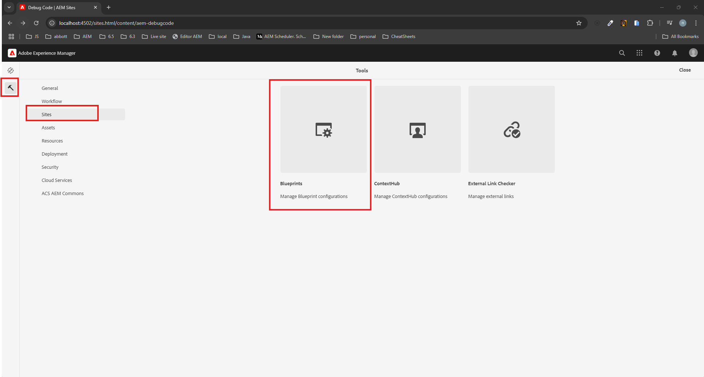
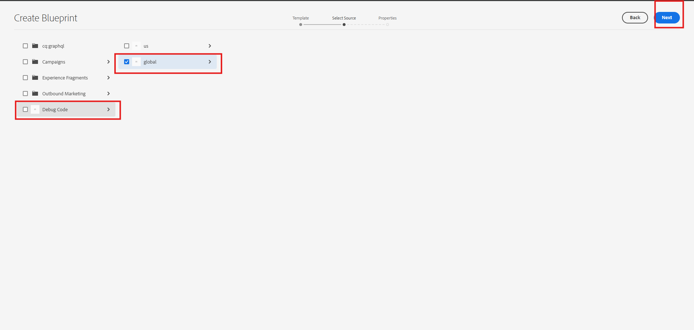
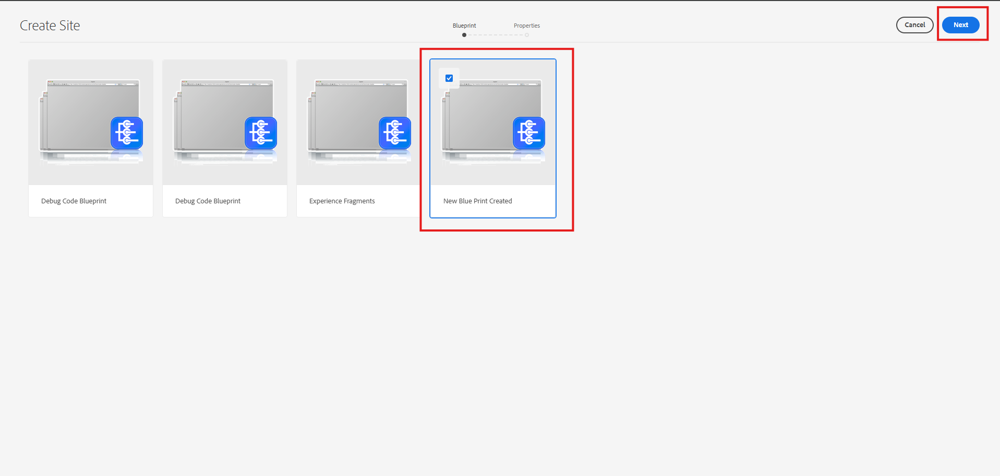
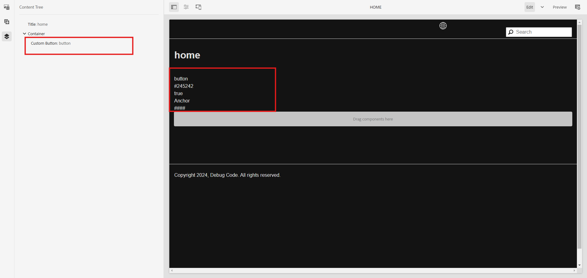
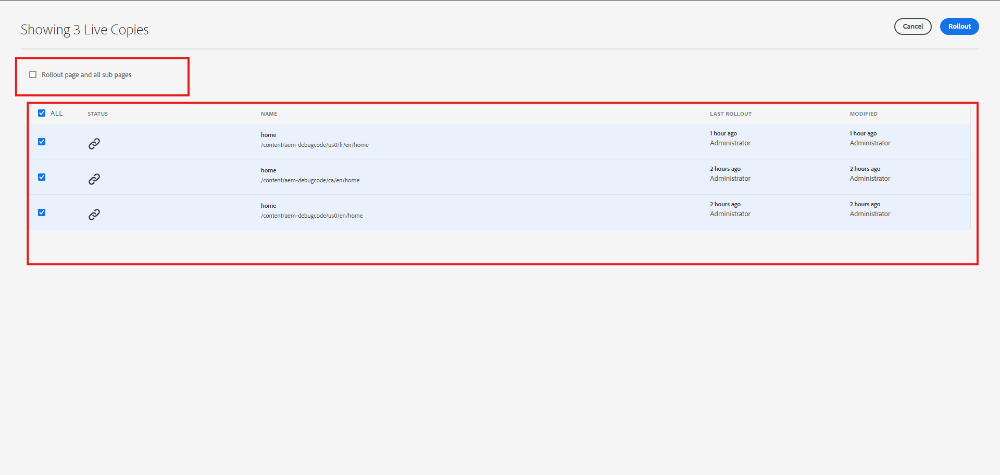

### Objective

- After reading this Article, You should have an Understanding of 

    - [What is Multi Site Manager (MSM) in AEM?](#what-is-multi-site-manager-msm-in-aem)

    - [Advantages of Using MSM](#advantages-of-using-msm)

    - [When to Use MSM in AEM](#when-to-use-msm-in-aem)

    - [Key Terms in AEM MSM](#key-terms-in-aem-msm)

    - [Create an MSM project Structure](#create-an-msm-project-structure)

        - [Create Blueprint](#create-blueprint)

        - [Language Copy](#language-copy)

        - [Site Creation](#site-creation)

        - [Live Copy](#live-copy)

        - [Rollout](#rollout)

        - [Synchronization](#synchronization)

    - [Break Inheritance](#break-inheritance)

        - [Steps to Break Inheritance](#steps-to-break-inheritance)

        - [Steps to Re-Enable Inheritance](#steps-to-re-enable-inheritance)

### What is Multi Site Manager (MSM) in AEM?

Multi-Site Manager (MSM) is a tool that helps manage several websites efficiently when they share similar content. By linking the sites, it ensures that any updates made to one site are reflected across others automatically. This feature saves time and effort, especially for managing multilingual websites or sites with shared content.

### Advantages of Using MSM
- Saves time by streamlining website management and allowing the reuse of shared content.

- Maintains a consistent design and layout across all web pages.

- Enables developers to link websites so that updates made to one site are automatically applied to others.

### When to Use MSM in AEM

- MSM is especially helpful in the following situations:

    - Managing websites for multiple countries.

    - Handling content in multiple languages.

    - Reusing or replicating the same content across various sites.

    - Ensuring consistent branding and messaging across all websites.

    - Automating translations with third-party translation tools.

### Key Terms in AEM MSM

- When working with AEM’s Multi-Site Manager (MSM), these five terms play a crucial role

1. Blueprint

    - A Blueprint serves as the source template for creating a copy of an existing site or set of pages.
    
    - It defines the original site that acts as the basis for one or more Live copies.
    
    - Blueprint configurations allow content updates in the source to be pushed to all associated Live copies.

2. Live Copy

    - A new site created based on an existing site or Blueprint.
    
    - Live copies inherit content from their source, and changes in the master can be synced via a rollout.
    

3. Language Copy

    - A Language Copy is a version of a site specifically created for translation purposes.
    
    - Unlike Live Copy, there’s no ongoing link between the source and the Language Copy—it’s a one-time content duplication.
    
    - AEM provides frameworks to integrate external translation services, as the Language Copy doesn’t handle translation automatically.

4. Rollout

    - Rollout refers to the process of synchronizing content from the source to its Live copies.
    
    - This can be done manually or triggered automatically based on specific events defined in a rollout configuration.
    
    - While editing a Blueprint page, the Rollout command allows you to push updates to all associated Live copies.

5. Synchronize

    - Synchronization is a manual process where updates from the master pages are pulled into the Live copies.
    
    - On a Live Copy page, the Synchronize command lets authors apply the latest changes from the source.
    
    - This command remains accessible at all times on Live Copy pages.

### Create an MSM project Structure

- To create a new MSM project, use the command with the parameter singleCountry set to n. This indicates it's a multi-site project instead of a single-country one.

```java
mvn -B org.apache.maven.plugins:maven-archetype-plugin:3.2.1:generate -DarchetypeGroupId=com.adobe.debugcode -DarchetypeArtifactId=aem-project-archetype -DarchetypeVersion=49 -DappTitle=debugcode  -DappId=debugcode -DgroupId=com.adobe.debugcode  -DartifactId=debugcode  -DsingleCountry=n  -Dpackage=com.adobe.debugcode  -Dversion=0.0.1-SNAPSHOT -DaemVersion=cloud
```

- Once Project is created, you will observe the language-masters site structure is created.

    


- To Check blueprint created for language-master Go to this URL -  http://localhost:4502/libs/wcm/msm/gui/content/blueprintconfig.html. 

    

- You can create your own blueprint also. 

### Create Blueprint

- Follow these steps to create a Blueprint

    - Access the Blueprint Tool

        - Navigate to tools -> Blueprints and click on Blueprints tile.

            

    - Start the Creation Process

        - Click the Create button.

            

    - Choose a Template

        - Select the desired template and click Next.

            

    - Select the Source

        - Choose the source site for the Blueprint. For example, select language-masters (global).

            

    - Verify the Blueprint

        - Once the Blueprint is created, it will appear like this:

            

### Language Copy

- Follow these steps to create a Language Copy

    - Access the Language Copy Option

        - Open [this URL](http://localhost:4502/sites.html/content)

        - Click on the Create button and select Language Copy.

            
    
    - Add Pages
        
        - Click the Add Pages button.

            

    - Select Source Language

        - Choose the language to copy from language_master and click Next

            

    - Configure Target Language and Cloud Settings:

        - On the next screen, select the required language(s) and specify the cloud configuration if needed.

            

    - Choose a Project Option:

        - Click Next, then select the project option.

        - For example, you can select Create Structure Only for the current project

            

    - Complete the Process:

        - Click Next again, and the Language Copy will be created from language_master

            

### Site Creation

- Steps to Create a Country Site.

    - Access the Site Creation Page

        - Open the URL: http://localhost:4502/sites.html/content/aem-debugcode.

        - Click the Create button and select the Site option

            

    - Select a Blueprint

        - Choose the desired Blueprint and click Next.

            

    - Set Initial Language and Details

        - You will see a screen showing the selected language (e.g., English) from the Language Masters (global).

            

   - Understand the Key Fields:

        - Initial Language: Picks the default language (e.g., English) from Language Masters.
        
        - Initial Chapters: Includes English sub-pages; you can remove them if not needed.
        
        - Title: Enter the name of the country site.
        
        - Name: Provide a short-form name for the country (e.g., ca, us, in, en_in, en_us).
        
        - Site Owner: Typically set to admin.
        
        - Live Copy: Check this box to establish a link between Language Masters and the new site (e.g., United States us).
        
        - Rollout Configs: Select the Standard Rollout Config.

    - Create the Site

        - Verify the configuration and click Create.

                


    - Validate the Site in CRXDE

        - Open CRXDE and confirm that the country site includes the English (en) language

              

###  Live Copy

- A Live Copy is a duplicate of Language Masters pages, maintaining an inheritance relationship with the original content.

- In the earlier steps, we created a Live Copy as part of the site creation process. In this section, we’ll create a French (fr) Live Copy for the existing Canada (ca) site.

- Steps to Create a Live Copy

    - Open the Create Menu

        - Click on the Create button and select the Live Copy option

            

    -  Choose the Source Language

        - Select the language from Language Masters for which you want to create the Live Copy.

            

    -  Select the Destination Site

        - Choose the destination site where the Live Copy will be created

            

    - Enter Details and Configure Rollout:

        - Provide the Title, Name, and set the Rollout Configuration to "Standard Rollout Config."

        - Click Create to generate the Live Copy

            

### Rollout

- Rollout applies changes from the source (e.g., language master or blueprint) to its live copies. These live copies automatically inherit updates made to the source site

- Why Rollout is Important:

    - Ensures consistency across all sites (e.g., country-specific or multilingual).
    
    - Saves time by automating updates across multiple sites.
    
    - Keeps all linked sites up-to-date with changes on the master site.

- How Does Rollout Work?
    
    - When you initiate Rollout, AEM pushes the changes from the master page to its live copies.
    
    - You can choose to Rollout the page and its child pages, which means the content updates will be reflected in the parent page as well as all its linked sub-pages.
    
    - You can also choose to Rollout all associated live copies, which means every site that’s linked to the original page will receive the updates.

- Steps to Perform a Rollout

    - Open the page: http://localhost:4502/editor.html/content/aem-debugcode/global/en/home.html.

        

    - Click the Edit button and add a component to the page. Refer to the image below

        

    - If the Rollout option is not visible.

        

    - Enable this option in the country site by navigating to Properties.

        

    - Go to Properites and Select the Live Copy tab, check the appropriate checkbox, and save.

        

    - Go to the menu options and select Rollout Page

        

    - The Rollout Page dialog will appear. You will see options like

        - Rollout page and all sub-pages: This applies changes to the current page and all its child pages in the selected live copy.
        
        - All associated live copies of this page will be displayed

        

    - Click the Rollout button, select Now, and confirm to continue.

    - Your changes have now been successfully rolled out to the live copy

    - To verify, open the live copy page at: http://localhost:4502/editor.html/content/aem-debugcode/us0/fr/en/home.html

        

### Synchronization

- Synchronization is the manual process of applying updates from the source (e.g., the master site) to its live copies. Unlike Rollout, which automatically pushes updates, Synchronization pulls changes into the live copy, ensuring the latest content is applied without needing to roll out the entire page.

- Why Synchronization is Important

    - Allows you to selectively update live copies, without affecting the entire page or site.
    
    - Ensures live copies are in sync with the latest changes from the master site.

- How Synchronization Works

    - You can manually synchronize a page or a component from the master site to the live copy.
    
    - Synchronization can be done after breaking inheritance or re-enabling it


- Steps to Perform Synchronization:

    - Go to Live Copy Page and Click on Properties.

         

    - In the page toolbar, click the Live Copy tab..

        

    - Synchronize

        - Use this option when you want the Live Copy to get the latest updates from the master page (source) without losing your own changes.

        - Adds new updates on top of the Live Copy's existing content.
    
    - Reset

        - This is like starting fresh. It makes the Live Copy exactly like the master page.
        
        - Any custom changes you made in the Live Copy will be erased.
    
    - Suspend

        - Temporarily pause updates from the master page to the Live Copy.
        
        - Changes you make locally will stay, and you can re-enable the updates later.
    
    - Detach

        - Permanently detaches the live copy from the master page

        - The Live Copy becomes independent and won’t get updates from the master anymore

    - You can choose to synchronize the entire page or just specific components

    - Once synchronized, the live copy will reflect the latest updates from the master page.

### Break Inheritance

- Breaking inheritance for components on a Live Copy page stops them from fetching updates from the Language Masters during a page rollout.

#### Steps to Break Inheritance:
    
- Select the component and click the highlighted option to break inheritance

    

- Confirm by clicking "Yes." This breaks the inheritance for the button component, and future rollouts will no longer fetch or override changes from the Language Masters.

    

#### Steps to Re-Enable Inheritance:

- Click the highlighted option to re-enable inheritance.

    

- Select the appropriate checkbox and confirm by clicking "Yes." This re-establishes component inheritance.

- Use one of the following options to synchronize changes:

    - Synchronize Page after Re-enabling Inheritance: Synchronizes both the page and the component immediately.
    
    - Synchronize Component after Re-enabling Inheritance: Synchronizes only the component

    
