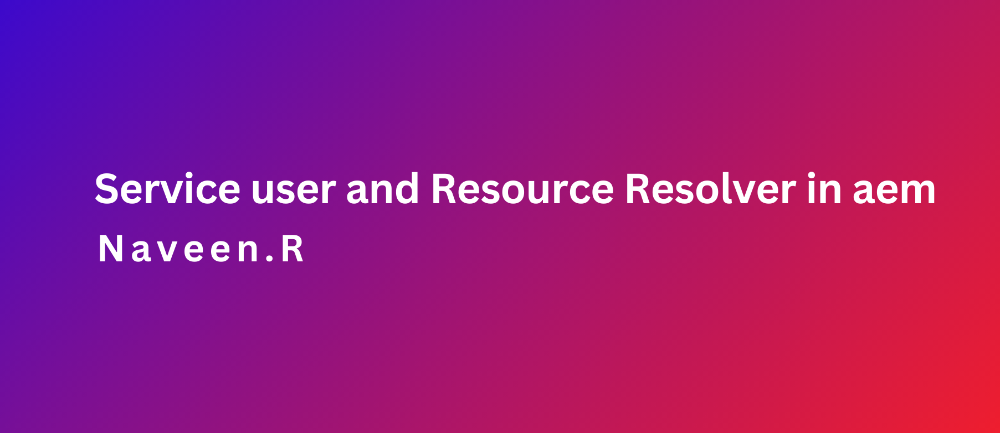

### Objective

- After reading this Article, You should have an Understanding of 

    - [System/Service Users in AEM](#systemservice-users-in-aem)

    - [Key Points to Remember](#key-points-to-remember)

    - [Create System/Service Users ](#create-systemservice-users)

    - [Mapping System Users to Bundles](#mapping-system-users-to-bundles)

    - [Resource Resolver](#resource-resolver)

        - [Key Points About ResolverUtil](#key-points-about-resolverutil)

    - [Using ResolverUtil in a Service Class](#using-resolverutil-in-a-service-class)

        - [Best Practices](#best-practices)

        - [Verify Output](#verify-output)

### System/Service Users in AEM

- Service user mapping with a system user enables the creation of a session or resource resolver, ensuring secure and controlled access to resources in AEM

### Key Points to Remember

- Create System/Service Users 

- Map System User with Bundle

- Resource Resolver

### Create System/Service Users 

- To create a System/Service User, there are two options: 

    - Using Repository Explorer: Create the user and manually assign permissions.
    
    - Using ACS Commons: Configure an OSGi configuration with permissions (Note: Not compatible with AEM as a Cloud Service).

Steps to Create a System User Using Repository Explorer

1. Access Repository Explorer

    - Open the URL: http://localhost:4502/crx/explorer/index.jsp

        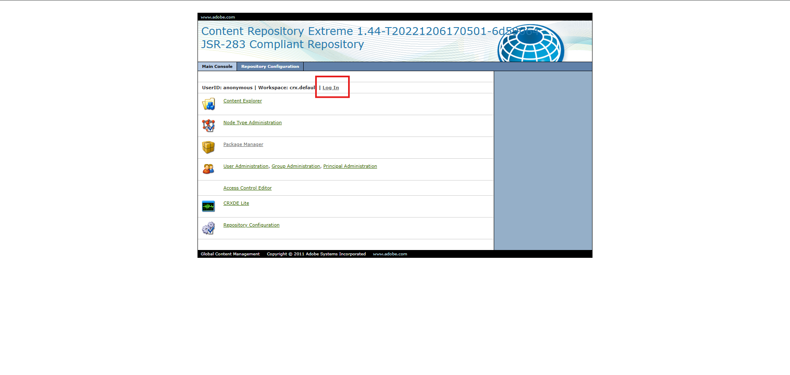

2. Log In

    - Enter your admin username and password to log in.

        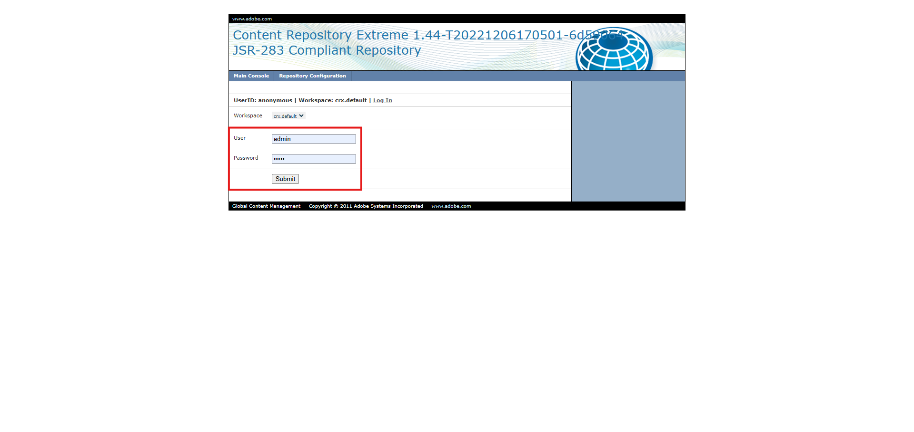

3. Navigate to User Administration

    - Click on the "User Administration" option

        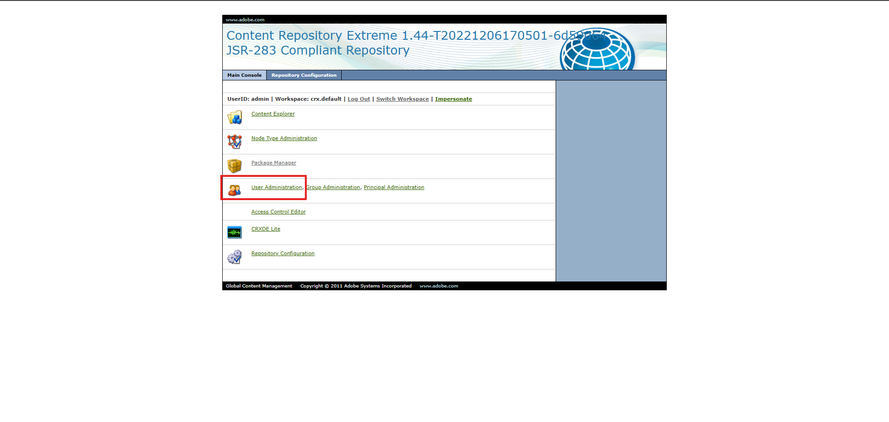

4. Create a System User

    - Enter the user ID and path (relative or system).

    - Click the green button to create the user
    
       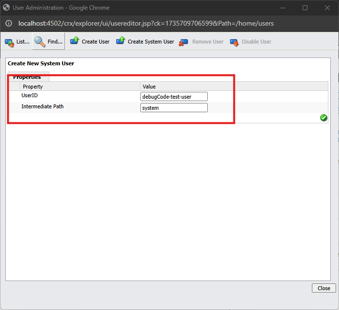

5. Verify User Creation

    - Visit the URL: http://localhost:4502/useradmin
    
    - Check if the user was successfully created.

       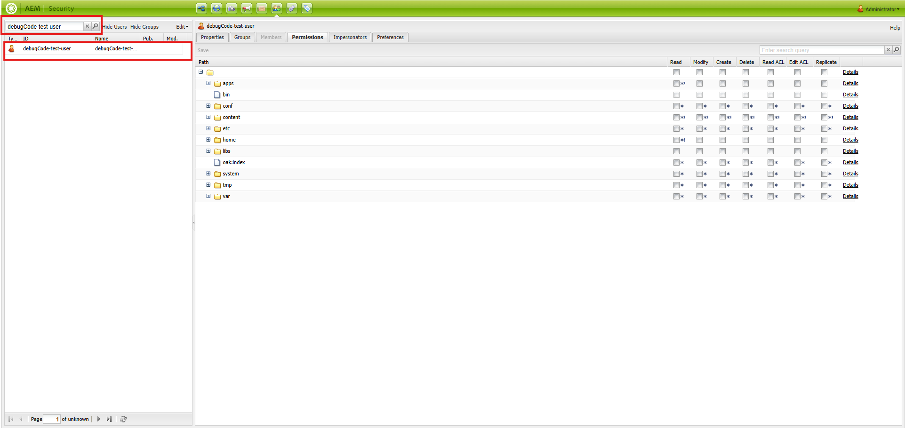

6. Assign Permissions

    - Navigate to the permissions section and assign necessary access to the user.

        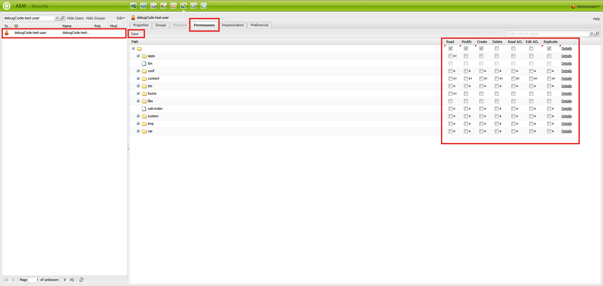

7. Ensure Correct Placement

    - All system users must reside under the /system path as per best practices. 

        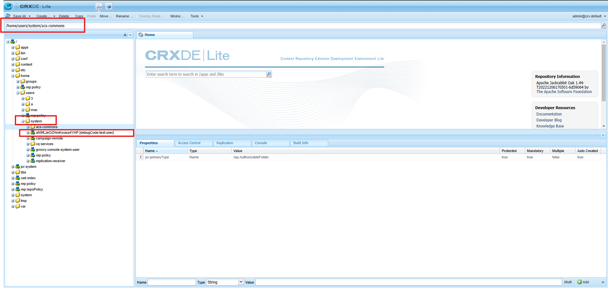


### Mapping System Users to Bundles

- After creating the system user, map it to the appropriate bundle using Apache Sling Service User Mapper Service Amendment.

Steps to Map the User

1. Access the Configuration Manager

    - Open the URL: http://localhost:4502/system/console/configMgr
    
2. Locate the Service

    - Search for Apache Sling Service User Mapper Service Amendment.
    
    - Click the "+" symbol to add a new configuration

        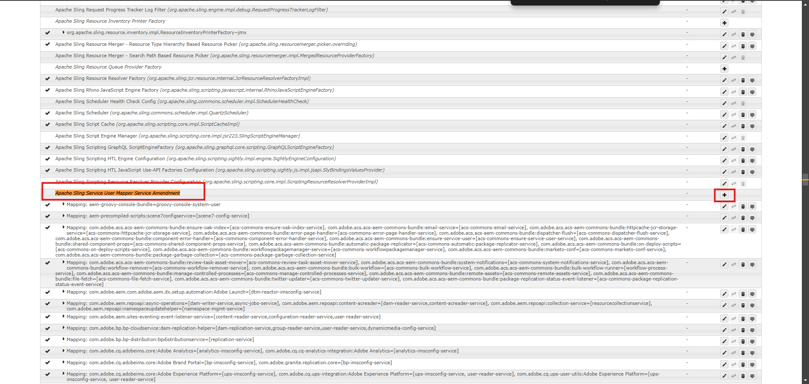

3. Add Mapping Details

    - Fill in the service mapping details in the format:

        ```java
        <Bundle-Symbolic-Name>:<Service-Function>=<User-ID>
        ```
    
    Example: aem-debugcode.core:debugcodeserviceuser=debugCode-test-user

    - Breakdown: 
        - aem-debugcode.core: Bundle symbolic name (find this under the Bundles section: http://localhost:4502/system/console/bundles).
        
        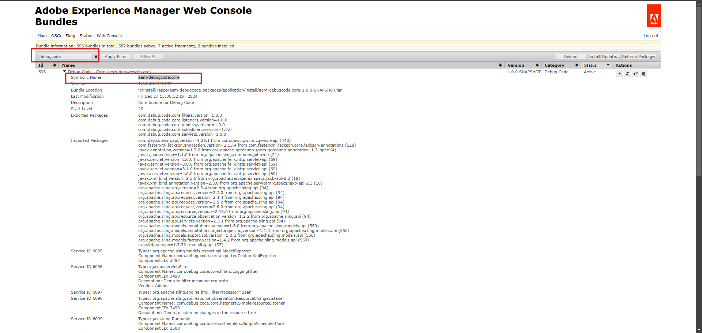

        - debugcodeserviceuser: Service Name.
        
        - debugCode-test-user: System user created earlier.

        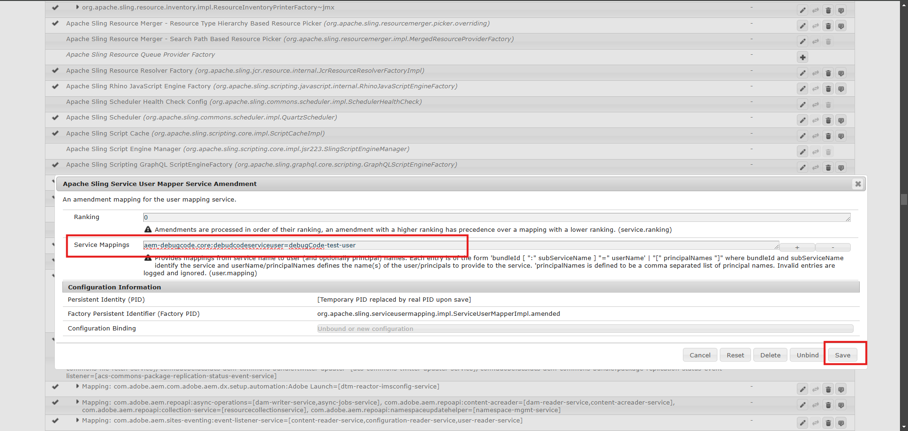

4. Save the Configuration

    Click the Save button to finalize the mapping.

> Note: The steps for creating and mapping a service user are a one-time activity for each environment

### Resource Resolver

- To use the system/service user effectively, we need to write code that creates a ResourceResolver using the service user. This ResourceResolver is crucial for interacting with JCR resources securely and with limited privileges.

    ```java
    package com.debug.code.core.utils;

    import org.apache.sling.api.resource.LoginException;
    import org.apache.sling.api.resource.ResourceResolver;
    import org.apache.sling.api.resource.ResourceResolverFactory;

    import java.util.HashMap;
    import java.util.Map;


    /**
     *  resource resolver factory helper class
     */
    public final class ResolverUtil {

        private ResolverUtil() {

        }

        public static final String DEBUGCODE_SERVICE_USER = "debugcodeserviceuser";
        /**
         * @param  resourceResolverFactory factory
         * @return new resource resolver for Sony service user
         * @throws LoginException if problems
         */
        public static ResourceResolver newResolver( ResourceResolverFactory resourceResolverFactory ) throws LoginException {
            final Map<String, Object> paramMap = new HashMap<String, Object>();
            paramMap.put( ResourceResolverFactory.SUBSERVICE, DEBUGCODE_SERVICE_USER );

            // fetches the admin service resolver using service user.
            ResourceResolver resolver = resourceResolverFactory.getServiceResourceResolver(paramMap);
            return resolver;
        }


    }
    ```

### Key Points About ResolverUtil
- Purpose

    - The ResolverUtil class is a utility to obtain a ResourceResolver for the service user defined during mapping (e.g., debugcodeserviceuser).

- Constants

    - DEBUGCODE_SERVICE_USER: This constant matches the service function name used in the bundle-to-user mapping. Consistency is critical here.

- Factory Dependency

    - The ResourceResolverFactory is passed to the method. This ensures the utility can remain flexible and reusable across different services.

- Error Handling

    - The LoginException is thrown if the service user cannot be resolved due to mapping issues or incorrect configurations. Always handle this exception in calling methods.

- Final Class

    - The ResolverUtil class is marked as final to prevent inheritance. This ensures it is used purely as a utility class.

### Using ResolverUtil in a Service Class
    
- In real-world scenarios, the ResolverUtil is typically used in service classes when you need to interact with JCR or other resources in AEM.    

    ```java
    package com.debug.code.core.services;

    import com.debug.code.core.utils.ResolverUtil;
    import org.apache.sling.api.resource.LoginException;
    import org.apache.sling.api.resource.ResourceResolver;
    import org.apache.sling.api.resource.ResourceResolverFactory;

    import org.slf4j.Logger;
    import org.slf4j.LoggerFactory;

    import javax.inject.Inject;
    import org.osgi.service.component.annotations.Component;

    @Component(service = MyExampleService.class, immediate = true)
    public class MyExampleService {

        private static final Logger LOG = LoggerFactory.getLogger(MyExampleService.class);

        @Inject
        private ResourceResolverFactory resourceResolverFactory;

        /**
         * Performs the task by accessing a resource using the service user.
         */
        public void performTask() {
            try (ResourceResolver resourceResolver = ResolverUtil.newResolver(resourceResolverFactory)) {
                // Use the resolver to access resources
                String resourcePath = "/content/aem-debugcode/us/en";

                // Check if the resource exists at the given path
                if (resourceResolver.getResource(resourcePath) != null) {
                    LOG.info("Resource found at path: {}", resourcePath);
                } else {
                    LOG.warn("No resource found at path: {}", resourcePath);
                }
            } catch (LoginException e) {
                // Log the exception in case of a login failure
                LOG.error("Error obtaining ResourceResolver: {}", e.getMessage());
            } catch (Exception e) {
                // Catch any other exceptions that might occur
                LOG.error("Unexpected error occurred while performing task: {}", e.getMessage());
            }
        }
    }

    ```

### Best Practices

- Dependency Injection

    - Always inject the ResourceResolverFactory into service classes using Sling Models or OSGi annotations.

- ResourceResolver Lifecycle

    - Always close the ResourceResolver after use to prevent memory leaks. Use a try-with-resources block, as shown in the example.

- Service User Permissions

    - Ensure the service user has only the necessary permissions. Assign permissions based on paths and actions (read/write/etc.).

- Error Logging

    - Handle and log exceptions clearly to debug issues with permissions or configurations.

- Reusability

    - Use ResolverUtil in multiple services to standardize the way ResourceResolvers are obtained.


### Verify Output

- To verify the output after implementing the ResolverUtil and integrating it into your service

- Deploy the Code

    ```java
    mvn clean install -PautoInstallPackage
    ```

- Verify Service Activation

    - Open the AEM OSGi Configuration Console: http://localhost:4502/system/console/components

    - Search for your service (e.g., MyExampleService).

    - Ensure it is in the "Active" state. If not, check your logs for errors. http://localhost:4502/system/console/slinglog

    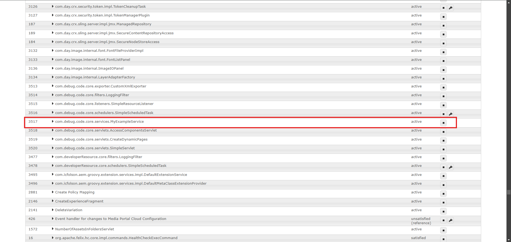