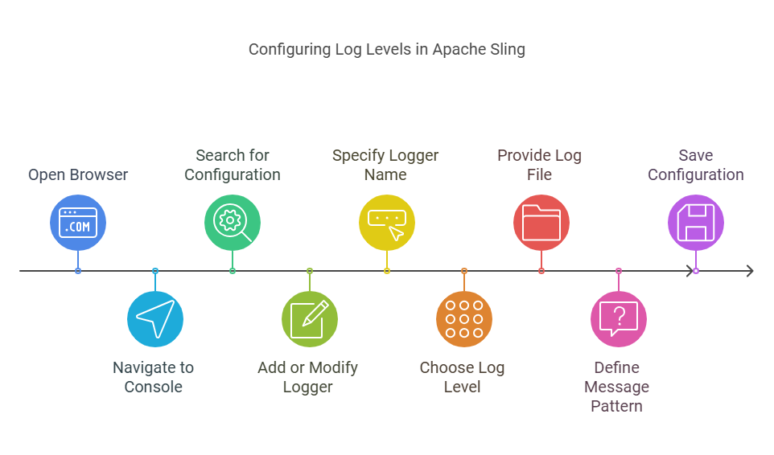
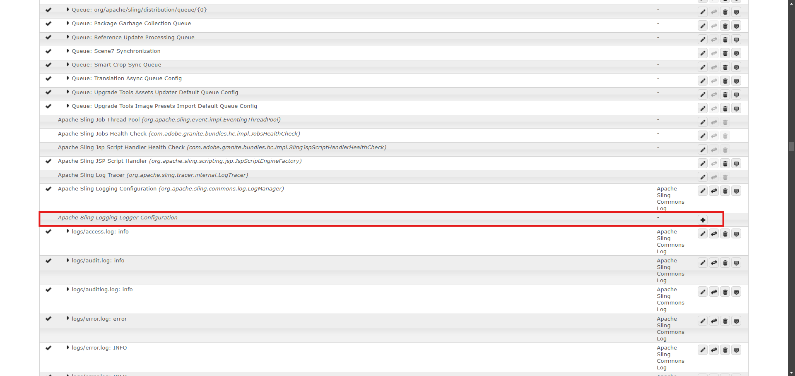
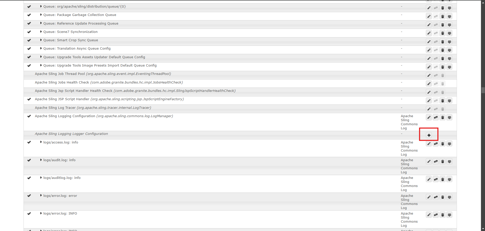
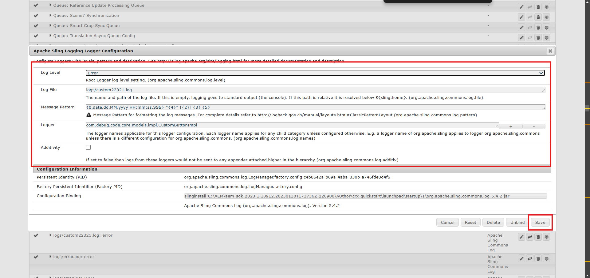
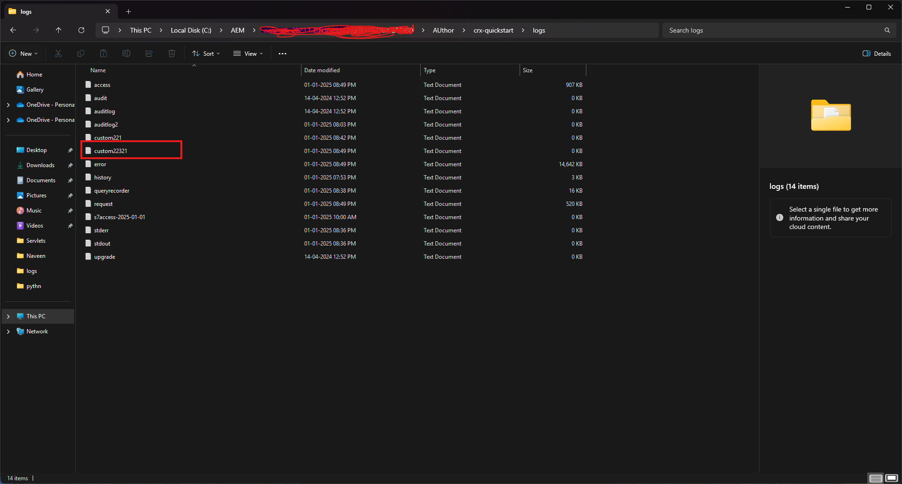
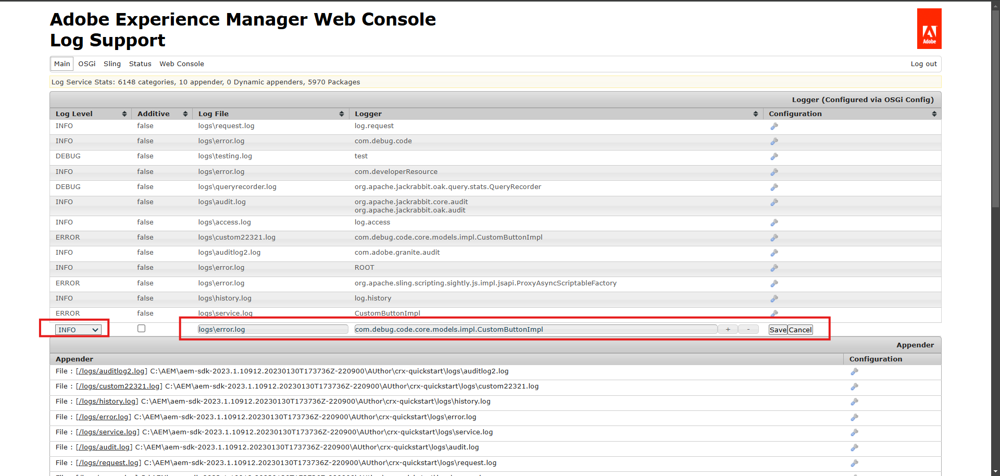
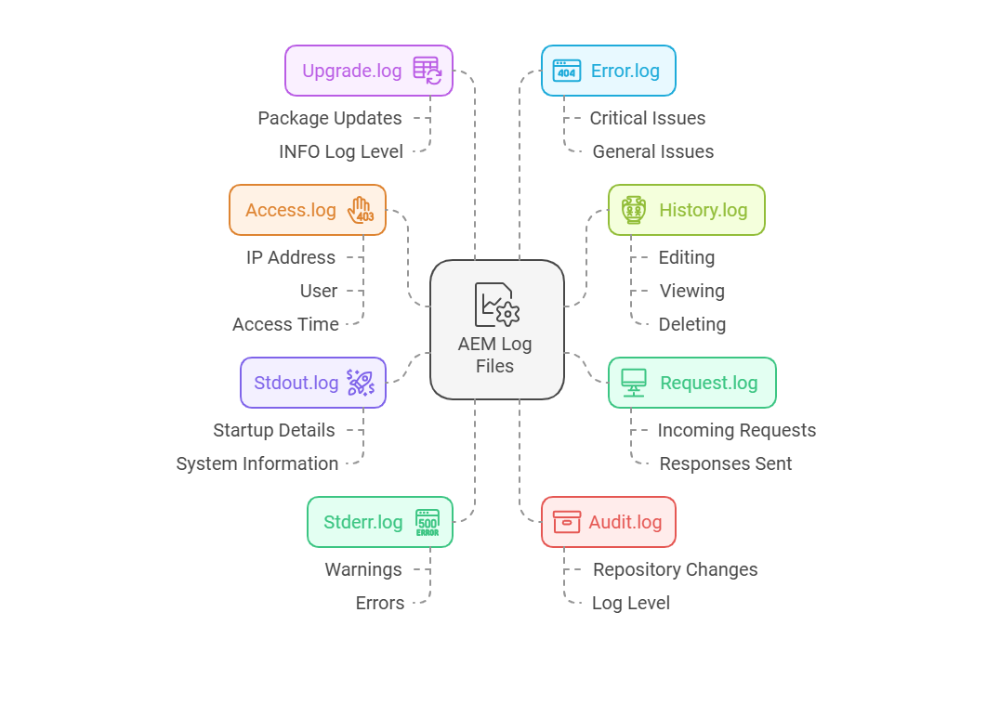
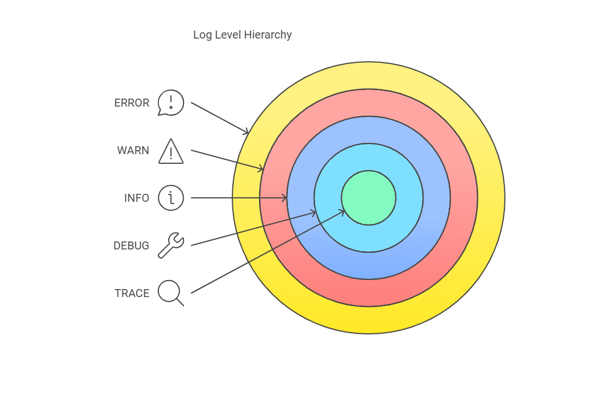

### Objective

- After reading this Article, You should have an Understanding of 

    - [What is Logging?](#systemservice-users-in-aem)

    - [When to Use Logging?]()

    - [When to Use Logging?]()

    - [How to Implement Logging in AEM](#how-to-implement-logging-in-aem)

        - [Implementing Logging in AEM Using SLF4J Logger](#implementing-logging-in-aem-using-slf4j-logger)

        - [Setting up Custom Loggers for Specific Components](#setting-up-custom-loggers-for-specific-components)

            - [Configure via Sling Configuration Manager](#option-1-configure-via-sling-configuration-manager)

            - [Using AEM’s Logging Console](#option-2-use-aems-logging-console)

    - [Understanding Log Levels](#understanding-log-levels)
    
    - [Customize log files using logging writer](#customize-log-files-using-logging-writer)

    - [AEM in-Build Log Files in Detail](#aem-in-build-log-files-in-detail)

    - [Log Level Hierarchy (from most to least detailed)](#log-level-hierarchy-from-most-to-least-detailed)

### What is Logging?

- Logging in AEM refers to the practice of recording events and messages during the execution of your application. These logs help developers monitor and debug the application’s behavior, identify errors, and understand the flow of events.

### Why Use Logging in AEM?

- Debugging: Helps identify and troubleshoot issues by providing real-time insights into what is happening in the system.

- Monitoring: Logs enable continuous monitoring of the system to ensure it functions as expected.

- Auditing: Helps in tracking actions performed by users, components, or processes for compliance and troubleshooting.

### When to Use Logging?

- During development, for debugging purposes.

- In production, for monitoring and identifying performance bottlenecks or errors.

- For tracking user actions or events (e.g., security-related events).

### How to Implement Logging in AEM

- There are some ways to implement logging

    - Using SLF4J Logger (Standard Java Logging)
    
    - Setting up Custom Loggers for Specific Components:

        - Configure via Sling Configuration Manager
    
        - Using AEM’s Logging Console

### Implementing Logging in AEM Using SLF4J Logger

- This is the most common and simplest way to implement logging in AEM.

Steps to Implement:

- Import the SLF4J Logger.

    - To start logging in your AEM application, you need to import the SLF4J Logger library. This logger is part of the SLF4J (Simple Logging Facade for Java) framework and is commonly used across Java applications, including AEM.  

```java
import org.slf4j.Logger;
import org.slf4j.LoggerFactory;
```

- Create a logger instance using LoggerFactory.

    - Once you have imported the required classes, you can create a logger instance for your class. This instance will be used to write log messages.

    - To do this, use the LoggerFactory.getLogger() method, passing the current class as the parameter. The logger will automatically associate itself with the class name for easier identification in the logs.

```java
private static final Logger logger = LoggerFactory.getLogger(sample.class);
```

- Use different log levels (e.g., info(), debug(), error(), etc.) to log messages.

    - Write Log Messages with Different Log Levels:

        - SLF4J supports multiple log levels messages. You can use the following methods to write logs at different levels:

            - Info: Used to log general, informational messages about the application’s flow.

                ```java
                logger.info("This is an info message.");
                ```
            - Debug: Logs detailed messages useful for debugging. These are typically used during development.
                ```java
                logger.debug("This is a debug message.");
                ```
            - Error: Logs error messages when an exception or critical failure occurs.
                ```java
                logger.error("An error occurred: ", exception);
                ```
            - Warn: Logs warning messages for potential issues that might require attention
                ```java
                logger.warn("This is a warning message.");
                ```
            - Trace: Captures fine-grained log messages, typically used for tracking very detailed execution steps
                ```java
                logger.trace("This is a trace message.");
                ```

        Example:

        ```java
        package com.debug.code.core.models.impl;

        import com.debug.code.core.models.CustomButton;
        import com.fasterxml.jackson.annotation.JsonProperty;
        import com.fasterxml.jackson.annotation.JsonRootName;
        import org.apache.sling.api.SlingHttpServletRequest;
        import org.apache.sling.models.annotations.DefaultInjectionStrategy;
        import org.apache.sling.models.annotations.Exporter;
        import org.apache.sling.models.annotations.ExporterOption;
        import org.apache.sling.models.annotations.Model;
        import org.apache.sling.models.annotations.injectorspecific.ValueMapValue;
        import org.slf4j.Logger;
        import org.slf4j.LoggerFactory;

        @Model(adaptables = SlingHttpServletRequest.class,
                adapters = CustomButton.class,
                defaultInjectionStrategy = DefaultInjectionStrategy.OPTIONAL,
                resourceType = CustomButtonImpl.RESOURCE_TYPE)
        @Exporter(name = "jackson", extensions = "json", selector = "debugcode",
            options = {
                    @ExporterOption(name="SerializationFeature.WRAP_ROOT_VALUE", value = "true"),
                    @ExporterOption(name="MapperFeature.SORT_PROPERTIES_ALPHABETICALLY", value = "true"),
            })

        @JsonRootName("buttonComponentDetails")
        public class CustomButtonImpl implements CustomButton{

            static final String RESOURCE_TYPE = "aem-debugcode/components/customButton";

            private static final Logger logger = LoggerFactory.getLogger(CustomButtonImpl.class);


            @ValueMapValue
            String buttonText;

            @ValueMapValue
            String urlLink;

            @ValueMapValue
            String targetNewWindow;

            @ValueMapValue
            String anchorName;

            @ValueMapValue
            String assetLink;


            @JsonProperty(value = "button")
            @Override
            public String getButtonText() {
                logger.info("Fetching buttonText property value: {}", buttonText);
                return buttonText;
            }

            @Override
            public String getUrlLink() {
                logger.debug("Fetching urlLink property value: {}", urlLink);
                return urlLink;
            }

            @Override
            public String getTargetNewWindow() {
                logger.debug("Fetching targetNewWindow property value: {}", targetNewWindow);
                return targetNewWindow;
            }

            @Override
            public String getAnchorName() {
                logger.debug("Fetching anchorName property value: {}", anchorName);
                return anchorName;
            }

            @Override
            public String getAssetLink() {
                if (assetLink == null) {
                    logger.warn("assetLink property is null.");
                } else {
                    logger.info("Fetching assetLink property value: {}", assetLink);
                }
                return assetLink;
            }
        }

        ```
### Setting up Custom Loggers for Specific Components

- By default, AEM has different log levels set for various loggers. However, you can control which log levels are printed in your logs using AEM's Sling Logging Console.

- You can set log levels (e.g., INFO, DEBUG, ERROR) at the global level or for specific classes or packages.

    
    
#### Option 1: Configure via Sling Configuration Manager

Steps to Configure Log Levels

- Navigate to the Sling Configuration Manage
    
    - Open your browser and go to: http://localhost:4502/system/console/configMgr.

- Locate Apache Sling Logging Logger Configuration:

    - In the Configuration Manager, search for "Apache Sling Logging Logger Configuration

        

- Add or Modify a Logger:
    
    - Click on "Create" or "Add a new configuration".

       

- Enter the following details:

    - Logger Name: Specify the package or class you want to log (e.g., com.debug.code.core.models.impl).

    - Log Level: Choose the desired level (DEBUG, INFO, ERROR, etc.).
    
    - Log File: Provide a log file name (e.g., /logs/custom-log.log).

    - Message Pattern:The java.util.MessageFormat pattern to use for formatting log messages with the root logger. This is a java.util.MessageFormat pattern supporting up to six arguments: 
    
        - {0} The timestamp of type java.util.Date, 
        - {1} the log marker,
        - {2} the name of the current thread, 
        - {3} the name of the logger, 
        - {4} the log level and
        - {5} the actual log message. 
    
        - If the log call includes a Throwable, the stacktrace is just appended to the message regardless of the pattern.
    
        - The Pattern can be like this: {0,date,dd.MM.yyyy HH:mm:ss.SSS} *{4}* {2} {3} {5}
    
    - Logger: Here we define the package name of the application,for which we want to print the logs.You can add multiple packages also.
    
    - Additivity: If set to false then logs from these loggers would not be sent to any appender attached higher in the hierarchy.

    - Save the configuration.

      

    - Here is the Output:

        


#### Option 2: Use AEM’s Logging Console (global configuration for all log files)

- The AEM Logging Console is a powerful tool to manage logging configurations. It allows developers to control what gets logged, where logs are saved, and the level of detail (log levels) for specific parts of the application

Steps to Configure Logging via the AEM Logging Console

- Access the Console

    - Open your browser and navigate to the following URL:  http://localhost:4502/system/console/slinglog

- Why Use the Console?

    - To define new loggers for specific components or packages.
    
    - To redirect logs to custom files for better traceability.
    
    - To adjust log levels (e.g., DEBUG, INFO, ERROR) for existing loggers.
  
- Adding or Modifying a Logger

    

- Save Changes

    - After adding or modifying the logger, click Save to confirm the changes

- Log Level Behavior

    - Logs will only appear in the specified file.

### Customize log files using logging writer

- Logging Writer configuration in AEM allows you to customize the behavior of log files

Steps to Customize log files using logging writer

- Navigate to the Sling Configuration Manage
    
    - Open your browser and go to: http://localhost:4502/system/console/configMgr.

- Locate Apache Sling Logging Logger Configuration:

    - In the Configuration Manager, search for "Apache Sling Logging Writer Configuration"

        

- Enter the following details:

    - Log File : Mention Your Log File Name.

    - Number of Log Files: This will generate how many file need to be generated one the limit is reached it will stop genearting file.

    - Log File Threshold: By default log file will rotate at 12AM every day 

        - You can Customize this behavior, This option supports Size and Rotation(date time)

        - Rotation Options : There are Six Options available
            
            - '.'yyyy-MM --> When You Specify this option Log File will generate every month of 1st date

            - '.'yyyy-ww --> When You Specify this option Log File will generate every week of 1st day

            - '.'yyyy-MM-dd --> When You Specify this option Log File will generate every day at 12AM

            - '.'yyyy-MM-dd-a --> When You Specify this option Log File will generate Two time in a day at 12AM and 12PM

            - '.'yyyy-MM-dd-HH --> When You Specify this option Log File will generate at every hour.
    
            - '.'yyyy-MM-dd-HH-mm - --> When You Specify this option Log File will generate at every minute
        
        - Size --> when the file size is exceed then new file will generate. 

            - KB

            - MB

            - GB

        Example : 5KB

    - Save the configuration.


### AEM in-Build Log Files in Detail

- AEM automatically generates several log files to help monitor and troubleshoot the system. Each log file has a specific purpose, and understanding them is key to effectively managing and maintaining your AEM instance
 
- Request.log
    
    - This log captures all incoming requests along with the responses sent from the AEM instance. It’s particularly useful for tracking and evaluating the performance of your AEM setup.

- Access.log
    
    - This log is quite similar to the request.log, but it provides more detailed access information:

        - Who is accessing the system?
        
        - What resource is being accessed?
        
        - When was the resource accessed?
        
        - Each entry in access.log is shorter because it combines request and response data in a single line.
        
        - What you’ll find in each Access.log line:

            - Access IP – The IP address of the machine making the request.
            
            - Access User – The user who sent the request.
            
            - Access Time – The time when the request was made.
            
            - Request Method –  The HTTP method used (GET, POST, PUT, etc.).
            
            - Access Resource – The resource being requested.
            
            - Protocol – The protocol (HTTP/1.1 or HTTPS)..
            
            - Response Status Code – A number indicating the result of the request (e.g., 404, 200).
            
            - Content Length – The size of the response.
            
            - Referrer URL – The page that referred the user to the resource.
            
            - User Agent – The browser and operating system used.

- Stdout.log
    
    - This log tracks the startup process of your AEM instance. It includes details such as sling.home and other important system information during startup

- Stderr.log 

    - Here you’ll find error messages generated during startup or runtime, including things like heap size or other issues. By default, this log is set to a "WARN" level, meaning it only records warnings and above.

- Audit.log

    - Used by Jackrabbit (the content repository in AEM) to log any changes made to the repository. Normally, the log level is set to INFO, so you won’t see many entries unless you change the log level to DEBUG. When set to DEBUG, every change to the repository (such as adding, modifying, or deleting components) gets logged.

- History.log 

    - This log keeps track of user actions like editing, viewing, or deleting content. It’s especially useful for auditing purposes and is primarily relevant on author instances. Each log entry includes:

        - TimeStamp

        - Action

        - User

        - Content path

        - Content type(cq:page, dam:asset)

- Upgrade.log
    
    - This log records any upgrade-related activities performed on the system. It’s generated during operations like package updates and is typically set to an INFO log level.

- Error.log 

    - Captures all error messages, including critical issues and lower-level errors that need attention. You can expect to find errors, warnings, and general issue logs in this file.

    

### Log Level Hierarchy (from most to least detailed)
    
- TRACE – The most detailed level, usually used for development and debugging.

- DEBUG – Used for troubleshooting and understanding the system's internal processes.

- INFO – Standard information, such as system status or operational logs.

- WARN – Indicates potential problems that may need attention.

- ERROR – Critical errors that require immediate attention.

    