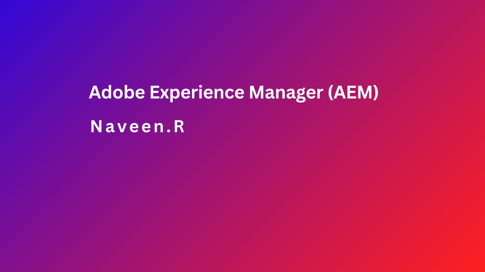

| Day |   Topics     | 
| ----- | :------------------: |
| 01    |  [ AEM Overview](./01_AEM_Overview.md) |
| 02    |  [ AEM Introduction](./02_AEM_Introduction.md) |
| 03    |  [ AEM Architecture](./03_AEM_Architecture.md) |
| 04    |  [ Softwares ](./04_Softwares.md) |
| 05    |  [ AEM Local Instance Setup](./05_AEM_Instances_Setup.md) |
| 06    |  [ create the AEM Project](./06_AEM_Project_Setup.md) |
| 07    |  [ AEM Replication](./07_Replication&ReverseReplication.md) |
| 08    |  [ AEM CRXDE Lite](./08_CRXDE_Lite.md) |
| 09    |  [ AEM Templates](./09_Templates.md) |
| 10    |  [ How to Create a Component without Sling Model](./10_Create_Component.md) |
| 11    |  [ Clientlibs in AEM](./11_Clientlibs_creation.md) |
| 12    |  [ clientlibs clear cache and recompile clientlibs in AEM](./12_Clientlibs_Clear_Cache.md) |
| 13    |  [ Content Fragment in AEM](./13_Content_Fragment.md) |
| 14    |  [ Sling Model in AEM](./14_Sling_Model.md) |
| 15    |  [ Sling Model Annotation in AEM](./15_Sling_Model_Annotation.md) |
| 16    |  [ Sling Model Content Exporter in AEM](./16_Sling_Model_Content_Exporter.md) |
| 17    |  [ Sling Servlets in AEM](./17_Sling_Servlets.md) |
| 18    |  [ MSM in AEM](./18_MSM.md) |
| 19    |  [ Service user and Resource Resolver in aem](./19_SystemUser.md) |
| 20    |  [ Logger in aem](./20_Logger.md) |

Keep Learning 🩷👍
